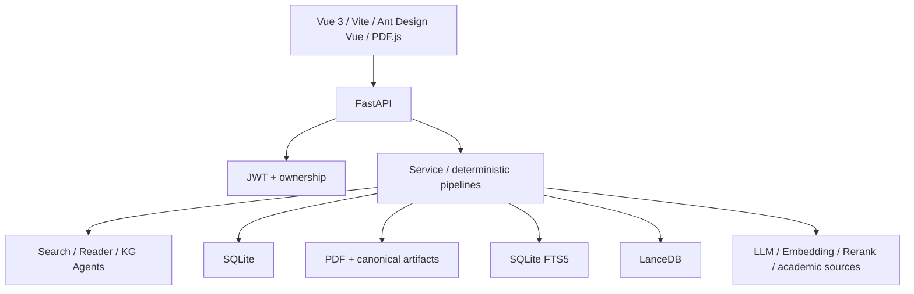

# PaperGraph（知脉）

PaperGraph 是一个本地优先的学术文献搜索、管理、PDF 阅读与研究辅助应用。项目采用 Vue 3 + FastAPI + SQLite，并正在将现有 Reader 升级为带 canonical PDF、混合检索、Memory 和可追溯 Evidence 的论文级 RAG 系统。

## 当前状态

当前代码基线：当前工作树（已含第二阶段核心 RAG/Context/Evidence/Trace 实现与 Silver v2 诊断）
核验日期：2026-07-28

| 能力 | 状态 |
| --- | --- |
| JWT 登录/注册与核心资源用户隔离 | 已验证 |
| 多源论文搜索与 SSE | 已实现，缺固定质量评测 |
| 个人文献库、PDF 下载和 PDF.js 阅读 | 下载/入库隔离 E2E 已验证；PDF canvas 仍需标准浏览器终验 |
| Reader 对话与历史持久化 | 隔离产品 E2E 已验证；业务论文仍待验收 |
| 用户确认式 Paper/User Memory | 已验证；读取侧已接入结构化、scope-safe 的 FTS/lexical Retrieval 基础 |
| 长期 Memory 管理页面 | 已实现 |
| 多论文研究 UI/API | 已接入 canonical 多论文全文检索、Token-budgeted Context 与 `[E#]` 引用；隔离回归已通过，业务论文/Golden/UI E2E 待验收 |
| Canonical PDF、Page/Block/Chunk/Job | 已实现底层 |
| Docling/PyMuPDF、双 FTS、LanceDB、Hybrid/Rerank | 已有 QueryPlan、unicode61/trigram、加权 RRF、bounded candidate rerank、Evidence Expansion 与任务化 Rerank；尚未接通现有业务论文 |
| 可靠 Evidence Citation | canonical Hybrid RAG 已实现 request-scoped Evidence Registry 与 Citation Validator；legacy fallback 仍是 `[pN]` 兼容路径 |
| 评测 | 16 篇/419 页隔离 PDF corpus 已 canonical 入库；Silver v2（24 例）已验证，Golden Candidate 待用户审查 |
| GraphRAG/生产级多租户 | 未实现，也不是当前阶段目标 |

详细的真实评测状态、命令和边界见 [EVALUATION_STATUS.md](docs/EVALUATION_STATUS.md) 与 [CURRENT_STATE.md](docs/CURRENT_STATE.md)。

## 主要页面

- 智能搜索：自然语言意图、多源召回、去重过滤和排序；
- 每日论文：arXiv 候选和用户反馈；
- 我的文献库：保存、分类、标签、阅读记录和 PDF；
- 单篇 Reader：PDF.js、论文问答、历史和手动总结 Memory；
- 长期 Memory：用户手动查看、添加和删除；
- 多文献研究：选择文献并基于元数据/摘要对话；
- 知识图谱：文献关系基础可视化。

## 当前架构



这不是自由多 Agent 系统。流程控制主要由 API、Service、Repository 和确定性 Pipeline 完成，Agent 负责语义理解和回答。

完整架构见 [ARCHITECTURE.md](docs/ARCHITECTURE.md)。

## 本地开发

### 1. 当前权威 Python 环境

当前开发机已建立完整 RAG 环境：

```text
D:\AIModels\PaperGraph\venv-rag
```

`backend/.venv` 是第一阶段轻量环境，不含 Docling/LanceDB，不能用于完整 RAG 验收。

### 2. 配置

如果尚无配置：

```powershell
Copy-Item backend\.env.example backend\.env
```

至少配置：

```env
PAPERGRAPH_JWT_SECRET=<至少 32 字符的随机私密字符串>
LLM_API_KEY=<chat model key>
LLM_BASE_URL=<OpenAI compatible base URL>
LLM_MODEL_ID=<model id>
```

论文级 Dense/Rerank 还需要 Embedding 和 Rerank 配置。不要提交 `backend/.env`。

### 3. 启动后端

```powershell
cd backend
$PaperGraphPython = 'D:\AIModels\PaperGraph\venv-rag\Scripts\python.exe'
& $PaperGraphPython run.py
```

后端默认位于 `http://127.0.0.1:8000`。

### 4. 启动前端

新终端：

```powershell
cd frontend
npm ci
npm run dev
```

前端默认位于 `http://127.0.0.1:5173`。

### 5. 验证

```powershell
cd backend
$PaperGraphPython = 'D:\AIModels\PaperGraph\venv-rag\Scripts\python.exe'
& $PaperGraphPython -m pip check
& $PaperGraphPython -m compileall -q app tests
& $PaperGraphPython -m pytest -q

cd ..\frontend
npm run typecheck
npm run build
```

环境和路径说明见 [ENVIRONMENT.md](docs/ENVIRONMENT.md)，测试和 Golden Test 见 [TESTING_AND_ACCEPTANCE.md](docs/TESTING_AND_ACCEPTANCE.md)。

## 数据路径

| 内容 | 默认路径 |
| --- | --- |
| SQLite | `backend/data/papers.db` |
| PDF | `backend/downloads/papers` |
| Canonical artifacts | `backend/data/rag_artifacts` |
| LanceDB | `backend/data/rag_vectors` |
| RAG 语料 | `backend/data/rag_eval_corpus` |
| 隔离 PDF 评测库 | `backend/data/rag_eval_workspace/rag_eval.db` |
| 隔离 SciFact 评测库 | `backend/data/rag_eval_workspace/benchmarks/scifact_v1/scifact.db` |

SQLite 是业务事实源；FTS、LanceDB 和缓存均是可重建投影。

## 当前 Reader 和 RAG 边界

当前 Reader 只有在论文存在 active document version 时才尝试 Hybrid RAG。用户业务库当前仍没有 active canonical document；相反，隔离评测库已经完成 16 篇/419 页公开 PDF 的 canonical 入库。两者必须严格区分，评测结果不能表述为业务库已回填。

已实现的底层：

```text
PDF
→ Docling / PyMuPDF
→ Quality Gate
→ Canonical Page/Block
→ Parent/Child Chunk
→ SQLite FTS5 + Embedding/LanceDB
→ RRF + Rerank
→ Dynamic Context Builder / ContextPackage
→ Evidence Registry / Citation Validator
```

已完成的入库产品边界：

- 本地 PDF 保存成功后创建幂等持久化 Ingest Job；
- 独立 Worker 处理 PDF → Canonical → Chunk → FTS/Embedding/LanceDB，API 不再在请求后台执行重型解析；
- Reader 显示并轮询论文入库状态，失败时支持重新入库；
- 历史 PDF 回填 CLI 默认 dry-run，避免误写业务库。

尚未完成：

- 对真实业务 PDF 完成并验收 canonical 入库；
- 真实 PDF 上的中文/跨语言检索效果与 Golden 校准；
- Memory 向量语义召回、真实语料/Golden 校准与用户可编辑的 TTL/importance 策略；
- 业务真实 PDF 上验证单一 Token Budget、引用和工具边界，并在标准浏览器验收 PDF canvas/引用跳页；
- canonical Reader tools 迁移及 legacy `[pN]` 路径删除；
- Frozen Golden、Reader answer/citation 门禁、SSE 与真实 UI E2E；
- 多论文全文 RAG 的业务论文、Golden 与浏览器引用交互验收。

## Memory 原则

永久 Memory 不自动写入：

```text
用户点击“总结本次阅读”
→ LLM 生成草稿
→ 用户选择/编辑
→ 用户确认
→ 写入 Paper Memory 或 User Memory
```

Memory 不能冒充 PDF 原文，也不能生成页码引用。

## 文档

- [文档索引](docs/README.md)
- [当前状态](docs/CURRENT_STATE.md)
- [RAG 评测状态](docs/EVALUATION_STATUS.md)
- [当前架构](docs/ARCHITECTURE.md)
- [环境与路径](docs/ENVIRONMENT.md)
- [测试与验收](docs/TESTING_AND_ACCEPTANCE.md)
- [下一阶段执行指南](docs/NEXT_STAGE_HARDENING_AND_QUALITY_EXECUTION_GUIDE.md)
- [仓库协作规则](AGENTS.md)

## Docker

仓库保留 Docker 配置，但当前本机阶段没有完成 Docker、GPU Docling、RAG 依赖和数据目录验收。Docker 不是当前推荐开发路径，详见 [README-Docker.md](README-Docker.md)。

## 当前优先级

1. 统一 RAG 环境选择和启动；
2. 自动 Ingest、回填和状态 UI；
3. 已完成运行时 DDL 收口、负反馈隔离和双语 Hybrid Retrieval 基础；
4. 已完成 Memory Retrieval、ContextPackage、服务端 History 和 canonical Evidence Citation 基础；继续完成 parent/neighbor expansion 与 canonical Reader tools；
5. 已在 Silver 上完成受限 dense/rerank 对照，等待用户审核 Golden Candidate；未经审核不得运行 Candidate；
6. 迁移 canonical Reader tools、补齐 answer/citation/故障注入门禁，然后删除旧链路；
7. 对多论文全文 RAG 补业务论文、Frozen Golden 与浏览器引用交互验收。

不要为了展示效果增加更多 Agent、GraphRAG 或分布式基础设施。
