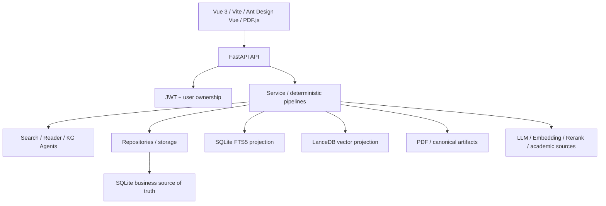
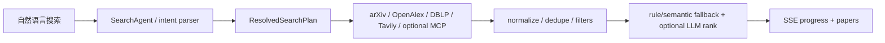
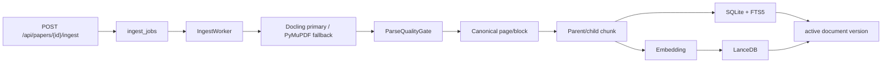
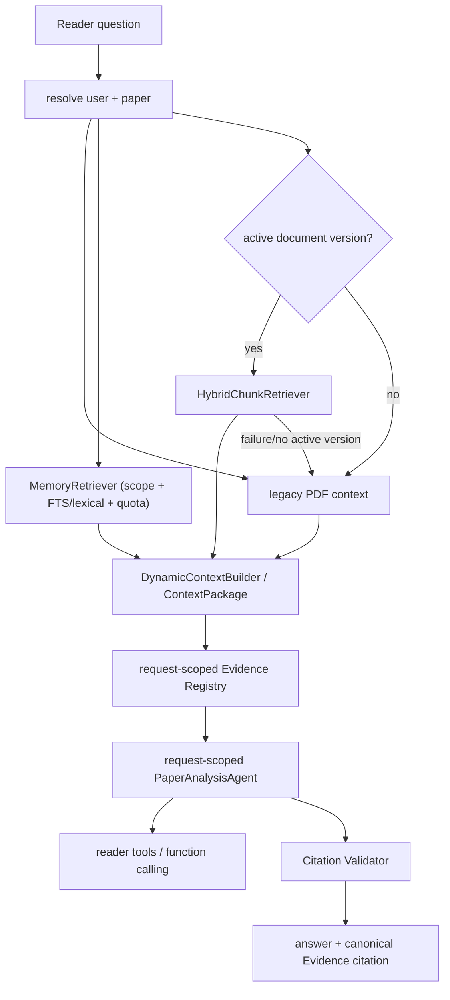
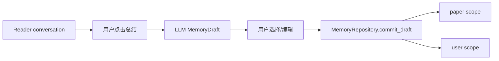

# PaperGraph 当前架构

文档状态：`CURRENT`
更新日期：2026-07-28

## 1. 总体结构



系统仍是单体应用，不是微服务。前端、FastAPI、SQLite、PDF 文件和本地向量索引共同构成一个本地优先部署单元。

## 2. 目录职责

```text
frontend/src/
├─ views/                 页面
├─ components/            PDF、论文卡片、搜索轨迹等组件
├─ services/api/          前后端 API 客户端
├─ router/                登录保护和页面路由
└─ types/                 业务/OpenAPI 类型

backend/app/
├─ api/                   FastAPI 入口、依赖、路由和错误契约
├─ agents/                LLM Agent 与 Reader tools
├─ core/                  论文、存储、下载和外部搜索基础能力
├─ domain/                Document/Memory 等领域对象
├─ repositories/          Document/Memory/Research 持久化接口
├─ services/              Ingest、Retrieval、Context、Reader、Memory 等业务
├─ infrastructure/
│  ├─ db/                 连接、Migration、Schema Validator
│  └─ vector/             LanceDB 投影
└─ settings/              配置和日志
```

当前 `papers` 的部分业务仍通过 `core/storage.py`，尚未完全收敛到 Repository。

## 3. 前端路由

| 路由 | 页面 |
| --- | --- |
| `/login` | 登录/注册 |
| `/search` | 智能论文搜索 |
| `/daily` | 每日论文 |
| `/library` | 个人文献库 |
| `/library/read/:id` | 单篇 PDF Reader |
| `/memory` | 长期 Memory 管理 |
| `/research` | 多文献协同研究 |
| `/graph` | 知识图谱 |

路由守卫只检查本地是否存在 `pg_token`；后端仍会验证 JWT 和资源 ownership。

## 4. API 边界

主要前缀：

- `/api/auth/*`：注册、登录、Token 验证；
- `/api/papers/*`：文献库、PDF、每日推荐、搜索 SSE 和 Ingest；
- `/api/ai/paper-reader/*`：Reader opening/chat/history；
- `/api/memory*`：Memory Draft、确认、列表、删除和长期 Memory；
- `/api/research/*`：多论文 session；
- `/api/export/*`：用户数据导出。

API 文档页面当前关闭，但 OpenAPI Schema 可由前端脚本从应用对象导出。

## 5. 外部论文搜索链路



这条链路检索互联网/学术元数据，不是 PDF 内部 RAG。`semantic_scoring.py` 是词法、N-gram 和元数据启发式评分，不是 Embedding 相似度。

关键实现：

- `agents/search_agent.py`
- `services/retrieval/search_plan.py`
- `services/retrieval/search_pipeline.py`
- `core/search/sources/`
- `api/routes/search.py`

## 6. PDF Ingest 链路



当前实现：

- `domain/document.py`
- `services/ingest/parsers.py`
- `services/ingest/quality.py`
- `services/ingest/canonicalizer.py`
- `services/ingest/chunking.py`
- `services/ingest/service.py`
- `services/ingest/worker.py`
- `services/ingest/queue.py`
- `workers/ingest_worker.py`
- `repositories/document_repository.py`
- `infrastructure/db/migrations/v006_document_rag.py`
- `infrastructure/db/migrations/v008_ingest_job_lifecycle.py`
- `infrastructure/db/migrations/v009_runtime_tables_and_feedback_isolation.py`
- `infrastructure/vector/lancedb_store.py`

当前已形成的产品边界：

- 保存论文的本地 PDF 成功落盘后会幂等 enqueue；
- API 不再用 `BackgroundTasks` 执行重型 Ingest；
- 独立 `python -m app.workers.ingest_worker` 消费任务，lease/heartbeat/retry 状态保存在 SQLite；
- Reader 能显示并轮询该论文的 user-scoped 入库状态，并提供失败后的手动重新入库入口；
- `app.cli.backfill_ingest` 提供 SQLite 只读 dry-run 的历史 PDF 回填；只有 `--execute` 才会应用迁移并创建任务。
- Reader/Daily/KG/Feedback 的持久化表由 v009 Migration 统一创建；用户范围缓存和关系表使用 `user_id` / 复合 `user_id + paper_id` 边界。

仍未完成的产品门禁：

- 当前业务数据库没有 document version/chunk；
- 默认 `RAG_INGEST_WORKER_ENABLED=false`，必须显式启动独立 Worker；
- 已在隔离评测库对 16 篇/419 页公开 PDF 跑完 Docling auto → canonical → parent/child Chunk → FTS 回填，并完成真实 Embedding/LanceDB 回填；新表格以 caption/header-aware `parent-child-v3` 生成独立可引用 Chunk；该库不等于用户业务库。
- 已有 Silver v2（24 例、26 个 qrel 证据锚点）和 10 例待审查 Golden Candidate；尚无 Frozen Golden、answer/citation gate，因此不能声明最终检索效果已验收。

## 7. 单论文 Reader 链路



当前 Hybrid：

```text
AcademicQueryPlanner
→ unicode61 FTS/BM25
+ CJK trigram FTS/BM25
+ text-embedding-v4 query vector
+ LanceDB
→ Weighted RRF
→ task-aware qwen3-rerank
→ EvidenceExpander（parent / neighbor）
→ DynamicContextBuilder
```

缺口：

- QueryPlan、双 FTS 与 task-aware rerank 已有临时数据库测试；真实隔离 PDF 的 Silver sparse 与受限 dense/rerank 对照均已运行。已审核 Frozen Golden 仍未完成；
- 已有 parent/neighbor Evidence Expansion；扩展半径、证据上限与多证据覆盖率仍需 Frozen Golden 校准；
- Rerank 默认不使用固定阈值；任务策略和可选阈值仍需 Golden 校准；
- canonical ContextPackage 不再进入 Agent 的 9000/2200/14000 字符二次裁剪；legacy compatibility path 尚保留；
- canonical Hybrid RAG 的 `[E#]` 已绑定本轮 Context Evidence；legacy fallback 的 `[pN]` 仍未绑定 Evidence；
- canonical Reader tools 已通过 `DocumentRepository` 按 `user_id + paper_id + active document_version_id` 受限读取，并经 ContextPackage/Evidence Registry 回流；旧 PDF cache tools 与 fallback 仍为兼容路径，待 Golden/E2E 门禁后删除。

## 8. Memory 链路

### 写入



LLM 只生成草稿，不决定最终用户身份，也不自动永久写入。

### 读取

当前 Reader 主链使用 `MemoryRetriever.retrieve()`，返回带 scope、score、
`inclusion_reason` 和 `citation_allowed=false` 的结构化 Memory hit：

1. Repository 先硬过滤当前 `user_id`、当前已拥有的 `paper_id`、`active`、`confirmed`、未过期的记录；Paper scope 必须是当前论文，User scope 必须是当前用户；
2. 对有问题的请求，unicode61（英文/缩写）与 trigram（CJK phrase）FTS 分路召回，并以确定性 lexical overlap 作为相关性门槛；FTS 不可用时会保留 lexical fallback；
3. 当前论文 Paper Memory 和长期 User Memory 分别限额（默认 3 + 2），并按 scope、相关性和 user-set importance 排序；
4. 空问题只允许少量当前论文 Memory 作为 opening fallback，不自动注入全局 User Memory；
5. deleted、unconfirmed、expired、superseded 或跨用户/跨论文的记录不会被读取；Memory 不会成为 `ContextEvidence`，也不能生成 PDF 页码引用。

`MemoryRepository.build_paper_context()` 目前仅是旧调用方的兼容渲染 facade，内部仍委托 `MemoryRetriever`。它将在 Golden 回归和旧调用方替换完成后删除。

当前还不是 dense/vector 语义 Memory Retrieval；是否为小规模用户记忆增加独立向量投影，必须先经过真实语料和 Golden 校准，不能把它当成当前正确性的前置条件。

### 与负反馈的边界

`services/feedback/negative_feedback_memory.py` 是推荐负反馈信号，不属于 canonical Memory。它使用 `user_id + identity_key` 的 TTL 记录，不调用 LLM、不自动晋升为长期用户记忆，也不会进入 Reader 上下文。

## 9. 多论文研究

```text
选择个人文献库论文
→ ResearchRepository session
→ 选中文献的 active canonical chunk Hybrid Recall
→ per-paper bounded anchor selection + Evidence Expansion
→ Token-budgeted ContextPackage（PDF Evidence / metadata / persisted history）
→ LLM
→ CitationValidator（只保留本轮 [E#]）
→ 保存带 Evidence 元数据的 research turns
```

`MultiPaperResearchService` 只允许由当前用户、当前 session 选中的论文进入检索。每个有命中的论文先保留一个 anchor，再以每篇最多两个 anchor 填充 4 个全局 anchor；随后只扩展 parent/邻近 canonical chunk，并在单一 `ContextPackage` Token Budget 下装配。`EvidenceRegistry.from_context_package_for_papers()` 再次检查 paper scope，`CitationValidator` 只保留实际进入本轮 Context 的 `[E#]`，返回 citation 的 paper title、chunk、页码和 snippet。

没有 active canonical version 的论文仍可作为明确标记的 metadata/abstract 背景；不能生成 PDF Evidence。当前已有 SQLite canonical regression（双论文全文、部分入库、伪造引用清理），但尚无业务论文、多论文 Frozen Golden 和浏览器 citation 跳页验收，因此不能表述为最终效果已验证。

## 10. Agent 职责

| Agent | 当前职责 | 状态/边界 |
| --- | --- | --- |
| SearchAgent | 搜索意图、SearchRecipe/查询辅助 | 流程主体仍是确定性 Search Pipeline |
| PaperAnalysisAgent | 论文分类、Reader 回答、旧工具编排 | Reader 请求级实例；职责仍偏大 |
| KnowledgeGraphAgent | KG 相关 LLM 调用 | 不是 GraphRAG |

项目不需要增加更多 Agent。目标模式是：

```text
Workflow 控制流程
Service 执行业务
Repository 管理数据
Agent 处理语义理解和回答
Validator 执行确定性校验
```

## 11. 状态与并发

- Reader Agent 请求级构造；
- Search 部分全局缓存已加锁/深拷贝，但仍需持续审查；
- SQLite 使用统一连接、WAL、foreign keys 和 busy timeout；
- Ingest Job 是 SQLite 持久化队列；独立 Worker 有 lease、heartbeat、延迟重试和过期 lease 恢复，但还不是多进程/分布式队列；
- 工具循环最多 5 轮，但同步工具没有可靠硬取消；
- Search SSE 缺 heartbeat、断线恢复和完整 producer cancellation。

## 12. 数据事实与派生数据

```text
业务事实：
SQLite papers/users/memories/conversations/document metadata

原始/审计材料：
PDF files + canonical artifacts

可重建投影：
SQLite FTS5 + LanceDB vectors + caches
```

任何向量索引损坏都不应导致论文、Memory 或 canonical Chunk 丢失。
