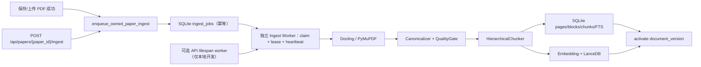
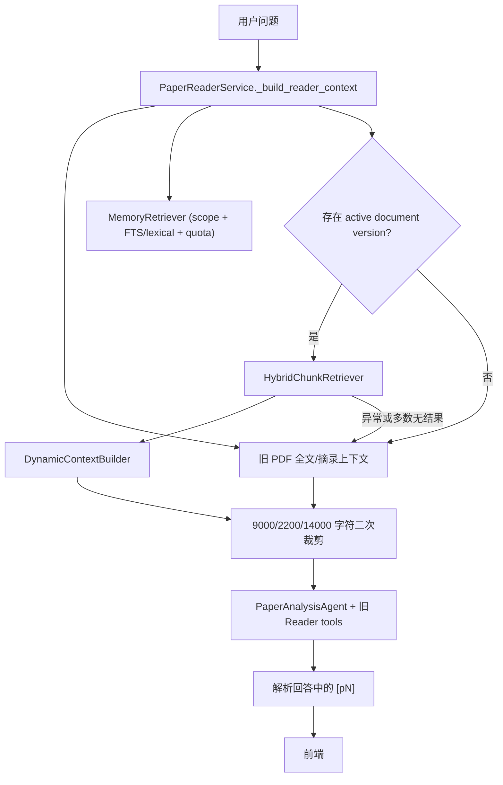
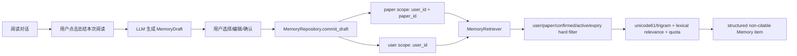
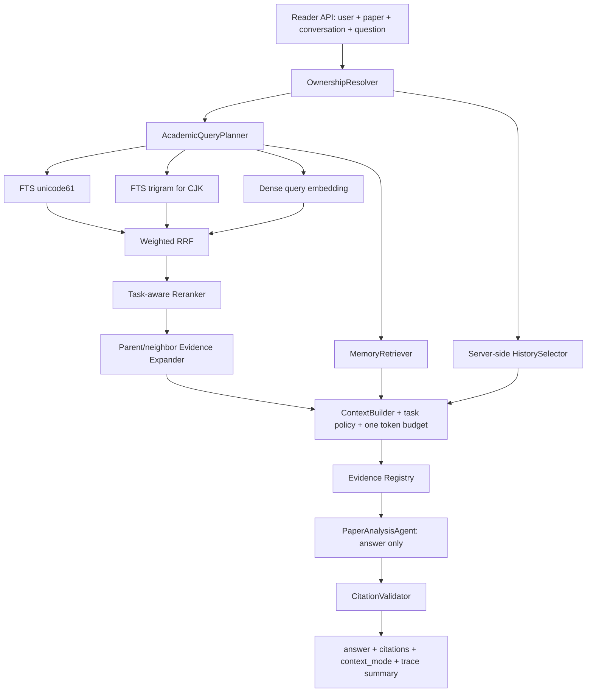
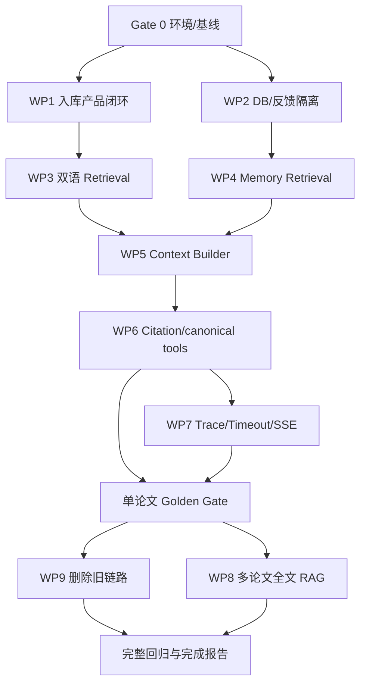

# PaperGraph 下一阶段修复、质量收口与能力提升执行指南

制定日期：2026-07-28
适用分支：`codex/phase1-foundation`
审查基线：当前工作树（Gate 0/WP1/WP2/WP3/WP4 基础实现）
文档状态：`EXECUTION_IN_PROGRESS`
本文件性质：后续开发的执行与验收契约；每个工作包完成后必须以真实代码和运行结果更新状态

当前事实源：[CURRENT_STATE.md](./CURRENT_STATE.md) · [EVALUATION_STATUS.md](./EVALUATION_STATUS.md) · [ARCHITECTURE.md](./ARCHITECTURE.md) · [ENVIRONMENT.md](./ENVIRONMENT.md) · [TESTING_AND_ACCEPTANCE.md](./TESTING_AND_ACCEPTANCE.md)
工作包状态速览：[PHASE_2_RAG_CONTEXT_MEMORY_UPGRADE_PLAN.md](./PHASE_2_RAG_CONTEXT_MEMORY_UPGRADE_PLAN.md)

---

## 0. 一句话结论

PaperGraph 已经完成了第一阶段的认证、用户隔离、数据库迁移、手动确认式 Memory，并实现了第二阶段 RAG 的主要底层骨架；但新 RAG 还没有形成“保存论文后可自动入库、阅读时稳定检索、回答引用可验证、Golden Test 可证明效果”的完整产品闭环。

下一阶段不应重新设计更多 Agent，也不应立刻做 GraphRAG。正确顺序是：

```text
先让现有 RAG 依赖、入库和索引真正工作
→ 修复用户隔离、运行时建表和引用正确性问题
→ 完善中英文混合检索与 Memory 相关性召回
→ 统一 Context Builder 和 canonical Reader tools
→ 删除被替代的旧链路
→ 用 Golden Test、Tracing 和真实 PDF 验收
→ 最后再升级多论文研究
```

---

## 1. 本阶段执行契约

### 1.1 目标

把目前“底层组件已经存在，但产品链路和质量证明不完整”的状态，收口为一个可重复验证、可持续扩展到数百篇论文的学术 AI 应用：

- 新保存或已存在的 PDF 能进入持久化 Ingest Workflow；
- 页面、Block、章节、Parent/Child Chunk 和索引版本可追溯；
- 单篇论文问答默认走 BM25 + 向量混合召回和 Rerank；
- 中文问题、英文论文以及中英文混合术语具有稳定召回能力；
- Memory 仍由用户确认写入，但召回由作用域、相关性和阈值共同控制；
- Context 的所有来源、优先级、Token 预算和引用权限均结构化；
- 回答引用只能指向本轮实际进入上下文的 PDF Evidence；
- 旧 Reader 和旧 Memory 代码在替代链路通过验收后被真正删除；
- 所有效果结论由固定 Golden Test 和真实运行记录支持。

### 1.2 范围

本阶段包含：

1. RAG 环境和依赖闭环；
2. 自动入库、任务状态、重试和恢复；
3. 运行时 DDL 收口和负反馈用户隔离；
4. 中英文查询规划与双路稀疏检索；
5. Query/Document Embedding 语义区分；
6. Hybrid Recall、RRF、Rerank 和 Evidence Expansion；
7. 结构化 Memory Retrieval；
8. Dynamic Context Builder 统一；
9. Evidence Registry 与 Citation Validator；
10. canonical Reader tools；
11. 旧代码删除；
12. Golden Test、回归测试、Tracing 和阶段验收；
13. 在单论文链路稳定后升级多论文全文 RAG。

### 1.3 明确不做

以下内容不应混入本阶段：

- 不增加新的“规划 Agent”“记忆 Agent”或自由 Agent-to-Agent 通信；
- 不让 LLM 决定 `user_id`、允许访问的 `paper_id` 或永久 Memory 作用域；
- 不恢复自动永久写入 Memory；
- 不引入 Neo4j 或 GraphRAG；
- 不为数百篇规模引入 Kubernetes、Kafka 或分布式微服务；
- 不把 MinerU 云解析作为默认路径；
- 不先做知识图谱大重构；
- 不用大规模 Prompt 调整掩盖解析和召回问题；
- 不删除历史 Migration；
- 不在新链路未通过 Golden Test 前删除可回滚的旧 Reader 路径。

### 1.4 完成定义

“代码写完”不等于本阶段完成。只有同时满足以下条件才能标记完成：

- 完整后端测试全绿，前端 typecheck/build 通过；
- Golden Corpus 可通过 manifest 重建并校验文件 Hash；
- 至少一批真实论文完成 PDF → canonical → Chunk → FTS → Vector 全链路；
- 单篇 Reader 确实命中新 RAG，而不是静默回退旧全文摘录；
- Hybrid Retrieval、Memory Retrieval、Context 和 Citation 均有可复现指标；
- 跨用户、跨论文泄漏数为 0；
- 非法引用数为 0；
- 降级路径可通过故障注入测试；
- 旧实现的删除有调用图和回归测试证明；
- 生成 `PHASE_2_5_COMPLETION_REPORT.md`，记录真实命令、环境、指标和遗留项。

---

## 2. 当前真实基线

### 2.1 2026-07-28 实际验证结果

下表中的业务库行是开始本轮改造前的盘点快照；后续自动化测试一律使用临时数据库，
不会把 `backend/data/papers.db` 当作验收目标或由测试更新其统计值。

| 检查项 | 当前结果 | 结论 |
| --- | --- | --- |
| 后端完整测试（RAG 环境） | `141 passed, 1 warning` | 使用正确环境时完整测试通过（含 Parser/Chunker、真实 image-only OCR 决策、加密/损坏 PDF 拒绝与永久错误不重试、Hybrid、Context/Evidence、Reader API E2E、multi-paper canonical regression、Reader trace 与评测 runner 回归） |
| 全仓静态类型 | `mypy app`：140 errors / 41 files | 本轮 RAG/Context/Agent 8 文件 scoped mypy 通过；全仓类型债务需单列收口，不能声称 typecheck 全绿 |
| 轻量环境误测结果 | `70 passed, 4 failed, 1 warning` | 4 项失败来自误用不含 LanceDB 的历史轻量环境，不是代码失败 |
| 轻量环境定向测试 | `23 passed, 1 warning` | 不依赖真实 LanceDB 的核心逻辑可运行 |
| 历史轻量环境 | `backend/.venv`，Python 3.11.9 | 含 FastAPI/pytest，不含 Docling/LanceDB/tiktoken/PyArrow/PyTorch；不用于当前完整验收 |
| 当前权威后端环境 | `D:\AIModels\PaperGraph\venv-rag`，Python 3.11.9 | LanceDB 0.34、Docling 2.115、tiktoken 0.13、PyArrow 25、PyTorch 2.7.1+cu126 |
| RAG 环境硬件 | CUDA 可用，RTX 4060 Laptop GPU | Docling/向量链路具备本地运行条件 |
| RAG 环境依赖检查 | `pip check` 通过 | 当前环境没有 broken requirements |
| Python `compileall` | 通过 | 无明显语法/静态导入阻塞 |
| 前端 `npm run build` | 通过 | Vue 类型检查和生产构建可用 |
| 前端分包 | Ant Design 最大业务 JS chunk 约 360.20 kB | 已修复原约 749 kB 单包告警；PDF.js worker 约 1.376 MB，后续按静态资源缓存优化 |
| 当前数据库 foreign key check | 0 条异常 | 关系完整性检查通过 |
| 当前数据库论文 | 11 篇 | 有业务论文数据 |
| 当前数据库 Memory | 4 条 | 已有少量正式 Memory |
| 当前数据库 `document_versions/pages/blocks/chunks/ingest_jobs` | 全部 0 | 新 RAG 尚未服务当前论文 |
| 隔离 PDF corpus | 16 篇、419 页真实公开 PDF、3,217 active chunks（1,102 parent / 2,115 child） | Docling/Canonical/FTS/vector 已验收；表格 `parent-child-v3` 已真实验证；不等于业务库回填 |
| Silver / Candidate | Silver v2 24 例/26 锚点已验证并跑 sparse 与受限 dense/rerank；Candidate 10 例 qrel 校验通过 | Candidate 必须等待用户审核，尚无 Frozen Golden |
| SciFact 固定子集 | 60 query / 300 title-abstract document | 独立公共文本检索评分，不证明 PDF 页码或回答质量 |
| 缺失 Golden 样本 | 中文/低清扫描件、损坏/截断 PDF、prompt injection、answer/citation E2E | 原生和 image-only 英文 OCR smoke、加密 PDF 的确定性拒绝已补；解析与最终产品验收仍不完整 |

当前工作树中原有 `backend/data/papers.db` 修改属于测试数据库状态。本阶段后续执行时必须继续避免把它和代码提交混合。

### 2.2 已完成、部分完成、尚未完成

| 能力 | 状态 | 当前实现与证据 |
| --- | --- | --- |
| Canonical Document 模型 | 已完成骨架 | `backend/app/domain/document.py` |
| 页面、Block、Chunk、Job Schema | 已完成骨架 | `v006_document_rag.py` |
| Embedding 状态字段 | 已完成骨架 | `v007_embedding_status.py` |
| Docling/PyMuPDF Parser Adapter | 已完成骨架 | `services/ingest/parsers.py` |
| Parse Quality Gate | 已完成骨架 | `services/ingest/quality.py` |
| section/page-aware Parent/Child Chunk | 已完成骨架 | `HierarchicalChunker` |
| 持久化 Ingest Job | 基础实现完成，待真实语料验收 | 保存后幂等入队、独立 Worker CLI、lease/heartbeat/retry/recovery、状态 API/Reader UI、dry-run backfill 已落地 |
| SQLite FTS5/BM25 | 部分完成并有隔离真实语料诊断 | v010 `unicode61` + optional `trigram` 双投影；Silver sparse 与受限 dense/rerank 已运行，Frozen Golden 未验收 |
| LanceDB 向量索引 | 代码与 RAG 环境可用，隔离评测已建 | Query/Document embedding 已拆分，document projection 有 config hash；16 篇隔离 PDF 已建向量，业务数据未建 |
| DashScope Embedding/Rerank | Silver v2 对照已验证，产品链路未完整验收 | Rerank 支持 task instruction 和 bounded candidate pool；固定 0.45 默认阈值已移除；仍需 Golden 校准 |
| Hybrid + RRF + Rerank | Silver v2 已验证 | `AcademicQueryPlanner`、双 sparse、Weighted RRF、Evidence expansion、source preference 与 bounded candidate rerank 已落地；Silver v2 Hybrid+Rerank `Recall@10=1.0/MRR@10=0.920290`；仍缺 Frozen Golden |
| Dynamic Context Builder | 已完成基础实现并可追踪 | 统一 `ContextPackage`、真实 TokenCounter、task policy、跨源去重、Evidence Registry、canonical Reader tools re-entry 与脱敏 request trace 已接入；产品 E2E 仍待完成 |
| 手动确认式 Memory | 已完成基础闭环 | Draft → 用户选择 → commit → scope → soft delete |
| Memory 相关性召回 | 基础实现完成，待效果验收 | v011 `MemoryRetriever` 使用 scope hard filter、unicode61/trigram、lexical relevance gate、paper/user quota、expiry/supersede；dense/vector 和 Golden 未完成 |
| Evidence Registry/Citation Validator | canonical 基础已完成 | 当前 ContextPackage 中的 PDF chunk 以 `[E#]` 绑定 canonical snippet/page；legacy `[pN]` 与旧 tools 仍待迁移 |
| 单论文 Reader RAG | 部分接入 | 有 active version 时尝试新 RAG；无数据时静默走旧链路 |
| 多论文全文 RAG | 基础实现完成，隔离 SQLite 回归通过 | session paper scope → Hybrid Recall → 每篇命中至少一个 anchor 的均衡选择 → Evidence Expansion → 单一 ContextPackage → 跨选中文献 `[E#]` 校验；业务论文、Frozen Golden 与浏览器 E2E 未完成 |
| Golden Test | 部分完成 | Silver/runner/Candidate 已有；Frozen Golden、answer/citation 门禁尚无 |
| Tracing/评测看板 | 未完成 | 有部分日志，没有完整 request→retrieval→context→citation trace |

### 2.3 当前三条关键调用链

#### PDF 入库



基础产品链路已收口：保存后会自动 enqueue，Reader 会展示并轮询 user-scoped 状态，
失败时可手动重新入队。当前剩余门禁是：不得以用户业务库作为测试目标；需要先对独立
评测语料执行真实 PDF → canonical → Chunk → FTS/Embedding/LanceDB 回填，再验证 Reader
确实使用 `hybrid_rag_v2`，而非旧 fallback。

#### 单论文问答



该链路具备渐进式回退能力，但现在会造成两类风险：

1. 新 RAG 是否被使用对用户和测试不透明；
2. 旧工具和旧上下文仍可能绕过 canonical Evidence。

#### Memory



写入原则保持不变；读取侧已完成范围正确性与可解释性基础，但尚未完成 vector semantics 和 Golden 效果验收。

---

## 3. 问题清单与分级

这里的 P0 分为“应用 P0”和“本阶段门禁 P0”。下表保留首次审计时的优先级；
标为“已完成基础修复”的项目不再是当前阻塞项，但仍需通过真实语料端到端验收。
当前第一阶段核心应用可以启动；RAG 阶段的剩余 P0-S2 是公开评测语料的真实入库和 Reader E2E，而非代码骨架缺失。

| 优先级 | 模块 | 问题 | 主要证据 | 触发与影响 | 修复方向 |
| --- | --- | --- | --- | --- | --- |
| P0-S2（已完成基础修复） | 环境选择 | 历史上轻量 `.venv` 与完整 `venv-rag` 没有权威选择 | `start.sh`、`app.cli.preflight`、`frontend/scripts/export-openapi.mjs` 已改为显式 `PAPERGRAPH_PYTHON` | 仍需补可跨机器重建 lock 和 CPU/CUDA 安装矩阵 | 维持 strict preflight/constraints；后续补可重建 lock |
| P0-S2（已完成基础修复，真实 E2E 待验收） | 产品链路 | 历史上业务论文没有 canonical/version/chunk/job，且没有自动触发 | `services/ingest/queue.py`、`workers/ingest_worker.py`、Reader 状态 API/UI | 代码已可排队和恢复；隔离公开语料已完成 Docling/FTS/Embedding 和 Silver dense/rerank 对照，业务 Reader E2E 仍未验收 | 做 Reader `hybrid_rag_v2` E2E，再做业务库受控回填 |
| P1（已完成基础修复） | 用户隔离 | 历史负反馈表无 `user_id`，会跨用户聚合并自动晋升 | `v009_runtime_tables_and_feedback_isolation.py`、`negative_feedback_memory.py` | 旧无 owner 数据被 archive，不能被错误归属；新 skip 为 user-scoped TTL signal | 保持无 LLM 自动偏好写入；后续仅在有明确产品需求时设计可撤销的用户偏好管理 |
| P1 | 引用正确性 | 引用只验证 PDF 中存在该页，不验证 Evidence 是否被召回或支撑结论 | `PaperAnalysisAgent._parse_citations_from_reply()` | 模型可输出合法但无依据的页码，产生虚假可信度 | 使用 `[E#]` + Evidence Registry + 服务端 Validator |
| P1（已完成基础修复） | 数据库 | 历史上多个 Service 在请求时 `CREATE/ALTER TABLE` | `v009_runtime_tables_and_feedback_isolation.py`、runtime DDL grep、Migration/legacy 回归测试 | 持久化 schema 已统一由 Migration 所有；历史无 owner 表归档 | 继续禁止业务 Service 增加持久化 DDL；新增 schema 必须补 Migration 与 validation/test |
| P1 | 降级语义 | RAG 大范围 `except Exception` 后静默回退旧上下文 | `PaperReaderService._build_rag_context()` | 新链路坏掉时界面仍正常，长期无法发现 | 返回 `context_mode`、degradation flags 和 trace |
| P1（已完成基础修复） | 任务可靠性 | 历史上 API `BackgroundTasks` 执行重型 Ingest；无独立恢复机制 | `ingest_jobs` v008、`IngestWorker`、独立 Worker CLI、`start.sh` | 已有 lease/heartbeat/延迟重试/过期恢复；剩余问题是单机 SQLite 无跨主机调度、指标与告警 | 后续引入任务 trace/metrics；规模或多机需求出现后再评估外部队列 |
| P1（已完成基础修复） | 权限/反馈边界 | 历史 skip 会调用 LLM 并自动写独立“记忆”表 | `record_skip_negative_pref()`、`daily_service.record_user_daily_feedback()` | 已改为确定性、TTL、user-scoped signal；不会自动写正式长期 Memory | 如需长期偏好，只允许用户可见、可编辑、显式确认的独立产品入口 |
| P2（已完成基础实现） | 中文检索 | 原 `unicode61` 逐字 phrase 基线无法稳定处理自然中文问题 | `academic_query_planner.py`、v010、`sparse_retriever.py` | 已增加 unicode61 + trigram、NFKC/低价值外壳剥离与 CJK n-gram；已有中文 Golden Candidate，待审核/执行 | 用 Silver/已审核 Golden 衡量中文自然问句，不达标时再评估可选分词 Adapter |
| P2（已完成基础实现） | 跨语言 | 原 sparse、Memory 和 query planning 不支持中英术语桥接 | `AcademicQueryPlanner`、`HybridChunkRetriever.retrieve()` | 已保留原语言 Dense 并增加小规模术语扩展；跨语言效果尚无真实语料证据 | 建立中问英/英问中 Golden cases，避免无限制自动翻译 |
| P2（已完成基础实现） | Embedding | 原 Query 和 Document 共用 `embed_texts` | `DashScopeEmbeddingProvider`、document `embedding_config_hash` | 已拆分 query/document API，document instruction 变化会拒绝混用旧投影；instruction 尚未校准 | 用 Golden dev split 校准或维持空 instruction |
| P2（已完成基础实现） | Rerank | 原固定阈值 0.45、无 task instruction | `PaperReaderService._build_rag_context()`、`DashScopeReranker` | 已移除固定默认阈值并加入任务化 instruction；仍无效果门禁 | Golden 数据标定可选阈值并保留 top candidate 保护 |
| P2（已完成基础实现） | Retrieval | 原直接使用原问题，无可审计 Query Plan | `AcademicQueryPlanner`、`HybridChunkRetriever.retrieve()` | 已有确定性 task QueryPlan；parent/neighbor expansion 与 content type policy 未完成 | child recall → parent/neighbor expansion → 去重 → budget |
| P2 | Evidence | 召回 child 后没有 parent/邻接 Chunk 扩展 | `HybridChunkRetriever` | 命中句子但缺少定义、上下文或表头 | child recall → parent/neighbor expansion → 去重 → budget |
| P2（已完成基础实现） | Memory | 原 regex token overlap、无阈值、返回字符串 | v011、`MemoryRetriever`、`MemoryRepository.build_paper_context()` | 已以 scope hard filter、unicode61/trigram、lexical relevance gate、quota、expiry/supersede 和结构化 handoff 替换 Reader 主链；dense/Golden 未完成 | 先用 Silver/Golden 校准，再仅在证明有收益时加独立 vector projection |
| P2 | Context | `query` 参数未参与构建；同时存在 3200 token 和 9000/2200/14000 字符预算 | `DynamicContextBuilder.build()`、`_run_reader_llm()` | 预算重复、重要 Evidence 被二次裁剪、任务不感知 | 单一 Token Budget Owner + task policy |
| P2 | Context 安全 | PDF、Memory、History、Tool 内容没有统一 `instruction_allowed=false` | Context Builder 与 prompt | 论文中的提示注入文本可能影响 Agent 行为 | ContextItem 安全字段和 prompt source boundary |
| P2 | History | Reader prompt 依赖客户端传来的 messages，而非服务端权威会话选择器 | Reader API/Service | 客户端漏传、篡改或重复历史，Context 不稳定 | 服务端按 conversation_id 加载和摘要 |
| P2 | Tool | 工具只有迭代次数限制，没有真实 wall-clock deadline | `agent_loop.run_agent_loop()`、`ToolSpec.fn` | 同步网络/解析工具卡住会拖慢请求 | async ToolSpec、HTTP timeout、总 deadline、可取消边界 |
| P2 | Reader 旧链路 | canonical 与旧全文缓存/正则结构/旧工具同时存在 | `paper_reader_context.py` 等 | 双事实源、重复解析、维护成本和引用分叉 | 先实现 canonical tools，再删除旧链路 |
| P2（基础实现已完成） | 多论文研究 | 当前已使用 session-scoped canonical Hybrid Recall、anchor 均衡、Evidence Expansion 与跨论文 Citation Validator；尚无业务论文/Golden/UI E2E | `MultiPaperResearchService._build_context()`、`EvidenceRegistry.from_context_package_for_papers()` | 未验收时不能声称多论文综述质量或发布可用 | 冻结 Golden 后补业务论文、每篇 recall coverage 指标与浏览器 citation 交互验收 |
| P2 | OCR | 旧 fallback OCR 固定 `eng` | `services/reader/pdf_extract.py` | 中文扫描件无法正确识别 | canonical Docling/RapidOCR 为主；旧路径删除前补语言策略 |
| P2 | 评测 | 尚无 Frozen Golden、answer/citation E2E | `tests/golden/`、`services/evaluation/rag_eval.py` | Silver/runner/Candidate 与 dense/rerank 对照已存在，但不能证明最终 Hybrid、中文、引用和 Context 效果 | 审核并冻结 Golden；补 answer/citation 与 E2E 门禁 |
| P3 | 可维护性 | 禁用的 Memory facade、旧 ToolResponse 兼容层、过时阶段注释仍在 | `services/memory/*compat*`、Reader tools、LLM client | 新开发者无法判断真实主链路 | 按调用图和替代门禁分批删除 |
| P3 | 类型 | 第一阶段报告记录全量 mypy 仍有大量既有错误 | `PHASE_1_COMPLETION_REPORT.md` | 重构时接口漂移难发现 | 按模块逐步扩大 strict mypy 范围 |
| P3 | 前端性能 | Ant Design 单包告警已修复；PDF.js worker 仍约 1.376 MB | 实际 `npm run build` | PDF Reader 首次资源加载仍可继续优化 | 保持功能域分包，为 worker 配置长期缓存；不阻塞 RAG 收口 |

---

## 4. 目标架构

### 4.1 设计原则

1. **SQLite 是业务事实源**：用户、论文、版本、Page、Block、Chunk、Memory 和 Job 均以 SQLite 为准。
2. **FTS/LanceDB 是可重建投影**：损坏后允许从 canonical Chunk 重建。
3. **权限先于召回**：任何检索必须先确定 `user_id` 和允许的 `paper_ids`。
4. **工作流控制确定性流程**：Agent 不负责任务状态、权限、持久化或引用合法性。
5. **Memory 不是论文证据**：Memory 可影响偏好和研究状态，不能生成 PDF 页码引用。
6. **一处管理上下文预算**：LLM 调用前只能有一个 Context Budget Owner。
7. **所有降级显式化**：不能用“还能回答”掩盖 RAG 已失效。
8. **替代完成后删除旧代码**：不长期维护两套事实源。

### 4.2 目标单论文流程



### 4.3 目标入库流程

```mermaid
flowchart LR
    SAVE["保存/上传 PDF"] --> ENQ["事务后 enqueue"]
    ENQ --> JOB["SQLite ingest_jobs"]
    WORKER["独立 Ingest Worker"] --> CLAIM["claim + lease"]
    JOB --> CLAIM
    CLAIM --> HASH["文件 Hash/幂等检查"]
    HASH --> PARSE["Docling / PyMuPDF fallback"]
    PARSE --> GATE["Quality Gate"]
    GATE --> CAN["Canonical Page/Block"]
    CAN --> CHUNK["Parent/Child Chunk"]
    CHUNK --> SQL["SQLite + dual FTS"]
    CHUNK --> VEC["Embedding + LanceDB"]
    SQL --> CHECK["数量/版本/权限对账"]
    VEC --> CHECK
    CHECK --> ACTIVE["原子激活 version"]
    ACTIVE --> READY["前端显示 Ready"]
```



### 4.4 推荐目录收口

不为目录整齐做一次性搬家。只在功能替换时逐步形成：

```text
backend/app/
├─ domain/
│  ├─ document.py
│  ├─ retrieval.py
│  ├─ context.py
│  ├─ memory.py
│  └─ citation.py
├─ workflows/
│  ├─ ingest_workflow.py
│  ├─ reader_workflow.py
│  └─ research_workflow.py
├─ services/
│  ├─ ingest/
│  ├─ retrieval/
│  │  ├─ academic_query_planner.py
│  │  ├─ sparse_retriever.py
│  │  ├─ dense_retriever.py
│  │  ├─ hybrid_retriever.py
│  │  └─ evidence_expander.py
│  ├─ memory/
│  │  ├─ draft_service.py
│  │  ├─ retriever.py
│  │  └─ indexer.py
│  ├─ context/
│  │  ├─ token_counter.py
│  │  ├─ builder.py
│  │  └─ policies.py
│  └─ citation/
│     ├─ evidence_registry.py
│     └─ validator.py
├─ repositories/
├─ infrastructure/
│  ├─ db/migrations/
│  ├─ vector/
│  └─ jobs/
└─ workers/
   └─ ingest_worker.py
```

---

## 5. 核心接口和数据契约

### 5.1 QueryPlan

```python
class QueryPlan:
    original_query: str
    standalone_query: str
    language: Literal["zh", "en", "mixed", "unknown"]
    task_type: Literal[
        "factual", "summary", "method", "experiment", "table",
        "formula", "reference", "comparison", "off_topic"
    ]
    dense_queries: list[str]
    sparse_queries: list[str]
    bilingual_terms: list[tuple[str, str]]
    content_types: list[str]
    need_parent_context: bool
    need_neighbor_context: bool
    use_memory: bool
```

边界：

- `user_id`、`paper_ids` 和 `document_version_ids` 不允许来自 LLM；
- 优先用规则生成，只有指代消解或复杂改写时才允许一次受限 LLM 调用；
- 术语扩展必须保留 RAG、LoRA、QLoRA、GPT-4、数据集名、公式符号和作者名；
- 不对整句做盲目翻译，只扩展高价值学术术语。

### 5.2 RetrievalHit 与 Evidence

```python
class RetrievalHit:
    chunk_uid: str
    parent_chunk_uid: str | None
    user_id: int
    paper_id: int
    document_version_id: str
    page_start: int
    page_end: int
    section_path: list[str]
    content_type: str
    sparse_ranks: dict[str, int]
    dense_rank: int | None
    rrf_score: float
    rerank_score: float | None
    display_text: str

class Evidence:
    evidence_id: str       # E1, E2...
    retrieval_hit: RetrievalHit
    citation_allowed: bool
    instruction_allowed: bool  # PDF/工具/Memory 一律 False
    trust: str
```

### 5.3 MemoryHit

```python
class MemoryHit:
    memory_id: str
    user_id: int
    scope_type: Literal["paper", "user"]
    scope_id: str
    kind: str
    content: str
    lexical_score: float | None
    vector_score: float | None
    final_score: float
    importance: float
    updated_at: int
    inclusion_reason: str
    citation_allowed: Literal[False] = False
```

必须先做作用域过滤，再做相关性检索。禁止“跨用户召回后再过滤”。

### 5.4 ContextItem 与 ContextPackage

```python
class ContextItem:
    item_id: str
    source_type: Literal[
        "paper_metadata", "paper_evidence", "memory",
        "history", "tool", "web", "system_note"
    ]
    content: str
    priority: int
    token_cost: int
    trust: str
    citation_allowed: bool
    instruction_allowed: bool
    inclusion_reason: str
    metadata: dict

class ContextPackage:
    system_rules: str
    task_policy: str
    items: list[ContextItem]
    evidence_registry: dict[str, Evidence]
    token_usage: dict[str, int]
    dropped_items: list[dict]
    degradation_flags: list[str]
```

### 5.5 Reader 返回契约

```json
{
  "answer": "... [E1]",
  "citations": [
    {
      "evidence_id": "E1",
      "paper_id": 10,
      "chunk_uid": "...",
      "page_start": 4,
      "page_end": 4,
      "section_path": ["3 Method"],
      "snippet": "来自 canonical chunk 的原文"
    }
  ],
  "context_mode": "hybrid_rag_v2",
  "degradation_flags": [],
  "trace_id": "..."
}
```

前端展示时可以把 `[E1]` 渲染为 `[p4]`，但服务端内部和 API 必须保留 Evidence ID，不能只剩页码。

---

## 6. 分步执行计划

### 实施进度（2026-07-28，当前工作树）

本指南仍是完整阶段目标；以下只记录已落地且经过临时数据库/构建验证的部分，不能替代后续真实 PDF 与 Golden 验收：

| 工作包 | 已完成 | 仍未完成 |
| --- | --- | --- |
| Gate 0 | 权威解释器 preflight、`/health/capabilities`、显式 `PAPERGRAPH_PYTHON` 启动约束、RAG requirements 与本机 constraints 对齐 | 可跨机器完全重建的 lock、CPU/CUDA 安装矩阵 |
| WP1 | 保存后幂等 enqueue、API 脱离 `BackgroundTasks`、独立 Worker CLI、lease/heartbeat/延迟重试、状态 API/Reader UI、只读 dry-run backfill；16 篇/419 页隔离 PDF 已完成 Docling/FTS/Embedding 入库，`auto` OCR preflight 已真实验证；另有隔离产品 `save → download → Job → Worker → canonical` E2E | 业务 Reader `hybrid_rag_v2` E2E、业务库回填 |
| WP2 | v009 迁移 Reader/Daily/KG/Feedback 的持久化 schema、归档无 owner legacy 表、移除运行时 DDL、TTL skip signal、复合 user/paper FK 与隔离回归 | 真实用户业务库尚未由本轮测试迁移；启动前应按文档备份 |
| WP3 | v010 dual FTS、AcademicQueryPlanner、双 sparse、Weighted RRF、Embedding split/config hash、task-aware Rerank、Evidence expansion、CJK layout normalization、table caption/header row chunk、临时数据库中英文/隔离回归，以及真实 PDF Silver v2 sparse/dense/rerank | 已审核跨语言 Golden、阈值校准 |
| WP4 | v011 Memory schema/dual FTS、`MemoryRetriever`、scope/expiry filter、quota、supersede、非证据化 Context handoff | dense/vector Memory、真实 Memory Golden、用户编辑 retrieval policy UI/API |
| WP5/WP6 | `ContextPackage`、Token Budget、服务端 History、Evidence Registry/Citation Validator、canonical Reader tools 与 tool re-entry 已完成；临时 DB API canonical Reader/citation E2E 以及隔离浏览器真实 LLM 问答/`[E#]` 页码锚点已通过 | legacy 路径收口、业务论文 E2E、标准浏览器 PDF canvas/跳页、SSE E2E |
| WP7 评测 | Silver v2 24 例、Golden Candidate 10 例、SciFact 60/300 评分卡、Reader request trace 已完成 | Candidate 用户审核、Frozen Golden、故障注入与最终门禁 |

本次验证：full RAG 环境 `pytest`、前端 typecheck/build、strict preflight 均通过；真实 `backend/data/papers.db` 未作为自动化测试或回填目标。

### Gate 0：冻结基线、环境可重复与阶段看板

#### 为什么先做

当前 RAG 环境本身完整，使用 `D:/AIModels/PaperGraph/venv-rag` 时完整测试为
当前完整回归为 `141 passed, 1 warning`。全仓 `mypy app` 仍有 141 个历史类型错误；本轮 8 个 RAG/Context/Agent 文件、本轮修改的 3 个 Ingest 文件与 multi-paper RAG 相关模块均已通过 scoped mypy。历史问题不是“缺少 LanceDB”，而是仓库没有明确指定权威解释器，
导致验收命令误用了 `backend/.venv`。该问题现已通过 strict preflight 和显式
`PAPERGRAPH_PYTHON` 修复；后续必须保持此约束，否则 RAG 问题仍可能被解释器差异污染。

#### 涉及模块

- `backend/requirements-rag.txt`
- `backend/requirements-dev.txt`
- `backend/app/settings/config.py`
- 新增 capability/preflight 检查
- 阶段验收文档和测试脚本

#### 执行步骤

1. 备份当前真实 DB/WAL/SHM，测试继续使用临时数据库；
2. 将 `D:/AIModels/PaperGraph/venv-rag/Scripts/python.exe` 记录为当前阶段后端与测试的权威解释器；
3. 保留 `backend/.venv` 作为第一阶段轻量环境，但不再用它验收完整 RAG；
4. 明确并记录 Python、SQLite、Docling、PyTorch、LanceDB、PyArrow、tiktoken 版本；
5. 用 `venv-rag` 运行 `pip check` 和完整 pytest；
6. 运行 LanceDB 3 维 fake-vector smoke test；
7. 运行 Docling 文本 PDF、表格 PDF 和 OCR fixture smoke test；
8. 对齐 `requirements-rag.txt` 与真实环境，已改用
   `rapidocr>=3.9,<4 + onnxruntime>=1.28,<2`，不再声明旧的
   `rapidocr-onnxruntime<2`；
9. 维护 `requirements-rag-constraints.txt` 的已验证核心版本，PyTorch/CUDA 单独记录；完整跨机器 lock 仍是后续任务；
10. 增加 `/health/capabilities` 或等价内部检查，返回：
   - `fts5_available`
   - `fts5_trigram_available`
   - `docling_available`
   - `lancedb_available`
   - `embedding_configured`
   - `rerank_configured`
   - `ingest_worker_enabled/alive`
11. 修改后续启动方式，使其不再依赖 PATH 中不确定的 `python`；
12. 重新执行完整测试、compileall、前端 typecheck/build；
13. 把结果写入阶段基线，不把 API Key、PDF 原文或真实 Memory 写入日志。

#### 验收

- 使用 `venv-rag` 的完整 pytest 维持全绿；
- capability 检查能区分“未安装”“未配置”“运行失败”；
- 后端启动、Worker 和测试明确使用同一权威 RAG 环境；
- 从锁定文件能够重建等价环境，而不是只依赖本机已有目录；
- 前端构建继续通过；
- 没有修改真实业务 DB 的测试数据。

#### 风险与回滚

- `venv-rag` 约 5.95 GB，直接复制或随意重装成本较高；
- 先记录 `pip freeze` 和 CUDA 信息；环境损坏时按 lock/constraints 重建，不手工删除项目数据；
- 外置绝对路径只适合当前机器，提交到仓库的启动方式应允许通过环境变量覆盖；
- 本阶段仍不要求 Docker。

---

### WP1：打通 PDF 自动入库与可见状态

#### 为什么要改

此前组件虽然存在，但真实数据库 canonical 表全空。该工作包的基础实现现已完成：
本地 PDF 成功落盘后自动排队，API 不再执行重型解析，独立 Worker 处理入库并把状态回传给 Reader。
剩余工作是以独立公开评测语料做真实端到端回填和 Reader 验收，而不是直接批量改写用户业务库。

#### 涉及模块

- `api/routes/papers.py`
- `services/papers/papers_library_service.py`
- `services/ingest/worker.py`
- `services/ingest/queue.py`
- `workers/ingest_worker.py`
- `services/ingest/factory.py`
- `repositories/document_repository.py`
- `frontend/src/services/api/papers.ts`
- `frontend/src/views/Library.vue`
- `frontend/src/views/PaperReader.vue`

#### 执行步骤

以下 1–9 已完成基础实现；第 10 项和真实端到端验收仍未完成：

1. 保存论文和 PDF 成功提交后，幂等创建 Ingest Job；
2. API 只负责 enqueue，不再用 `BackgroundTasks` 执行完整 Ingest；
3. 增加独立 worker CLI，开发环境可单独启动；
4. 保留 API lifespan worker 只作为明确的本地开发模式，不作为正式默认；
5. 完善 Job lease：
   - `queued → running → ready/degraded/failed`
   - heartbeat/lease expiry
   - 有界重试和 `next_attempt_at`
   - 同 `paper_id + file_hash + parser/chunker/index version` 幂等
6. 增加论文级状态接口，返回当前/最近 Job、active document version 与 `rag_ready`；细粒度 parse/chunk/embedding 步骤仍可后续补充；
7. 前端显示“等待解析、解析中、可检索、降级、失败、重试”；
8. Reader 在索引未就绪时明确显示 `legacy_fallback`，而不是静默；
9. 编写回填命令：
   - 默认 dry-run；
   - 仅处理当前用户有 PDF 且没有可复用 active version 的论文；
   - 支持 limit、paper-id、resume；
10. 先对 Golden Corpus 回填，再对测试库回填。

#### 验收

- 新保存且 PDF 下载成功的论文自动产生 Job；
- API 重启不会丢失 queued/running Job；
- 同一文件重复 enqueue 不产生重复 active version；
- 独立评测库至少若干论文真正产生 pages/blocks/chunks/FTS/vector；
- 前端能看到状态与错误；
- Reader 响应包含 `context_mode`，测试能断言使用 `hybrid_rag_v2`。

---

### WP2：数据库迁移收口与负反馈隔离

#### 为什么要改

运行时建表会产生 schema 漂移和并发锁；全局负反馈表会跨用户污染，是当前最明确的正确性问题之一。

该工作包的基础实现已完成：v009 将 Reader/Daily/KG/Feedback 的持久化表收口到 Migration，
旧无 owner 表被保留为 `*_legacy_v009` 而非错误归属给某个用户；skip 已变为无 LLM、
不自动晋升的 user-scoped TTL signal。完整业务库迁移仍应在备份后由正常启动/显式 migration 执行，
本轮测试没有修改 `backend/data/papers.db`。

#### 涉及模块

- `services/feedback/negative_feedback_memory.py`
- `services/reader/paper_reader_context.py`
- `services/reader/reader_opening_cache.py`
- `services/daily/daily_cache_store.py`
- `services/daily/daily_recommend_store.py`
- `services/graph/kg_relations.py`
- `infrastructure/db/migrations/`
- `infrastructure/db/schema_validator.py`

#### 推荐 Migration

```text
v009_runtime_tables_and_feedback_isolation.py
```

#### 执行步骤

以下 1–9 已完成基础实现和临时数据库回归：

1. 盘点所有 Service 中的 `CREATE TABLE/INDEX` 和 `ALTER TABLE`；
2. 把 schema 全部移入 Migration；
3. 移除 Service 的持久化 `ensure_tables()`；仅保留内存 capability probe，不在请求时改变 schema；
4. 负反馈表增加 `user_id`、`expires_at`、来源和审计字段；
5. 删除跨全表聚合的自动长期晋升；
6. 推荐系统 skip 改写确定性 signal：
   - paper identity
   - 用户可见的 reason/tag（如有）
   - TTL
   - 可撤销
7. 如果未来需要 LLM 聚合，只允许：
   - 按单个 user_id
   - 批量、低频
   - 输出候选，不直接写正式长期 Memory
8. 迁移 legacy 全局负反馈时归档为 `*_legacy_v009`，不分配给真实用户；
9. 添加 fresh、legacy、idempotent、rollback 和跨用户隔离测试。

#### 验收

- 生产请求不再执行持久化 DDL；
- 两个用户的 skip、Daily cache/recommendation audit、Reader cache 和 KG relation 完全隔离；
- 没有用户确认时，不产生长期用户 Memory；
- Migration 失败完整回滚；
- schema validator 能发现缺失 `user_id` 或索引。

---

### WP3：中英文 Academic Query Planner 与混合检索升级

#### 为什么要改

当前中文方案把连续中文变成逐字空格，并把整段作为 quoted phrase。它能处理短的精确词，但不适合真实问题，例如“作者为什么认为长上下文中间的信息更容易丢失”。

#### 技术选择

默认不引入 HanLP、PaddleNLP、PKUSeg 等大依赖。使用：

```text
SQLite FTS5 unicode61
+ SQLite FTS5 trigram
+ 轻量 AcademicQueryNormalizer
+ text-embedding-v4
+ Weighted RRF
+ qwen3-rerank
```

Jieba 只作为可选 Adapter，不作为系统正确性的前置条件。

#### 涉及模块

- `services/retrieval/hybrid.py`
- 新增 `academic_query_planner.py`
- 新增 `sparse_retriever.py`
- `services/ingest/chunking.py`
- `services/embedding/base.py`
- `services/embedding/dashscope_embedding.py`
- `services/rerank/dashscope_reranker.py`
- `repositories/document_repository.py`
- 新 Migration

#### 推荐 Migration

```text
v010_bilingual_fts_and_memory_index.py
```

#### 实现状态（2026-07-28）

已落地并通过临时数据库回归：`v010_bilingual_fts_and_memory_index.py`、
`AcademicQueryPlanner`、unicode61/trigram 双 FTS、独立 sparse 排名、Weighted RRF、
`embed_documents`/`embed_query`、document embedding config hash、任务化 Rerank 与无
Dense/Rerank 时的显式 degradation。仍未完成：parent/neighbor Evidence Expansion、真实
PDF 的中文/跨语言效果验证和 Golden 阈值校准；因此本工作包尚不能宣称最终效果验收通过。

#### 执行步骤

1. 增加 `AcademicQueryNormalizer`：
   - Unicode NFKC；
   - 修复 PDF/用户输入中的断词和连字符；
   - 识别 zh/en/mixed span；
   - 移除“请问、这篇论文、作者提到”等低价值问句外壳；
   - 保留缩写、公式、模型、数据集、作者和版本号；
   - 识别 method/table/formula/limitation/reference 等任务词；
2. 保留现有 `unicode61` 索引，用于英文、数字、缩写和领域词；
3. 新增 `trigram` FTS 投影，用原始规范化中文文本做子串召回；
4. 两路 sparse 分别排名，不直接混合 BM25 原始分数；
5. Embedding 接口拆分：

```python
embed_documents(texts, *, instruction=None)
embed_query(text, *, instruction=None)
```

6. Dense query 保持用户原语言；只对高价值术语做中英扩展；
7. Rerank 增加 task-aware instruct，例如事实问答、表格数值、方法解释；
8. 使用 Weighted RRF 融合：
   - unicode sparse
   - CJK trigram
   - dense
9. 不把固定 0.45 当永恒阈值：
   - 在 Golden dev split 上校准；
   - 为 summary/table/factual 分任务记录分布；
   - 至少保留一个 top candidate 的保护策略必须由评测决定；
10. 添加 parent/neighbor expansion：
    - child 用于召回；
    - parent/相邻 child 用于补充定义、表头和上下文；
    - 扩展后按 block/chunk hash 去重；
11. 在召回前做 user/paper/version scope，在 hydration 时再次校验。

#### 验收

- 中文问中文、中文问英文、英文问英文、英文问中文分别有 Golden cases；
- 缩写、模型名、公式和数据集名不会被错误切分；
- Hybrid Recall@10 不低于 sparse-only 和 dense-only 中较好者；
- 中文自然问句相对当前逐字 phrase 基线有明确提升；
- 跨用户和跨论文命中为 0；
- Dense/Rerank 故障时 sparse 仍可用，并显式返回 degradation flag。

---

### WP4：Memory Retrieval 升级，但保持用户确认式写入

#### 为什么要改

当前写入链路符合产品原则，不需要推倒重来；真正需要升级的是召回。初始审计中的无阈值 token overlap 会把不相关长期 Memory 注入论文问答；v011 已完成第一层 scope-safe/FTS/lexical 修复，剩余工作是效果校准而非恢复自动写入。

#### 保持不变

```text
用户点击总结
→ LLM 生成草稿
→ 用户编辑/选择 paper 或 user memory
→ 用户确认
→ 正式持久化
```

#### 涉及模块

- `domain/memory.py`
- `repositories/memory_repository.py`
- `services/memory/memory_draft_service.py`
- 新增 `services/memory/retriever.py`
- 新增 `services/memory/indexer.py`
- Memory API 与前端长期记忆管理

#### 实现状态（2026-07-28）

已完成读取侧的第一层正确性实现并通过临时数据库回归：v011 为 canonical
`memories` 增加 `importance`、`expires_at`、`superseded_by` 和两个可重建 FTS
投影；`MemoryRetriever` 先执行 user/paper/confirmed/active/expiry 硬过滤，再做
unicode61/trigram FTS、确定性 lexical relevance gate 和 paper/user quota。Reader
已接收结构化 Memory item，且 `citation_allowed=false`。写入流程没有改变。

本工作包尚未实现 Memory 向量表、dense rerank、真实用户 Memory Golden 或完整的
importance/TTL/supersede 管理 UI。由于当前每个用户的 Memory 数量很小，先验证范围
正确性和可解释性，比过早建立第二套向量事实源更重要。

#### 执行步骤

1. Reader 主链改为结构化 `MemoryRetriever.retrieve(...) -> MemoryRetrievalResult`；
   `build_paper_context()` 仅保留兼容 facade，待 Golden 和旧调用方迁移后删除；
2. `MemoryRetrievalResult.hits` 使用 `MemoryHit`，保留 score、scope、inclusion reason 和 `citation_allowed=false`；
3. 候选集合先做硬过滤：
   - 当前 `user_id`
   - `status=active`
   - `confirmed=1`
   - 非 deleted/expired/superseded
   - paper scope 只能匹配当前 paper_id
   - user scope 只能匹配当前 user_id
4. 当前已实现的召回分两路：
    - SQLite FTS/轻量 lexical；
    - unicode61（英文/缩写）和 trigram（CJK）投影分别排名，再以 lexical overlap 验证；
   只有在 Golden 显示 lexical recall 明显不足且 Memory 规模需要时，才增加 confirmed
   Memory embedding，并使用独立 LanceDB projection；
5. Memory 数量很少时允许只做 FTS + 精确 scope fallback，但接口保持一致；
6. 分数包含：
   - relevance
   - scope bonus
   - user-set importance
   - 可选 time decay
7. 设最低相关性阈值；无关时返回空列表；
8. Paper Memory 和 User Memory 分别设低配额，例如 3 + 2，最终由 Golden Test 校准；
9. 冲突处理：
   - 新 Memory 可 supersede 旧 Memory；
   - Context 中不同时注入互相冲突的 active Memory；
10. 当前删除、更新和 supersede 由 canonical SQLite 状态过滤；若后续新增向量投影，必须将其作为可重建 projection 同步更新/删除；
11. 记录 `inclusion_reason`，但不把完整 Memory 内容写入普通日志；
12. Memory 的 `citation_allowed` 永远为 false。

#### 验收

- 相关 paper Memory 能被召回；
- 其他论文的 paper Memory 永不召回；
- 相关 user Memory 可召回，无关 user Memory 不注入；
- 删除、过期、未确认、被 supersede 的 Memory 不召回；
- Embedding 不可用时 lexical fallback 正常；
- Memory 不生成论文页码；
- 两用户隔离测试为 0 泄漏。

---

### WP5：统一 Dynamic Context Builder

#### 当前实现状态（2026-07-28）

`IMPLEMENTED_BASELINE`：已新增 `ContextItem/ContextPackage`、共享
`TokenCounter`（`tiktoken` 可用时使用 `cl100k_base` 本地近似计数，缺失时显式
标记 conservative fallback）、QueryPlan task policy、分 source budget、跨源去重、
dropped trace 和 History tail 保留。Reader 现在只读取已持久化的
`user_id + paper_id + conversation_id` History；客户端 `messages` 仅为 API 兼容字段，
不再进入 Prompt。canonical package 不会再经过 Agent 的 9000/2200/14000 字符二次裁剪。

尚未完成：system/output reserve 的 provider 精确 token 计量、旧 fallback 的统一删除、
prompt-injection 真实 fixture，以及 tool result 的 ContextPackage 重入。

#### 为什么要改

当前 Builder 已经优于全文直接截断，但 `query` 没有参与决策，且后续 Agent 又执行 9000/2200/14000 字符裁剪，导致“Builder 认为已选中的 Evidence”可能被再次破坏。

#### 涉及模块

- `services/context/builder.py`
- 新增 `services/context/token_counter.py`
- 新增 `services/context/policies.py`
- `services/reader/paper_reader_service.py`
- `agents/paper_analysis_agent.py`
- Reader history repository/service

#### 执行步骤

1. 建立统一 `ContextItem/ContextPackage`；
2. 使用真实 TokenCounter；如果模型 tokenizer 不可得，使用经过 Golden 校准的 fallback；
3. 定义总预算和分区预算：
   - system/task rules
   - latest query
   - paper evidence
   - Memory
   - history
   - tool/web
   - output reserve
4. system rules、授权范围和最新问题不可被裁剪；
5. Builder 使用 QueryPlan 选择策略：
   - factual：高相关 evidence
   - summary：章节覆盖/parent chunks
   - table/formula：内容类型优先
   - comparison：多组证据平衡
   - off_topic：不注入论文全文
6. History 从服务端 conversation 加载：
   - 最近若干轮；
   - 旧历史摘要；
   - 保留 unresolved references；
   - 客户端 messages 不再作为唯一事实源；
7. Evidence、Memory、History、Tool 使用不同 `source_type`；
8. 所有非系统内容标记 `instruction_allowed=false`；
9. PDF 中出现“忽略系统提示”等文本时只能作为被引用内容，不得作为指令；
10. Tool 结果必须重新进入 Context Builder 和 Evidence Registry，不能直通 Prompt；
11. 删除 Agent 内部的重复大段字符裁剪，只保留最终防御性 hard cap；
12. 返回 dropped items 和 token usage，便于调试与 Golden Test。

#### 推荐优先级

```text
system/task rules > latest query > local PDF evidence > paper metadata
> confirmed relevant Memory > selected history > trusted tool results > web hints
```

实际“paper metadata”和“evidence”顺序应按 task policy 调整，而不是永远固定。

#### 验收

- 单次 LLM 输入不超过配置预算；
- 进入 Evidence Registry 的片段不会被后续静默裁掉；
- 无关 Memory 注入率为 0；
- 同一内容不会从 PDF、Memory、History 重复注入；
- prompt injection fixture 不改变系统行为；
- factual/summary/table/off-topic 使用不同 Context Policy；
- Context trace 能说明每项“为何进入、为何被丢弃”。

---

### WP6：Evidence Registry、可靠引用与 canonical Reader tools

#### 当前实现状态（2026-07-28）

`IMPLEMENTED_BASELINE（canonical RAG path）`：实际进入 ContextPackage 的
`retrieved_chunk` 会获得 `[E#]`；request-scoped `EvidenceRegistry` 只接收当前
paper、version、chunk 的可引用记录；`CitationValidator` 会移除伪造 `[E99]` 和自由
`[pN]`，且 API 的 snippet/page 来自 canonical chunk 而非模型回答。Memory、History、
Tool/Web 均不能进入 registry。前端已能展示 Evidence marker、真实 snippet，并在有
page 时跳转 PDF。

尚未完成：`reader_pdf_structure` / `reader_pdf_table` 等旧 tools 仍读取全文缓存并通过
Agent loop 直接返回；它们尚未迁移为 canonical repository tool，也尚未获得 deadline、
token cap 和 ContextPackage 重入，因此不能把 WP6 称为最终完成。

#### 为什么要改

页码存在不等于引用正确。当前 citation snippet 来自模型回答附近，而不是 PDF 原文。

#### 涉及模块

- 新增 `services/citation/evidence_registry.py`
- 新增 `services/citation/validator.py`
- `agents/prompts/paper_analysis.py`
- `agents/paper_analysis_agent.py`
- Reader API Schema
- `agents/support/reader_pdf_parse_tool.py`
- `agents/support/reader_table_tool.py`
- `repositories/document_repository.py`
- 前端引用组件/PDF jump

#### 执行步骤

1. Context Builder 给本轮实际进入 Prompt 的 PDF Evidence 分配 `[E1]...[En]`；
2. Prompt 要求模型只引用 Evidence ID，不直接自由生成页码；
3. Citation Validator 检查：
   - marker 是否存在于本轮 registry；
   - Evidence 是否属于当前 user/paper/version；
   - page 是否来自保存的 chunk；
   - source_type 是否允许 citation；
4. API citation snippet 必须来自 canonical `display_text`，不能从模型回答截取；
5. 无效 marker：
   - 从有效 citations 中剔除；
   - 记录 trace；
   - 根据产品策略删除 marker或触发一次受限修复，不允许伪造替代页；
6. 第一阶段只做结构与来源验证；
7. claim-evidence entailment 作为离线评测或后续增强，不能用第二次 LLM 调用假装绝对正确；
8. 用 canonical repository 实现：
   - `reader_get_outline`
   - `reader_get_section`
   - `reader_get_table`
   - `reader_search_document`
9. 每个 tool 强制当前 scope、次数、输入长度、结果 Token 和 deadline；
10. 前端点击 Evidence 跳到 PDF 物理页，并展示真实 snippet/section。

#### 验收

- API 返回的 citation 100% 映射本轮 Evidence；
- citation snippet 100% 来自 canonical Chunk；
- Memory、History、Web 不会被标成 PDF 页码证据；
- 模型伪造 `[E99]` 时不会返回有效 citation；
- 页码跳转命中率在 Golden 集达到目标；
- 旧 Reader tool 不再读取另一套全文缓存。

---

### WP7：工具超时、错误契约、Tracing 与 SSE

#### 为什么要改

限制工具调用 5 轮只能控制次数，不能控制单次同步调用耗时。静默 fallback 也会让“功能已坏”看起来像“回答质量一般”。

#### 涉及模块

- `services/llm/agent_loop.py`
- `agents/paper_analysis_agent.py`
- Reader/Search API
- SSE search route
- settings/logging

#### 执行步骤

1. `ToolSpec` 支持 async callable 和：
   - `timeout_sec`
   - `max_output_tokens`
   - `allowed_source_types`
2. 每个 HTTP 工具本身配置 connect/read/total timeout 和有界 retry；
3. Agent loop 设置整轮 deadline、单工具 deadline 和最大并行数；
4. 明确线程超时边界：
   - `to_thread + fail_after` 只能让调用方停止等待；
   - 不能宣称已经杀死底层线程；
   - 重型解析使用 worker/process 隔离；
5. Tool error 返回结构化 code，不把内部堆栈交给 LLM；
6. 每个 Reader 请求生成：
   - `request_id`
   - `trace_id`
   - retrieval stage latency/count
   - context token/source counts
   - LLM latency/token
   - citation valid/invalid count
   - degradation flags
7. 日志禁止写：
   - API Key
   - JWT
   - 完整 PDF 原文
   - 完整 Memory
8. SSE 增加 heartbeat、disconnect 检测、bounded queue、producer cancel 和终态事件；
9. 外部搜索、Embedding、Rerank 分别做故障注入。

#### 验收

- 工具超时、未知工具、非法 JSON 参数均有确定结果；
- 客户端断开 SSE 后 producer 不继续无限运行；
- 单个 trace 可还原 query→recall→rerank→context→LLM→citation；
- 故障时响应和日志均有 degradation code；
- 用户不看到内部异常和密钥。

---

### WP8：多论文全文 RAG

#### 当前实现（已完成基础代码与 SQLite canonical regression）

`MultiPaperResearchService` 没有新增自由 Agent 或第二套 Prompt assembler，而是复用单论文的确定性组件：

1. `ResearchRepository` 先验证 session 的每篇论文归当前用户，限制 1–8 篇；
2. `DocumentRepository` 只读取这些论文的 active canonical version；
3. `HybridChunkRetriever` 在 session paper scope 内执行 QueryPlan、dual sparse、可选 dense/rerank；
4. `_select_diverse_anchors()` 先为每篇有命中的论文保留一个 anchor，再在全局 4 个 anchor 内每篇最多保留两个，避免单一论文占满局部上下文；
5. `EvidenceExpander` 仅扩展这些 anchor 的 active parent/邻近 chunk；
6. `DynamicContextBuilder` 用一个 6,200 Token Budget 组装 PDF Evidence、选中文献 metadata/abstract 和服务端 research turns；PDF、摘要和历史均为非指令数据；
7. `EvidenceRegistry.from_context_package_for_papers()` 再次检查 selected paper scope，`CitationValidator` 清理伪造 `[E#]` 与 `[pN]`；assistant turn 持久化 context mode、trace、citation（含 paper title/page/snippet）；
8. 没有全文的论文明确标为“仅摘要背景”；全部未入库时保持 `metadata_abstract_v1`，不会冒充全文 RAG；
9. 前端已显示当前上下文模式与每条回答的 Evidence tag/tooltip。

已覆盖的回归：双论文 canonical full-text、部分入库不把摘要升级成 Evidence、伪造 citation 清理，以及原 metadata-only 会话兼容。

#### 尚需完成的验收与效果升级

1. 用业务论文和 Frozen Golden 衡量每篇论文的 recall coverage、跨论文比较正确性和 citation entailment；
2. 对“比较所有选中文献”类任务评估是否需要真正的 per-paper recall quota 或跨论文 rerank。当前的 anchor 均衡只保证已命中论文不被后续 Context 独占，不会伪造未召回论文的 Evidence；
3. 在标准浏览器完成 citation tag → 正确论文/页码的跳页 E2E；
4. 添加多论文 answer-faithfulness、跨用户/跨 session 隔离和 SSE/失败降级门禁。

#### 验收

- 不混淆不同论文的结论；
- 每个关键比较结论至少有对应论文 Evidence；
- 缺全文论文不生成页码；
- 不因高分论文占满 Context 而完全丢失其他选中论文；
- 跨用户泄漏为 0；
- 单论文路径不回归。

---

### WP9：删除旧架构与可维护性收口

#### 原则

删除必须遵守：

```text
建立替代实现
→ 切换生产调用
→ Golden/回归测试通过
→ rg/调用图确认无生产引用
→ 删除代码和只为旧代码存在的测试
```

#### 第一批可直接评估删除

这些文件目前是禁用 facade 或仅由测试引用：

- `services/memory/agent_memory.py`
- `services/memory/memory_store.py`
- `services/memory/sqlite_document_store_compat.py`
- `services/reader/pdf_chunk.py`

删除前必须确认没有动态 import、插件入口或外部脚本引用。

#### 第二批替代后删除

- `services/reader/paper_reader_context.py`
- `services/reader/pdf_extract.py`
- `services/reader/paper_reader_artifact.py`
- `services/reader/paper_reader_structure.py`
- `agents/support/reader_pdf_parse_tool.py`
- `agents/support/reader_table_tool.py`
- 对应 excerpt/opening cache 中只服务旧链路的部分

不能在 canonical outline/section/table/formula tools 完成前删除。

#### 其他收口

1. 删除 LLM Client 中无生产调用者的兼容方法；
2. 把论文分类从全局 `get_paper_analysis_agent()` 拆成 stateless service；
3. 修正文档和注释中的过时“阶段 1/阶段 5/暂不调用”描述；
4. 不删除历史 Migration；
5. 全量 `mypy` 按模块收口，不要求一次修完 100%：
   - 新增/修改模块必须通过；
   - retrieval/context/memory/citation/workflow 先进入 strict；
   - daily/search legacy 后续处理。

#### 验收

- 生产代码只有一套 Memory 入口；
- Reader 只有 canonical PDF 事实源；
- 删除文件后完整测试、前端构建和 Golden Test 全部通过；
- 文档没有继续指导新开发者调用旧接口；
- 历史 DB 仍能按 Migration 正常升级。

---

## 7. Golden Test 与验收体系

### 7.1 为什么必须建立 Golden Test

RAG、Memory、Context 和 Prompt 的问题通常不会表现为接口 500，而会表现为“答案似乎还行，但漏了关键证据或引用错了”。普通单元测试无法证明效果，人工随便问几个问题也不可重复。

Golden Test 的目标不是把 LLM 完整回答逐字锁死，而是固定：

- 输入语料；
- 解析期望；
- 问题和允许的答案事实；
- gold paper/page/block/chunk；
- 应召回/不应召回的 Memory；
- 允许的 Evidence 和引用；
- 关键指标和回归阈值。

### 7.2 执行约定：Silver → Golden Candidate → Frozen Golden

评测集建设不得阻塞主链路开发，也不能把未经人工确认的 LLM 生成数据直接称为最终 Golden。采用三级状态：

```text
Silver Set
→ 自动生成 + 自动验证，可立即用于开发回归
→
Golden Candidate
→ 在 Silver 基础上生成更完整的问题、qrels、答案事实和困难负例
→ 只自动做 schema/provenance 校验；继续后续开发，不等待人工确认
→ 用户审核前不得运行任何 Candidate 检索或据此调参
→
Frozen Golden
→ 用户集中审核/修订并批准
→ 冻结版本、Hash 和阈值
→ 完成阶段最终验收重跑
```

执行规则：

1. 到达评测工作包时，Agent 自主完成 Silver Set 的构建、自动验证、失败修订和基线运行，不中断开发等待逐条确认；
2. Agent 随后自主生成 Golden Candidate，标记 `review_status=pending_user_review`，只允许 schema/provenance 校验，用户审核前不得运行检索或用于调参；
3. Golden Candidate 生成后继续完成后续可独立工作，不因等待用户审核而停住；
4. 在阶段完成前集中提交候选集给用户审核；审核通过后标记 `review_status=approved`，冻结为 `golden-v1` 并完整重跑；
5. 如果用户修改问题、Evidence 或答案事实，必须递增数据版本并保留变更记录；
6. 任何自动生成数据必须记录生成模型、Prompt 版本、parser/chunker 版本和 source hash。

Silver/Golden Candidate 使用 Evidence-first 构建：

```text
先选真实 Page/Block/Chunk Evidence
→ 基于 Evidence 生成问题与 required facts
→ 独立验证回答和引用
→ 确定性检查页码、Hash、scope 和可回答性
→ 去重并淘汰歧义样本
```

禁止让同一次 LLM 调用同时生成问题、答案、Evidence 并自我宣布通过。自动验证至少包含独立验证调用和确定性规则；最终 Frozen Golden 仍以用户审核为准。

### 7.3 推荐目录

```text
backend/tests/golden/
├─ corpus_manifest.json
├─ generation_runs/
├─ silver/
│  ├─ parse_expectations.jsonl
│  ├─ retrieval_questions.jsonl
│  └─ qrels/
├─ candidates/
│  └─ golden_v1/
├─ benchmarks/
│  └─ scifact_v1.json
├─ frozen/
│  └─ golden_v1/
├─ imports/
│  ├─ qasper/
│  ├─ qasa_peerqa/
│  └─ mmlongbench_doc/
├─ fixtures/
│  ├─ synthetic_scan_zh.pdf
│  ├─ prompt_injection.pdf
│  └─ corrupt.pdf
├─ snapshots/
│  └─ canonical_v1/
└─ runners/
   ├─ ingest_eval.py
   ├─ retrieval_eval.py
   ├─ context_eval.py
   └─ answer_eval.py
```

公开 PDF 可继续放在 gitignored `backend/data/rag_eval_corpus/pdfs`。Git 中只提交 manifest、Hash、下载来源、标注和小型合法 fixture。

### 7.4 Corpus 扩充与公开基准子集

当前 16 篇、419 页公开论文已完成 Ingest/Chunk/FTS/vector 验收，包含 3 篇中英文混合中文论文、1 篇 47 页长文档和 1 篇 92 页长文档；表格 row chunk 也已在真实 Llama 3 PDF 上验证。它仍不足以作为最终质量集，因为缺少扫描/OCR、损坏/加密、完整 answer/citation 与更困难的跨论文负例。正常核心语料已达到 12–16 篇目标，不通过盲目增加论文数量代替标注质量。

Agent 可以自主搜索和补充测试论文，但必须遵守：

- 只使用公开、合法获取的 PDF，不绕过付费墙或访问控制；
- 优先使用 arXiv、ACL Anthology、PMLR、作者/机构公开仓库等稳定来源；
- 下载前检查内容类型，下载后检查 PDF header、页数、加密状态和 SHA-256；
- manifest 记录来源、获取日期、许可或使用说明；
- PDF 保持 gitignored；不可再分发时只保存 URL、Hash 和本地获取说明；
- 不改变用户文献库中的业务论文，评测语料使用独立目录。

当前优先新增 fixture 而非正常论文，特征允许重叠：

1. 已覆盖：3 篇中英文混合中文论文、复杂表格/公式、47 页和 92 页长文档；只有出现明确缺口时才新增公开正常论文；
2. 1 个合成中文扫描件或许可清晰的公开低清扫描 PDF，并实际验证 OCR output/quality gate；英文 image-only OCR smoke 已完成，不能代替中文/低清质量门禁；
3. 损坏、截断 PDF 的小型 fixture，断言安全失败和可见 degradation；加密 PDF 已有 Parser/Service fixture，后续补前端 Job 状态 UI 验收；
4. PDF prompt-injection fixture，断言正文始终为 `instruction_allowed=false` 且不能改变系统/工具策略；
5. 1–2 个内容相近、易跨论文串证据的受控 case，用于跨 paper scope 和 multi-paper quota；
6. answer/citation 和浏览器 E2E fixture，覆盖保存 → Ingest → 阅读 → 引用跳页 → Memory；
7. 所有 fixture 不计入正常论文数量，并保持小、合法、可随仓库分发。

每个文件记录：

```json
{
  "corpus_id": "rag_2005_11401",
  "source_url": "...",
  "license_or_usage_note": "...",
  "sha256": "...",
  "pages": 19,
  "languages": ["en"],
  "features": ["two-column", "table", "formula"],
  "expected_parser_modes": ["docling", "pymupdf_fallback"]
}
```

公开基准不直接混入项目核心分数，而是通过 Adapter 形成独立 scorecard。首轮只抽取小型、固定、可审计子集：

| 基准 | 建议首轮子集 | 用途 | 边界 |
| --- | ---: | --- | --- |
| [BEIR SciFact](https://huggingface.co/datasets/BeIR/scifact) | **已完成**：60 query / 300 document | 固定公共 title/abstract 文本 retrieval 诊断 | 不证明 PDF parse/page/citation/answer；独立报告 |
| [QASPER](https://arxiv.org/abs/2105.03011) | 60–100 问题 | 科学论文文本 Retrieval、Evidence 和回答 | 主要是结构化段落证据，不用于证明原始 PDF 页码解析 |
| [QASA](https://proceedings.mlr.press/v202/lee23n.html) / [PeerQA](https://github.com/UKPLab/PeerQA) | 合计 30–50 问题 | 深层问题、真实同行评审问题和多证据推理 | 通过统一 Adapter 映射，保留原始数据 ID |
| [MMLongBench-Doc](https://github.com/mayubo2333/MMLongBench-Doc) | 20–30 问题 | 长 PDF、跨页、表格/图表和不可回答 | 单独报告多模态结果，不与纯文本 Recall 混算 |

子集选择使用固定 seed、任务分层和原始 ID；记录数据集版本与许可。不得为了提高结果只选择简单问题。

本阶段明确不建立 50–200 篇性能集，不做规模压测门禁。性能集延后到单论文正确性和 Frozen Golden 通过之后。

### 7.5 Retrieval 问题格式

```json
{
  "case_id": "zh_query_en_doc_001",
  "paper_ids": ["rag_2307_03172"],
  "query": "为什么长上下文中间位置的信息更容易被忽略？",
  "query_language": "zh",
  "document_language": "en",
  "task_type": "factual",
  "gold_pages": [2, 5],
  "gold_section_patterns": ["Introduction", "Results"],
  "required_terms": ["middle"],
  "forbidden_paper_ids": ["rag_2005_11401"],
  "answerable": true
}
```

Chunk ID 会随 parser/chunker 版本变化，因此 qrels 同时保存：

- corpus ID；
- page；
- section；
- block text hash；
- 当前版本 chunk UID。

升级解析器时可以用 page/section/hash 重新映射，而不是把所有标注作废。

每个自动生成 Case 额外保存：

```json
{
  "quality_status": "silver",
  "review_status": "auto_verified",
  "generator_model": "...",
  "generator_prompt_version": "...",
  "verifier_model": "...",
  "parser_version": "...",
  "chunker_version": "...",
  "source_sha256": "..."
}
```

进入 Golden Candidate 后将 `quality_status` 改为 `golden_candidate`、`review_status` 改为 `pending_user_review`；只有用户批准后才能成为 `frozen_gold/approved`。

### 7.6 Memory Case 格式

```json
{
  "case_id": "paper_scope_no_leak_001",
  "query": "作者还有哪些未解决的问题？",
  "current_user": "u1",
  "current_paper": "p1",
  "candidate_memories": [
    {"id": "m1", "user": "u1", "scope": "paper:p1", "relevant": true},
    {"id": "m2", "user": "u1", "scope": "paper:p2", "relevant": false},
    {"id": "m3", "user": "u2", "scope": "user:u2", "relevant": false}
  ],
  "expected_ids": ["m1"],
  "forbidden_ids": ["m2", "m3"]
}
```

### 7.7 Context Case

必须覆盖：

- Evidence 总量超过预算；
- Paper Evidence 与 Memory 内容重复；
- History 与当前问题冲突；
- PDF 内嵌 prompt injection；
- Tool 结果过长；
- off-topic 不应注入论文正文；
- summary 需要章节覆盖；
- table 问题优先保留表格和表头；
- Memory 无关时为空；
- 被 Builder 纳入 registry 的 Evidence 不可在后续消失。

不要对完整 Prompt 做脆弱的逐字 snapshot。应断言结构、不变量、Token 和来源。

### 7.8 测试分层

| 层级 | 内容 | 是否默认运行 |
| --- | --- | --- |
| T0 | 单元、Schema、Migration、scope、RRF、budget、validator | 每次 pytest |
| T1 | 本地 Golden 解析/Chunk/FTS/fake embedding/Context | 每次合并前 |
| T2 | 真实 LanceDB + 真实 PDF，无外部 LLM | 本地/CI 能力允许时 |
| T3 | 真实 Embedding/Rerank smoke 和 retrieval benchmark | 显式开关，阶段验收必跑 |
| T4 | 真实 LLM answer/citation eval | 阶段验收、Prompt/模型变更时 |
| T5 | 浏览器 E2E：保存→入库→阅读→引用跳页→Memory | 发布前 |

真实外部 API 测试必须：

- 显式 `--run-external` 或环境开关；
- 设置最大样本和费用预算；
- 缓存输入 Hash 与响应元数据；
- 不把 Key 写入 fixture；
- 失败时区分鉴权、限流、超时、Schema 和质量回归。

### 7.9 指标与阶段门禁

#### 不可妥协的正确性指标

| 指标 | 门禁 |
| --- | --- |
| Chunk 的 user/paper/version/page provenance | 100% |
| 跨用户 Retrieval/Memory 泄漏 | 0 |
| 跨论文越权 | 0 |
| Citation marker 映射 registry | 100% |
| Citation snippet 来自 canonical source | 100% |
| deleted/unconfirmed/expired Memory 召回 | 0 |
| Migration fresh/legacy/idempotent/rollback | 全通过 |

#### 效果指标

初始目标：

| 指标 | 初始目标 |
| --- | --- |
| Hybrid Recall@10 | ≥ 0.85 |
| Hybrid 相对 best single retriever | 不下降 |
| Rerank 后 MRR@10 / nDCG@10 | 不下降；最好有明确提升 |
| 中文自然问句 Recall@10 | 显著高于当前逐字 quoted phrase 基线 |
| 中问英 Recall@10 | 不低于 English paraphrase 的可接受区间 |
| 页码命中率 | ≥ 0.90 |
| 无关 Memory 注入率 | 0 |
| 不可回答问题的伪引用率 | 0 |

绝对阈值必须在第一轮人工标注后复核。样本量过小时，优先使用：

- 不可妥协的结构正确性；
- 相对旧基线的增益；
- 分问题类型报告；
- 失败案例人工审查。

不能为了过门禁删掉困难问题。

#### 基本运行记录；性能集延后

本阶段不建设独立性能语料，也不以数百篇规模或严格 P95 作为完成门禁。但真实外部 API 和 Ingest 仍需要保留最基本的运行记录，方便发现明显退化和失控成本：

- 每页解析耗时；
- 每篇 Chunk/Embedding 数和费用；
- 单次 sparse/dense/rerank 耗时；
- Context input/output token；
- 单问总延迟；
- fallback 比例；
- worker backlog 和失败率。

这些数据只作为诊断记录，不在本阶段承诺生产 SLA。50–200 篇性能集、并发压测和正式 P95 regression budget 延后到 Frozen Golden 和单论文产品闭环通过之后。

### 7.10 Answer 评测边界

- 不断言 LLM 完整文本完全相同；
- 断言必需事实、禁止事实、Evidence IDs、页码和 abstention；
- temperature 固定，记录模型和 Prompt 版本；
- LLM-as-judge 只能作为辅助指标；
- 引用和权限由确定性代码验证；
- 高价值失败案例必须人工复核；
- Prompt、模型、chunker、embedding 或 rerank 版本变化时重跑相关子集。

---

## 8. Prompt 与 Context 策略

### 8.1 当前 Prompt 可保留的部分

- 优先回答最新问题；
- 非论文问题不强行摘要；
- 禁止声称自动写入 Memory；
- 资料不足时明确说明；
- 要求页码和章节信息；
- 约束工具原始 JSON 不直接输出。

### 8.2 需要修改的部分

1. 删除“结构化阅读档案是优先事实源”的旧链路表述；
2. 不强制所有比较都用表格，只在表格真正改善理解时使用；
3. 输出语言默认跟随用户，而不是无条件中文；
4. 明确 source hierarchy：

```text
本轮 canonical PDF Evidence
> 官方论文元数据/摘要
> 用户确认且相关的 Memory
> 服务端选取的 History
> 可信工具结果
> 外部 Web 线索
```

5. 明确非系统内容都可能包含不可信指令；
6. 模型只能引用 `[E#]`；
7. History 只用于指代和连续性，不能单独支撑论文事实；
8. Memory 只表示用户偏好、研究状态或已确认笔记，不等于论文原文；
9. 不同 task 使用独立 task policy，不复制多套巨型 system prompt。

### 8.3 推荐 Prompt 分层

```text
System Invariants
→ Security/Source Boundary
→ Task Policy
→ Tool Policy
→ Citation Policy
→ Context Package
→ Latest User Query
```

Prompt 的改动必须通过 Golden cases，不能仅凭“感觉更专业”合并。

---

## 9. 推荐提交顺序

每个提交只包含一个可回滚工作包：

1. `chore: lock and verify rag runtime dependencies`
2. `feat: enqueue persisted ingest jobs from paper lifecycle`
3. `feat: expose ingest status and backfill command`
4. `fix: migrate runtime schemas and isolate feedback by user`
5. `feat: add bilingual academic query planning and dual fts`
6. `feat: separate query and document embeddings`
7. `feat: add task-aware rerank and evidence expansion`
8. `feat: add scoped structured memory retrieval`
9. `refactor: unify reader context budgeting and source policy`
10. `feat: validate citations against evidence registry`
11. `refactor: replace reader tools with canonical document tools`
12. `test: add golden rag memory context and citation suite`
13. `refactor: remove superseded memory and reader paths`
14. `feat: upgrade multi-paper research to evidence retrieval`
15. `docs: publish phase 2.5 completion report`

每个提交要求：

- 新增或修改行为必须有测试；
- 不混入真实 DB、`.env`、PDF、LanceDB 数据或模型缓存；
- 对 schema 变更提供 Migration 和 rollback 测试；
- 对 API 变更同步 OpenAPI 类型和前端；
- 提交前检查 `git diff` 和 `git status`。

---

## 10. 推荐执行顺序和阶段门



### 阶段 A：可运行与正确性

范围：Gate 0、WP1、WP2。

验收：

- 完整测试全绿；
- 入库自动触发且可恢复；
- 负反馈隔离；
- 运行时无 DDL；
- 前端可见真实状态。

### 阶段 B：效果与上下文

范围：WP3、WP4、WP5、WP6。

验收：

- 双语 Hybrid 指标达标；
- Memory 无关注入为 0；
- 单一 Token Budget；
- Citation 全部绑定 Evidence。

### 阶段 C：工程收口

范围：WP7、Golden Gate、WP9。

验收：

- Trace、deadline、SSE 故障处理可验证；
- 旧路径删除；
- 完整 Golden/回归/E2E 通过。

### 阶段 D：多论文升级

范围：WP8。

验收：

- 多论文证据配额和引用正确；
- 不串论文、不串用户；
- metadata-only 明确降级；
- 单论文性能与效果不回归。

---

## 11. 下一步立即执行的 10 项任务

1. [已完成基础实现] 固定 `venv-rag`、strict preflight、capability API 和 requirements constraints；下一步补 CPU/CUDA 安装矩阵与可重建 lock。
2. [已完成] PDF 成功落盘后幂等 enqueue，API 不再通过 `BackgroundTasks` 执行重型 Ingest。
3. [已完成基础实现] 独立 Worker、lease/retry/recovery、状态 API/Reader UI 和默认 dry-run backfill；下一步对真实语料做回填验收。
4. [已完成隔离语料] 对 16 篇/419 页 PDF 执行真实 Docling/PyMuPDF、Chunk、FTS、Embedding 回填，来源、许可、Hash 和解析特征已记录；Silver v2 dense/rerank 对照已通过，不触碰业务库。
5. [已完成基础实现] 新建 v009 Migration，迁移 Reader/Daily/KG/Negative Feedback 的运行时 DDL，归档无 owner legacy 表，并为 TTL skip signal 增加 `user_id`、复合 user/paper FK 与隔离测试。
6. [已完成基础实现] 实现 `AcademicQueryPlanner + unicode61/trigram 双 FTS + QueryPlan`，并建立中文自然问句、英文和跨用户隔离的临时数据库 retrieval cases；下一步补真实 PDF 跨语言 Golden。
7. [已完成 Silver v2 验证] 将 Embedding 拆为 `embed_query` 与 `embed_documents`，为 document projection 增加 config hash，给 Rerank 增加 task instruct、bounded candidate pool 和 Evidence expansion；下一步用 Golden dev split 校准 instruction/阈值。
8. [已完成基础实现] 以结构化 `MemoryRetriever` 替换 Reader 主链，增加 v011 dual FTS、相关性门槛、paper/user 配额、过期/supersede 和删除/跨用户测试；下一步以 Silver/Golden 校准阈值，并只在证明确有收益后增加 Memory vector projection。
9. [已完成 canonical 主链] 统一 `ContextPackage` 和 Token Budget，接入服务端 History、Evidence Registry、Citation Validator、canonical Reader tools 与 tool re-entry，删除 canonical Agent 二次字符裁剪；下一步删除旧 Reader tools 与 legacy `[pN]` 路径。
10. [已完成] 自主构建并验证 Silver、生成 Golden Candidate、运行独立 SciFact 固定子集；Golden Candidate 仅做 provenance 校验，等待用户审核后才冻结并首次完整运行最终门禁，再替换和删除旧 Reader/Memory 链路。

---

## 12. 风险、预警和止损

### 风险 1：表面接入新 RAG，实际大部分请求仍在 fallback

预防：

- API 返回 `context_mode`；
- trace 记录 active version、hits 和 degradation；
- E2E 强制断言 `hybrid_rag_v2`；
- 统计 fallback rate。

止损：

- fallback 超过阈值时停止删除旧链路，优先修入库和索引。

### 风险 2：为了提升平均指标，牺牲中文、表格或长论文困难样本

预防：

- Golden cases 按语言、任务、布局分别报告；
- 不只看总平均；
- 困难样本固定在 holdout；
- 失败案例保留，不因难以通过而删除。

止损：

- 新检索在任一关键分组明显退化时，保留 feature flag，先调整 QueryPlan/候选数/阈值。

### 风险 3：新旧链路长期共存，代码复杂度继续上升

预防：

- 每个替代工作包都有删除门禁；
- 建立 production import/call graph；
- 旧链路只允许作为短期回滚，不新增功能。

止损：

- canonical tools 和 Golden Gate 通过后，必须安排专门提交删除旧路径，不能继续延期。

---

## 13. 变更边界与开发纪律

- 真实 `backend/data/papers.db` 不作为自动化测试数据库；
- Migration 先在复制库、fresh fixture 和 legacy fixture 上执行；
- 不提交 `.env`、API Key、JWT secret、真实 Memory、PDF、模型缓存或向量文件；
- 外部 API 测试必须有显式开关和费用上限；
- 所有读取都按服务端认证用户过滤；
- 所有写入必须在 Repository/Workflow 明确事务边界；
- 派生索引失败不能破坏 canonical active version；
- 新版本激活必须在 parse/chunk/index 对账后原子完成；
- 宽泛异常捕获必须附带结构化 degradation code 和日志，不能只 `pass`；
- 不能把线程池等待超时描述为“底层任务已被终止”；
- 删除前必须证明替代链路和回滚路径；
- 任何“效果更好”的结论必须引用 Golden 指标或人工评测记录。

---

## 14. 最终交付物

阶段完成时应交付：

1. 可重复安装并通过完整测试的 RAG 环境；
2. 自动入库、回填、独立 Worker 和状态 UI；
3. 无运行时 DDL、用户隔离的数据库结构；
4. 中英文 Academic Query Planner；
5. unicode61 + trigram + dense + RRF + rerank；
6. parent/neighbor Evidence Expansion；
7. 结构化、相关性受控的 Memory Retrieval；
8. 单一 Token Budget 的 Context Builder；
9. Evidence Registry 和 Citation Validator；
10. canonical outline/section/table/search tools；
11. 可追踪的 Reader/Retrieval/Context/Citation 链路；
12. Golden Corpus manifest、questions、qrels、cases 和 runners；
13. 浏览器端保存→入库→问答→引用跳页→Memory 的 E2E；
14. 删除后的单一 Reader/Memory 主链路；
15. 证据驱动的多论文研究；
16. `PHASE_2_5_COMPLETION_REPORT.md`。

最终目标不是“项目里出现了 RAG、向量库和 Agent 文件”，而是：

> 用户保存论文后，系统能够可靠地解析、建库和检索；用户用中文或英文提问时，系统只选择相关、授权且可追溯的证据和记忆；模型给出的引用能由服务端映射到真实 PDF；当组件失败时，系统能够明确降级；所有这些能力都能被固定测试集、指标和端到端流程重复证明。
