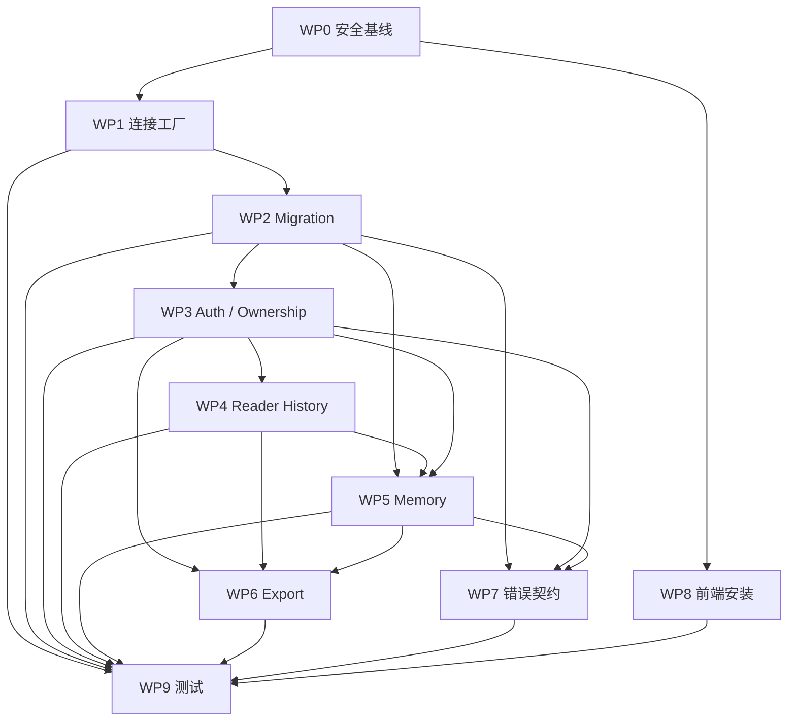

# PaperGraph 第一阶段基础升级与 P0 修复执行指导

> 文档状态：`HISTORICAL_COMPLETED_PLAN`
>
> 历史说明：本文保留第一阶段实施时的目标、步骤和验收契约，不再代表项目当前状态。第一阶段已于 2026-07-27 完成；当前事实以 [CURRENT_STATE.md](./CURRENT_STATE.md)、[ARCHITECTURE.md](./ARCHITECTURE.md) 和 [ENVIRONMENT.md](./ENVIRONMENT.md) 为准。
>
> 适用范围：回溯第一阶段基础修复
>
> 历史结果：[第一阶段完成报告](./PHASE_1_COMPLETION_REPORT.md) · [第一阶段验收报告](./PHASE_1_ACCEPTANCE_REPORT.md)

## 1. 阶段目标

第一阶段不追求增加新技术，而是让 PaperGraph 具备可信的基础运行条件。

本阶段完成后必须能够稳定执行：

```text
从完全空的数据目录启动
→ 完成数据库初始化
→ 注册并登录
→ 保存一篇论文
→ 创建并读取论文阅读会话
→ 用户点击“总结本次阅读”
→ 生成 Memory 草稿
→ 用户确认并写入
→ 重启服务
→ 再次召回 Memory
→ 删除 Memory
→ 导出当前用户数据
```

### 1.1 第一性原理

本阶段所有设计从以下不变量出发：

1. **先有一致的数据模型，才有上层能力。**
2. **数据库中的每条用户数据必须有明确 owner。**
3. **同一概念只能有一套正式持久化模型。**
4. **LLM 可以生成候选内容，但不能决定权限和正式作用域。**
5. **失败必须可见，不能用空列表或普通提示伪装成功。**
6. **Fresh DB 和 Legacy DB 都必须通过测试。**
7. **所有迁移必须幂等、可验证、可恢复。**
8. **先修最短闭环，再增加高级自动化。**

### 1.2 本阶段非目标

本阶段明确不实施：

- PDF Chunk Embedding；
- 向量检索；
- Reranker；
- GraphRAG；
- 自动每轮写长期 Memory；
- LLM 自主判断 paper/user scope；
- 新增 Agent；
- 分布式任务系统；
- 独立向量数据库；
- 大规模目录重构；
- 全面 UI 重做。

这些内容只有在本阶段出口门槛全部通过后才能进入下一阶段。

## 2. 当前 P0 根因

### 2.1 数据库没有唯一 schema 所有者

当前 schema 分散在：

- `backend/app/core/storage.py`
- `backend/app/services/auth/user_service.py`
- `backend/app/services/memory/sqlite_document_store_compat.py`
- `backend/app/services/reader/paper_reader_history.py`
- `backend/app/services/reader/paper_reader_context.py`
- `backend/app/services/reader/reader_opening_cache.py`
- `backend/app/services/graph/kg_relations.py`
- daily、feedback 和 reading_log 等 Service

结果是：

- 新数据库和旧数据库字段不同；
- 启动顺序会改变最终 schema；
- `CREATE TABLE IF NOT EXISTS` 被错误当作兼容迁移；
- 表存在不代表字段满足当前代码；
- Service 首次调用可能临时改变数据库。

### 2.2 Memory 的抽象和数据库同时分裂

代码层存在：

- `MemoryStore`
- `AgentMemory`
- `SQLiteDocumentStore`

数据库层存在：

- 新式 `memories(metadata, created_at, updated_at)`
- 旧式 `memories(properties, timestamp, memory_id, user_id FK)`
- 遗留 `agent_memory`

调用层又分别使用：

- Paper Reader → `MemoryStore`
- Agent 共享记忆 → `AgentMemory`
- Memory API → 主要面向 `AgentMemory`
- Export → 查询另一种旧 `agent_memory` schema

因此不能通过修复某一条 SQL 得到稳定系统，必须统一模型。

### 2.3 用户作用域只存在于部分路由

当前问题包括：

- 旧 `users` 表不是认证用户表；
- 新 Auth 代码假定 `username/password_hash` 已存在；
- `papers` 模型和主表没有可靠 user_id；
- 阅读历史写入不带 user_id，读取却按 user_id 查询；
- 部分论文 get/update/delete 没有用户条件；
- 无效 Token 会降级为 default 用户。

### 2.4 测试没有覆盖首次调用

当前测试以纯函数和局部模块为主。测试通过不能证明：

- 空目录能启动；
- 旧数据库能迁移；
- Memory 能写入；
- 用户能隔离；
- history/export 能首次调用；
- 重启后数据仍存在。

## 3. 本阶段设计决策

这些决策在第一阶段作为默认实现，不再保留多套并行方案。

### 3.1 使用版本化迁移作为唯一 schema 入口

建议新增：

```text
backend/app/infrastructure/db/
├─ __init__.py
├─ connection.py
├─ migration_runner.py
├─ schema_validator.py
└─ migrations/
   ├─ __init__.py
   ├─ v001_baseline.py
   ├─ v002_auth_and_ownership.py
   ├─ v003_reader_history.py
   └─ v004_memory.py
```

迁移完成后：

- 正式表不再由 Service 懒创建；
- `PaperDatabase._init_database()` 不再独立维护另一套版本；
- 历史 `user_migration.py` 已由迁移 Runner 替代并删除；
- Service 的 `ensure_tables()` 只允许做断言，不能在请求期间改变正式 schema。

### 3.2 新建 `auth_users`，不复用旧 `users`

仓库现有 `users` 表语义与认证表冲突。第一阶段推荐新建 `auth_users`，避免对旧表做含义不清的原地改造。

所有新的用户外键统一指向：

```text
auth_users.id
```

旧 `users` 表在确认无现行业务依赖前保留，不再由 Auth 代码访问。

### 3.3 一个 Memory Repository

第一阶段只保留一个正式接口：

```text
MemoryRepository
```

旧 `MemoryStore` 和 `AgentMemory` 不再分别直接操作数据库。迁移期可以通过适配器调用 `MemoryRepository`，但不得继续各自定义字段和 scope。

### 3.4 使用用户触发的 Memory 总结

第一阶段 Memory 写入机制：

```text
Draft
→ Review
→ Commit
```

不再在每轮 Paper Reader 回答后自动写长期 Memory。

### 3.5 第一阶段仍使用 SQLite

SQLite 足以支持当前开发和演示规模，但连接必须统一设置：

```sql
PRAGMA foreign_keys = ON;
PRAGMA journal_mode = WAL;
PRAGMA busy_timeout = 5000;
```

事务应保持短小。网络、LLM、PDF 解析不能在数据库事务中执行。

## 4. 目标数据模型

以下是第一阶段 canonical schema。具体 SQL 可在实施时根据 SQLite 版本调整，但字段语义不得再出现多套定义。

### 4.1 `schema_migrations`

```sql
CREATE TABLE schema_migrations (
    version INTEGER PRIMARY KEY,
    name TEXT NOT NULL,
    checksum TEXT NOT NULL,
    applied_at INTEGER NOT NULL
);
```

要求：

- 每个迁移只成功记录一次；
- 文件内容变化时 checksum 不一致必须报错；
- 迁移失败不得写 applied 记录；
- 不再同时依赖多套 `PRAGMA user_version` 逻辑。

### 4.2 `auth_users`

```sql
CREATE TABLE auth_users (
    id INTEGER PRIMARY KEY AUTOINCREMENT,
    username TEXT NOT NULL UNIQUE,
    password_hash TEXT NOT NULL,
    status TEXT NOT NULL DEFAULT 'active',
    created_at INTEGER NOT NULL,
    updated_at INTEGER NOT NULL
);
```

要求：

- 不提供固定 `default/default` 生产账户；
- 密码只保存强哈希；
- JWT Secret 必须来自配置；
- `status != active` 的用户不能获取新 Token。

### 4.3 `papers`

第一阶段在现有字段基础上增加：

```sql
user_id INTEGER NOT NULL REFERENCES auth_users(id)
```

索引：

```sql
CREATE INDEX idx_papers_user_created
ON papers(user_id, created_at DESC);
```

唯一约束需要考虑用户作用域。不能继续使用全局唯一 DOI/arXiv ID 阻止不同用户分别保存同一论文。

推荐逐步改为：

```text
UNIQUE(user_id, doi)
UNIQUE(user_id, arxiv_id)
```

SQLite 无法直接修改已有 unique 定义时，应通过新表复制迁移完成。

### 4.4 `reader_conversations`

```sql
CREATE TABLE reader_conversations (
    id TEXT PRIMARY KEY,
    user_id INTEGER NOT NULL REFERENCES auth_users(id),
    paper_id INTEGER NOT NULL REFERENCES papers(id),
    title TEXT,
    created_at INTEGER NOT NULL,
    updated_at INTEGER NOT NULL
);
```

### 4.5 `paper_reader_turns`

```sql
CREATE TABLE paper_reader_turns (
    id INTEGER PRIMARY KEY AUTOINCREMENT,
    user_id INTEGER NOT NULL REFERENCES auth_users(id),
    paper_id INTEGER NOT NULL REFERENCES papers(id),
    conversation_id TEXT NOT NULL REFERENCES reader_conversations(id),
    role TEXT NOT NULL CHECK(role IN ('user', 'assistant', 'tool')),
    content TEXT NOT NULL,
    metadata_json TEXT NOT NULL DEFAULT '{}',
    created_at INTEGER NOT NULL
);
```

索引：

```sql
CREATE INDEX idx_reader_turns_scope
ON paper_reader_turns(user_id, paper_id, conversation_id, id);
```

### 4.6 `memory_drafts`

```sql
CREATE TABLE memory_drafts (
    id TEXT PRIMARY KEY,
    user_id INTEGER NOT NULL REFERENCES auth_users(id),
    paper_id INTEGER NOT NULL REFERENCES papers(id),
    conversation_id TEXT NOT NULL REFERENCES reader_conversations(id),
    from_turn_id INTEGER NOT NULL,
    to_turn_id INTEGER NOT NULL,
    status TEXT NOT NULL CHECK(status IN ('draft', 'committed', 'cancelled', 'expired')),
    payload_json TEXT NOT NULL,
    source_snapshot_hash TEXT NOT NULL,
    llm_model TEXT,
    created_at INTEGER NOT NULL,
    updated_at INTEGER NOT NULL,
    committed_at INTEGER
);
```

草稿持久化的原因：

- 支持用户审核；
- 服务重启后仍可确认；
- 保证幂等提交；
- 记录总结使用的对话快照；
- 避免草稿与后续新消息混淆。

### 4.7 `memories`

```sql
CREATE TABLE memories (
    id TEXT PRIMARY KEY,
    user_id INTEGER NOT NULL REFERENCES auth_users(id),
    scope_type TEXT NOT NULL CHECK(scope_type IN ('paper', 'conversation', 'user')),
    scope_id TEXT NOT NULL,
    kind TEXT NOT NULL,
    content TEXT NOT NULL,
    content_hash TEXT NOT NULL,
    source_type TEXT NOT NULL,
    source_id TEXT,
    source_turn_from INTEGER,
    source_turn_to INTEGER,
    confirmed_by_user INTEGER NOT NULL DEFAULT 0,
    status TEXT NOT NULL DEFAULT 'active'
        CHECK(status IN ('active', 'superseded', 'deleted')),
    metadata_json TEXT NOT NULL DEFAULT '{}',
    created_at INTEGER NOT NULL,
    updated_at INTEGER NOT NULL
);
```

索引与去重约束：

```sql
CREATE INDEX idx_memories_scope
ON memories(user_id, scope_type, scope_id, kind, status, updated_at DESC);

CREATE UNIQUE INDEX idx_memories_active_content
ON memories(user_id, scope_type, scope_id, kind, content_hash)
WHERE status = 'active';
```

第一阶段 Memory 不需要：

- embedding；
- importance 自动衰减；
- LLM 自动合并；
- 自动压缩；
- 自动跨 Agent 共享。

## 5. 目标接口

### 5.1 数据库连接

```python
class Database:
    def connect(self) -> sqlite3.Connection: ...
    def transaction(self) -> ContextManager[sqlite3.Connection]: ...
    def query_one(self, sql: str, params: tuple = ()) -> Row | None: ...
    def query_all(self, sql: str, params: tuple = ()) -> list[Row]: ...
```

连接工厂负责：

- 创建父目录；
- `foreign_keys=ON`；
- WAL；
- busy_timeout；
- row_factory；
- commit/rollback；
- 关闭连接。

### 5.2 Paper Repository

```python
add_papers(user_id: int, papers: list[PaperCreate]) -> AddPapersResult
get_by_id(user_id: int, paper_id: int) -> Paper | None
list_library(user_id: int, query: LibraryQuery) -> list[Paper]
update(user_id: int, paper_id: int, patch: PaperPatch) -> Paper
delete(user_id: int, paper_id: int) -> bool
```

不允许存在不带 `user_id` 的公开 Repository 方法。

### 5.3 Conversation Repository

```python
create_conversation(user_id, paper_id, title=None)
append_turn(user_id, paper_id, conversation_id, role, content, metadata)
list_turns(user_id, paper_id, conversation_id, limit)
```

### 5.4 Memory Repository

```python
create_draft(...)
get_draft(user_id, draft_id)
commit_draft(user_id, draft_id, accepted_items, idempotency_key)
list_memories(user_id, scope_type, scope_id, kinds=None)
get_memory(user_id, memory_id)
delete_memory(user_id, memory_id)
```

Repository 不调用 LLM。LLM 总结属于 `MemoryDraftService`。

## 6. Memory Draft 输出契约

LLM 必须返回结构化对象：

```json
{
  "paper_summary": "本次阅读形成的简明总结",
  "key_findings": [
    {
      "content": "关键发现",
      "evidence_turn_ids": [10, 12]
    }
  ],
  "open_questions": [
    {
      "content": "尚未解决的问题",
      "evidence_turn_ids": [15]
    }
  ],
  "research_decisions": [],
  "user_memory_candidates": [
    {
      "content": "候选长期偏好",
      "kind": "preference",
      "evidence_turn_ids": [8],
      "confidence": 0.85
    }
  ]
}
```

服务端规则：

- `paper_summary`、findings、questions 默认属于当前 paper；
- `user_memory_candidates` 只有用户额外勾选后才能进入 user scope；
- LLM 返回的 `user_id/paper_id/scope_id` 一律忽略；
- evidence_turn_ids 必须属于当前用户、论文、会话和快照范围；
- 内容长度、数量和 JSON schema 必须验证；
- LLM 输出无效时返回草稿生成失败，不写正式 Memory。

## 7. API 目标

### 7.1 创建草稿

```http
POST /api/papers/{paper_id}/memory-drafts
Authorization: Bearer ...
```

请求：

```json
{
  "conversation_id": "conv-123",
  "from_turn_id": 10,
  "to_turn_id": 30
}
```

行为：

1. 从 Token 获取 user_id；
2. 验证 paper 属于 user；
3. 验证 conversation 属于 user + paper；
4. 冻结 turn 范围并计算 snapshot hash；
5. 在事务外调用 LLM；
6. 验证结构化结果；
7. 保存 `memory_drafts(status=draft)`；
8. 返回草稿，不写 `memories`。

### 7.2 提交草稿

```http
POST /api/memory-drafts/{draft_id}/commit
Idempotency-Key: ...
```

请求：

```json
{
  "paper_items": [
    {
      "kind": "reading_summary",
      "content": "用户审核后的总结"
    }
  ],
  "accepted_user_items": []
}
```

行为：

1. 校验草稿属于当前用户；
2. 校验草稿状态为 draft，或已经由同一幂等键提交；
3. 服务端确定 paper/user scope；
4. 计算标准化内容 hash；
5. 在一个事务中写 Memory 并更新 draft 状态；
6. 重复提交返回第一次提交结果；
7. 不允许客户端修改 draft 的 source turn 范围。

### 7.3 查询和删除

```http
GET /api/papers/{paper_id}/memories
DELETE /api/memories/{memory_id}
```

删除第一阶段可采用软删除：

```text
status = deleted
```

查询默认只返回 active。

## 8. 执行工作包

## WP0：建立安全基线

### 目标

确保实施过程中可以对比、回滚和复现。

### 步骤

1. 确认 Git 工作区无未知修改。
2. 记录当前 Python、Node、npm 和 SQLite 版本。
3. 记录当前测试、导入、前端 build/typecheck 结果。
4. 对 `backend/data/papers.db` 做文件级备份，仅用于迁移测试。
5. 创建旧数据库测试 fixture，不直接在仓库数据库上开发迁移。
6. 记录现有所有表、字段、索引、外键、trigger 和 `user_version`。

### 产物

```text
backend/tests/fixtures/legacy_schema_*.sql
docs/baselines/phase1_prechange.md
```

测试 fixture 应使用脱敏结构和最少虚拟数据，不提交真实用户内容。

### 验收

- 能从 fixture 构造旧数据库；
- 基线命令和结果可重复；
- 仓库原始数据库未被测试修改。

### 回滚

本工作包只增加测试资料和文档，可直接通过 Git 恢复。

## WP1：统一连接工厂

### 目标

所有数据库访问获得相同的 SQLite 行为。

### 修改范围

新增：

```text
backend/app/infrastructure/db/connection.py
```

逐步替换：

- `core/storage.py`
- `utils/common.py`
- reader/history/cache
- memory
- auth
- graph
- daily/feedback

### 实施步骤

1. 连接前创建 `db_path` 父目录。
2. 设置 `row_factory=sqlite3.Row`。
3. 设置 `foreign_keys=ON`。
4. 设置 `journal_mode=WAL`。
5. 设置 `busy_timeout=5000`。
6. 提供读连接和短事务上下文。
7. 事务异常时 rollback 并重新抛出。
8. 禁止事务内部执行 LLM、HTTP 和 PDF 解析。

### 测试

- 父目录不存在时能创建；
- 外键约束生效；
- 异常会 rollback；
- 两个连接短时并发写有明确等待或错误；
- 连接关闭后无未提交数据。

### 回滚

保留现有调用适配器，按模块逐步切换，不一次性删除旧连接代码。

## WP2：实现 Migration Runner

### 目标

从 fresh DB 和 legacy DB 都能得到同一个目标 schema。

### 修改范围

新增：

```text
backend/app/infrastructure/db/migration_runner.py
backend/app/infrastructure/db/schema_validator.py
backend/app/infrastructure/db/migrations/*
```

修改：

```text
backend/app/api/main.py
backend/app/core/storage.py
```

已删除/禁止：

```text
历史 backend/app/services/auth/user_migration.py
各 Service 的正式表 ensure_tables()
```

### 启动顺序

```text
加载配置
→ 创建 data/download 目录
→ 打开数据库
→ 获取 migration lock
→ 运行 migrations
→ 校验 schema
→ 初始化只读 Service
→ 启动后台任务
→ 接受请求
```

### Fresh DB 步骤

1. 创建 `schema_migrations`。
2. 执行 baseline tables。
3. 执行 auth/ownership。
4. 执行 reader history。
5. 执行 memory。
6. 建立索引和 trigger。
7. 运行 schema validator。

### Legacy DB 步骤

每个旧表先检测实际字段，不按版本号猜测：

```text
PRAGMA table_info(table)
PRAGMA foreign_key_list(table)
SELECT sql FROM sqlite_master
```

对不兼容表使用：

```text
创建 new_table
→ 显式字段映射复制
→ 校验行数和关键字段
→ 原表重命名为 backup name
→ new_table 重命名为正式表
→ 重建索引和 trigger
→ 提交事务
```

迁移成功前不删除旧表数据。正式发布前通过文件级备份提供恢复路径。

### 必须处理的旧差异

- `users` 不是认证用户表；
- `papers` 没有 user_id；
- `paper_reader_turns` 没有 user_id/conversation_id；
- `memories` 的 id、memory_id、properties、metadata、timestamp 不一致；
- `agent_memory` 为遗留表；
- `paper_authors` 使用 `author_order`；
- 当前 `user_version=2` 不代表全部 Service schema 已满足。

### Schema Validator

启动时至少验证：

- 关键表存在；
- 必需字段存在；
- 字段 NOT NULL 和外键符合预期；
- 必需索引存在；
- migration checksum 一致；
- 不存在只迁移了一半的临时表。

### 验收

- 空路径启动成功；
- 旧 fixture 迁移成功；
- 重复运行不产生变化；
- 迁移中途注入异常后数据库可恢复；
- schema validator 能识别故意缺失字段；
- 启动不会把迁移失败记录成 warning 后继续运行。

## WP3：认证和所有权

### 目标

所有核心用户数据都有真实作用域。

### 修改范围

- `services/auth/user_service.py`
- `api/deps.py`
- `api/routes/auth.py`
- `api/routes/papers.py`
- `core/paper.py`
- `core/storage.py` 或新的 PaperRepository
- reader、memory、export

### 实施步骤

1. Auth 改用 `auth_users`。
2. 删除路径派生 JWT Secret fallback；未配置时开发环境明确警告，生产模式拒绝启动。
3. 无效 Token 返回 401，不降级 default 用户。
4. Paper domain model 增加 `user_id`。
5. 所有论文 Repository 方法显式要求 user_id。
6. save/get/update/delete/pdf/history/export 都校验 owner。
7. Legacy papers 迁移给明确的 legacy owner。
8. 为未来单用户演示保留显式配置，而不是隐式认证绕过。

### 安全不变量

```text
客户端提供的 user_id 永不可信
Token user_id 是作用域来源
paper_id 只能在 user_id 下解析
conversation_id 只能在 user + paper 下解析
memory_id 只能在 user_id 下解析
```

### 测试

- 用户 A/B 各保存同一 DOI，互不影响；
- A 不能 get/update/delete B 的论文；
- A 不能读取 B 的 PDF、history、Memory、export；
- 无效 Token 为 401；
- disabled 用户不能登录；
- Legacy 数据只属于迁移 owner。

## WP4：统一 Reader History

### 目标

阅读历史能够正确写入、读取和提供 Memory 快照。

### 修改范围

- `services/reader/paper_reader_history.py`
- `services/reader/paper_reader_service.py`
- reader API route 和 schema

### 实施步骤

1. 新建 conversation 时绑定 user + paper。
2. `append_turn()` 必须接收 user_id、paper_id、conversation_id。
3. 读写都使用同一 scope。
4. opening message 也写入同一个 conversation。
5. metadata 使用统一 JSON 字段名。
6. 对话排序优先用递增 id，而不是只依赖秒级 timestamp。
7. MemoryDraft 只能选择同一 conversation 中的 turn 范围。

### 测试

- append/list round-trip；
- 两个 conversation 隔离；
- 两个用户隔离；
- opening 不重复；
- 同一秒多条消息顺序稳定；
- 非法 turn 范围被拒绝。

## WP5：重建 Memory

### 目标

删除当前“表面可用、实际失败”的 Memory 链路。

### 修改范围

新增建议：

```text
backend/app/domain/memory.py
backend/app/repositories/memory_repository.py
backend/app/services/memory/memory_draft_service.py
backend/app/api/routes/memory.py
backend/app/api/schemas/memory.py
```

迁移/废弃：

```text
services/memory/memory_store.py
services/memory/agent_memory.py
services/memory/sqlite_document_store_compat.py
```

第一阶段可以保留旧文件作为短期适配层，但适配层只能调用新 Repository，不得继续执行旧 SQL。

### 实施步骤

1. 创建 canonical `memory_drafts` 和 `memories`。
2. 实现纯数据库 MemoryRepository。
3. 实现 MemoryDraftService：
   - 读取对话快照；
   - 构造有限上下文；
   - 调用 LLM；
   - 验证结构；
   - 保存草稿。
4. 实现 Commit Service：
   - 校验 owner；
   - 校验 draft status；
   - 服务端确定 scope；
   - 标准化内容；
   - content hash 去重；
   - 事务写入；
   - 幂等返回。
5. Paper Reader 移除每轮自动 `store.add()`。
6. Reader 上下文只读取当前用户、当前论文已确认 Memory。
7. 前端增加“总结本次阅读”按钮和草稿审核弹窗。
8. 提供查询、软删除接口。
9. Export 只导出当前用户已确认 Memory。

### 内容标准化

hash 前建议：

- Unicode 标准化；
- 去除首尾空白；
- 连续空白折叠；
- 保留中文标点语义；
- 不做激进 lowercase 或分词替换。

### 测试

- 创建草稿不写正式 Memory；
- Commit 后可查询；
- 用户取消不写入；
- 重复幂等提交只产生一条；
- 相同内容 hash 去重；
- 不同 paper 不串线；
- 不同 user 不串线；
- 非当前快照的 evidence turn 被拒绝；
- 删除后默认查询不可见；
- LLM JSON 无效时无正式写入；
- 服务重启后 draft 和 Memory 保留。

## WP6：修复 Export

### 目标

导出结果与数据库事实一致，并严格按用户过滤。

### 修改范围

- `api/routes/export.py`
- Paper/Conversation/Memory repositories

### 实施步骤

1. 所有查询使用显式字段。
2. 使用 `sqlite3.Row` 转 dict。
3. 作者排序使用 `author_order`。
4. 不再查询旧 `agent_memory`。
5. 导出 paper、conversation、turn、memory、feedback 时均带 user_id。
6. 对不存在的可选表使用 schema version 判断，不用宽泛异常返回空。
7. 导出 metadata 中包含 schema version 和 generated_at。

### 测试

- 空库导出；
- 一篇论文完整导出；
- 作者顺序正确；
- Memory 内容正确；
- 两用户导出隔离；
- JSON schema 快照；
- 导出后可被最小 importer 解析。

## WP7：消除核心静默失败

### 目标

核心数据操作失败时，API 和日志都能明确表达。

### 第一阶段重点清理

- Memory 写入/读取；
- Migration；
- Auth；
- Reader History；
- Export；
- Paper save/get/update/delete。

### 实施步骤

1. 定义领域错误：
   - `MigrationError`
   - `AuthenticationError`
   - `OwnershipError`
   - `MemoryDraftError`
   - `MemoryCommitError`
   - `RepositoryError`
2. 路由将领域错误映射到稳定 HTTP 状态和 error_code。
3. 日志包含 request_id、user_id、operation。
4. 不在响应中泄露原始 SQL 和内部路径。
5. 不允许核心操作失败后返回 `success=True`。

### 验收

- 故意删除字段后启动失败且说明 schema 问题；
- Memory 写失败返回结构化 5xx；
- 非 owner 返回 404 或 403，策略统一；
- 日志可用 request_id 追踪同一请求。

## WP8：修复前端首次安装和类型门禁

### 目标

标准开发流程在 Windows 和 Docker 可复现。

### 修改范围

- `frontend/package.json`
- 新增 `frontend/scripts/copy-pdfjs.mjs`
- Vue/KaTeX/Vite 类型声明
- `useSearchConversations.ts`
- `config/ports.ts`

### 实施步骤

1. 用 Node `fs.rm/fs.mkdir/fs.cp` 替换 Unix shell postinstall。
2. 增加 `vue-tsc` 和必要类型依赖。
3. 增加：

```json
"typecheck": "vue-tsc --noEmit"
```

4. 修复现有 `UnwrapRef`、`ImportMetaEnv.DEV`、`.vue` module、KaTeX 类型错误。
5. 将 build 设为 typecheck 后再 Vite build。
6. Memory API 使用统一前端 client，并带 Authorization。

### 验收

Windows：

```powershell
npm ci
npm run typecheck
npm run build
```

Docker：

```text
docker compose build
docker compose up
```

均成功。

## WP9：建立第一阶段测试金字塔

### 单元测试

- 内容标准化和 hash；
- MemoryDraft schema；
- JWT encode/decode；
- scope 校验；
- migration detector；
- error mapping。

### Repository 集成测试

- Paper CRUD；
- Conversation/Turn；
- Memory Draft/Commit/Delete；
- Export；
- foreign key 和 transaction rollback。

### Migration 测试

- fresh empty path；
- empty existing SQLite file；
- 当前 legacy fixture；
- 中途失败；
- 重复迁移；
- checksum 冲突。

### API Smoke 测试

完整流程：

```text
创建 temp data dir
→ TestClient startup
→ register/login
→ save paper
→ create conversation
→ append turns
→ mock LLM generate draft
→ commit draft
→ query memory
→ restart app
→ query memory
→ export
→ delete memory
```

### 多用户隔离测试

所有资源至少包含：

```text
owner success
other user read denied
other user write denied
invalid token denied
```

### 测试原则

- LLM 使用固定 mock，不依赖外部 API；
- 外部网络测试单独标记 integration/external；
- 测试不访问仓库真实数据库；
- 每个测试从独立临时目录开始；
- 不依赖执行顺序。

## 9. 最小 Critical P1 收尾

P0 闭环通过后，在第一阶段结束前处理以下关键 P1。

### 9.1 Agent 可变状态

将 PaperAnalysisAgent 的推荐 offset 移出单例，至少放入：

```text
user_id + conversation_id + paper_id
```

作用域的会话状态。Agent 本身只保留只读配置、工具定义和 LLM client。

### 9.2 真实网络超时

不要依赖当前 ThreadPoolExecutor timeout 终止函数。第一阶段至少做到：

- LLM client 配置 connect/read timeout；
- httpx/requests 所有调用有显式 timeout；
- API wall timeout 到达时返回明确错误；
- 日志记录实际耗时；
- 不再声称线程任务已经被取消。

持久化 Worker 留到后续阶段。

### 9.3 SSE 认证

前端原生 fetch 必须显式带 Bearer Token。后端认证策略与普通 API 一致。

### 9.4 Web/PDF 来源标记

Tavily 结果不得继续标记为 PDF 正文。第一阶段即使尚未实现 Chunk RAG，也必须在上下文中明确：

```text
source_type = web
```

并禁止用 Web 内容生成 PDF 页码引用。

## 10. 实施顺序和依赖



推荐提交粒度：

1. Baseline tests/fixtures；
2. Connection factory；
3. Migration runner + fresh DB；
4. Legacy migration；
5. Auth users + ownership；
6. Reader conversations/history；
7. Memory repository；
8. Memory draft/commit API；
9. Memory UI；
10. Export；
11. Error contract；
12. Windows install/typecheck；
13. Full smoke suite。

不要把全部第一阶段改动放入一个提交。

## 11. 每个工作包的完成定义

任何工作包只有同时满足以下条件才算完成：

- 代码路径不再依赖旧契约；
- 有正常路径测试；
- 有至少一个失败路径测试；
- 有用户/论文作用域测试；
- 有迁移或兼容说明；
- 有日志和错误码；
- 类型检查没有新增错误；
- Git diff 不包含无关改动；
- 文档状态已更新。

## 12. 第一阶段统一验证命令

实施时应提供等价的可重复命令。建议最终形成：

### 后端

```powershell
cd backend
.\.venv\Scripts\python.exe -m pip check
.\.venv\Scripts\python.exe -m pytest tests -q
.\.venv\Scripts\python.exe -m compileall -q app tests
.\.venv\Scripts\python.exe -m mypy `
  app/infrastructure app/domain app/repositories `
  app/services/memory/memory_draft_service.py `
  app/services/reader/paper_reader_history.py `
  app/services/auth/user_service.py `
  --ignore-missing-imports --follow-imports=skip --no-error-summary
```

第一阶段只要求本阶段修改的核心边界通过 mypy；全量 `mypy app` 的既有
问题作为后续独立工作包清理，不能用它掩盖本阶段回归测试结果。

### Fresh DB Smoke

```powershell
$env:DATA_DIR = "<temporary-empty-directory>"
.\.venv\Scripts\python.exe -m pytest tests/test_phase1_api_integration.py -q
```

测试代码必须创建和清理自己的临时目录，不应要求开发者手工删除真实数据。

### 前端

```powershell
cd frontend
npm ci
npm run typecheck
npm run build
```

### Docker

```powershell
docker compose build
docker compose up -d
docker compose ps
```

需要额外执行 health、登录和最小 API smoke，而不能只看容器 running。

## 13. 第一阶段出口门槛

以下条件必须全部满足：

### 数据库

- [ ] 完全空目录可以启动；
- [ ] Migration 重复执行无变化；
- [ ] Legacy fixture 可以迁移；
- [ ] 启动时 schema validator 通过；
- [ ] 迁移失败时服务拒绝启动；
- [ ] SQLite WAL、foreign_keys、busy_timeout 生效。

### 用户和论文

- [ ] Auth 使用 canonical 表；
- [ ] 无效 Token 返回 401；
- [ ] Paper CRUD 全部使用 owner；
- [ ] 两用户可以分别保存同一论文；
- [ ] 两用户不能互访资源。

### 阅读历史

- [ ] Conversation 和 turn 均绑定 user + paper；
- [ ] History round-trip 通过；
- [ ] opening 不重复；
- [ ] turn 顺序稳定；
- [ ] 其他用户无法读取。

### Memory

- [ ] 不再每轮自动写长期 Memory；
- [ ] 点击按钮可生成草稿；
- [ ] 草稿不会直接写正式 Memory；
- [ ] 用户可编辑和确认；
- [ ] Commit 幂等；
- [ ] 重启后可召回；
- [ ] 可删除；
- [ ] paper/user scope 不串线；
- [ ] 旧 Memory 代码不再直接执行 SQL。

### Export

- [ ] 导出字段和值对应正确；
- [ ] 作者顺序正确；
- [ ] 包含已确认 Memory；
- [ ] 严格按用户过滤；
- [ ] 空库和普通库均可导出。

### 工程

- [ ] Windows `npm ci` 成功；
- [ ] 前端 typecheck/build 成功；
- [ ] 后端测试全部通过；
- [ ] Fresh DB API smoke 通过；
- [ ] Legacy migration 测试通过；
- [ ] Git 工作区不包含临时数据库、日志和构建产物。

## 14. 回滚与数据安全

### 14.1 开发期间

- 永远在临时数据库或旧库副本上测试迁移；
- 不直接修改仓库中的真实 `papers.db`；
- 每个迁移工作包使用独立 Git 提交；
- 迁移失败时保留原数据库文件。

### 14.2 正式迁移

迁移前：

1. 停止写入；
2. SQLite checkpoint；
3. 复制 DB、WAL、SHM；
4. 计算备份 hash；
5. 在副本上预演；
6. 记录当前 schema；
7. 执行迁移；
8. 运行 schema validator 和 smoke；
9. 成功后再恢复服务。

### 14.3 回滚条件

出现以下任一情况立即回滚：

- 行数校验不一致；
- owner 无法确定；
- 外键校验失败；
- schema validator 失败；
- 核心 smoke 失败；
- 导出结果字段错位；
- Memory scope 测试失败。

## 15. 阶段风险和预防

### 风险 1：为了兼容保留两套 Memory

预防：旧接口只能适配到新 Repository，禁止保留第二套 SQL。

### 风险 2：迁移旧数据时错误分配用户

预防：所有 legacy 数据只迁移给明确的 legacy owner；不根据内容猜用户。

### 风险 3：P0 修复扩大成全面重构

预防：第一阶段只调整数据和基础调用链；RAG、Graph、搜索效果不在本阶段重写。

### 风险 4：Memory 草稿仍然被 LLM 越权分类

预防：scope 完全由 API 路由和用户勾选决定；忽略模型返回的 scope/user/paper。

### 风险 5：测试通过但仍依赖开发机状态

预防：每个集成测试使用全新临时目录；CI 不读取仓库 `papers.db` 和本地 `.env`。

## 16. 第一阶段完成后的系统状态

完成后系统仍然不是最终 RAG，但它应当成为一个可靠的 Agent 基础平台：

```text
统一数据库
+ 明确用户所有权
+ 稳定阅读历史
+ 用户可控 Memory
+ 可验证导出
+ 首次调用测试
+ 跨平台开发基线
```

届时第二阶段可以安全增加：

```text
DocumentChunk
→ BM25
→ Embedding
→ Hybrid Recall
→ Reranker
→ Dynamic Context Builder
→ Citation Validator
```

而不必在加入向量检索后再次返工用户、会话和 Memory 数据模型。

## 17. 开工前最终检查

开始修改代码前，开发者应能明确回答：

1. Fresh DB 的唯一初始化入口在哪里？
2. 当前 migration version 如何判断？
3. 旧 `users` 和新 `auth_users` 如何处理？
4. Legacy papers 归属哪个 owner？
5. `paper_id` 是否始终在 user_id 下解析？
6. Memory scope 由谁决定？
7. Draft 和正式 Memory 的边界是什么？
8. 重复 Commit 如何保证幂等？
9. Migration 失败如何恢复？
10. 哪个测试能够证明整个基础闭环成功？

如果其中任何问题仍存在两种并行答案，应先补充 ADR 或阶段决策，再开始对应工作包。
