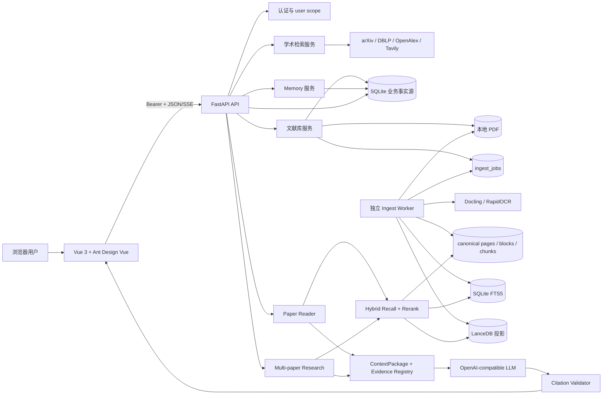

# PaperGraph 项目知识库索引

## 项目一句话介绍

PaperGraph 是面向个人科研阅读的全栈学术文献系统，把多源论文检索、文献库、PDF canonical 入库、证据约束的单篇/多篇 RAG 阅读、可确认 Memory、知识图谱和可移植导出连接成一条可审计链路。

## 口径

本知识库只描述 active document version 驱动的 canonical 链路。待删除的兼容代码不进入架构图、请求流、RAG 流程或能力说明，只在 `61_LIMITATIONS_TECH_DEBT.md` 和 `99_UNCONFIRMED_QUESTIONS.md` 标记清理边界。

## 项目核心能力

| 核心能力 | 作用 | 实现状态 | 对应文件 |
|---|---|---|---|
| 学术检索 | LLM 解析检索意图，多源召回、去重、过滤、精排与 SSE 进度 | 已实现；外部源依赖网络与配置 | `11_FEATURE_ACADEMIC_SEARCH.md` |
| 文献库 | 用户隔离的论文保存、分类、PDF 下载、筛选、阅读时长与导出 | 已实现 | `12_FEATURE_PAPER_LIBRARY.md` |
| canonical PDF Ingest | PDF 原子落盘、持久化队列、Docling 解析、质量门、层次 Chunk、Embedding | 已实现；业务库尚未回填 canonical 数据 | `13_FEATURE_CANONICAL_PDF_INGEST.md` |
| 单篇 Reader | Hybrid Recall、Evidence Expansion、ContextPackage、工具回流与 `[E#]` 校验 | 代码与隔离 E2E 已实现；业务论文/标准浏览器验收未完成 | `14_FEATURE_PAPER_READER.md` |
| 多论文研究 | 固定 session scope 内跨论文召回、anchor 均衡和跨论文引用校验 | 临时 SQLite 回归已实现；业务/Golden/浏览器验收未完成 | `15_FEATURE_MULTI_PAPER_RESEARCH.md` |
| 可确认 Memory | LLM 生成草稿，用户筛选/编辑后幂等提交，检索时硬作用域过滤 | 已实现；dense Memory 未实现 | `22_MEMORY_SYSTEM.md` |
| Daily、Graph、Export | 个性化推荐、文献关系可视化、用户作用域 JSON/BibTeX/PNG 导出 | 已实现；图谱为 SQLite 派生关系，不是 GraphRAG | `16_FEATURE_DAILY_GRAPH_EXPORT.md` |
| MCP 搜索适配 | 可选 arXiv MCP source adapter | 代码存在、默认关闭、依赖与运行验收不完整 | `25_MCP_INTEGRATION.md` |

## 总体架构图



## 模块关系

| 上游 | 下游 | 传递内容 | 不变量 |
|---|---|---|---|
| SearchAgent | ResolvedSearchPlan | 结构化 query、来源、年份、venue、排序策略 | 检索层不再调用 LLM 改写权限范围 |
| Paper Library | ingest_jobs | `user_id + paper_id + file_hash + parser_mode` | 重型解析不阻塞 HTTP 保存请求 |
| Ingest Worker | DocumentRepository | version/page/block/chunk 与质量报告 | 新版本完成后才原子激活 |
| DocumentRepository | FTS/LanceDB | canonical chunk 的可重建投影 | SQLite 是事实源，投影失败可降级 |
| HybridChunkRetriever | EvidenceExpander | 受用户/论文/active version 限制的 hit | 不能跨用户、跨论文或跨版本回流 |
| DynamicContextBuilder | EvidenceRegistry | 真正进入预算的证据片段 | 只有存活片段获得 `[E#]` |
| Reader Agent | canonical tools | outline/section/table/search 参数 | 工具输出需按 UID 回表并重新进 ContextPackage |
| Memory Draft | MemoryRepository | 用户确认的 Memory 项 | LLM 不能直接写永久 Memory |

## 文件导航

| 文件名 | 主要内容 | 适合回答的问题 | 关键词 |
|---|---|---|---|
| `00_PROJECT_INDEX.md` | 能力地图与检索路由 | 应先看哪个文件 | index、canonical |
| `01_PROJECT_OVERVIEW.md` | 背景、边界、技术规模 | 介绍一下项目 | 全栈、科研 |
| `02_SYSTEM_ARCHITECTURE.md` | 分层、依赖、架构不变量 | 整体架构是什么 | API、Workflow、投影 |
| `03_REQUEST_DATA_FLOW.md` | 启动、入库、Reader、异常流 | 一次请求怎么跑 | sequence、data flow |
| `11_FEATURE_ACADEMIC_SEARCH.md` | 标准/深度学术检索 | 搜索如何做 | intent、RRF、SSE |
| `12_FEATURE_PAPER_LIBRARY.md` | 文献库与 PDF 保存 | 数据如何进入系统 | library、download |
| `13_FEATURE_CANONICAL_PDF_INGEST.md` | canonical 建库全链路 | PDF 如何解析和切块 | Docling、Chunk、Worker |
| `14_FEATURE_PAPER_READER.md` | 单论文证据问答 | Reader 如何防幻觉 | `[E#]`、ContextPackage |
| `15_FEATURE_MULTI_PAPER_RESEARCH.md` | 多论文比较研究 | 如何跨论文且不串数据 | session、anchor balance |
| `16_FEATURE_DAILY_GRAPH_EXPORT.md` | 推荐、图谱、导出 | 辅助能力如何实现 | daily、D3、export |
| `20_AI_AGENT.md` | Agent 职责与循环 | Agent 做了什么 | planning、deadline |
| `21_RAG_PIPELINE.md` | 建库与查询 RAG | Hybrid RAG 如何实现 | FTS、dense、rerank |
| `22_MEMORY_SYSTEM.md` | 草稿、确认、检索 | Memory 如何安全写入 | idempotency、scope |
| `23_TOOL_FUNCTION_CALLING.md` | canonical Reader tools | 工具如何注册和执行 | function calling |
| `24_PROMPT_DESIGN.md` | Prompt 边界与注入防护 | Prompt 怎么设计 | system prompt、untrusted |
| `25_MCP_INTEGRATION.md` | MCP 适配边界 | 是否使用 MCP | opt-in、stdio |
| `30_API_DESIGN.md` | 路由、SSE、错误契约 | API 如何设计 | FastAPI、Pydantic |
| `31_DATABASE_STORAGE.md` | Schema、Migration、事务、投影 | 数据库怎么设计 | SQLite、WAL、FTS |
| `32_FRONTEND_IMPLEMENTATION.md` | 页面、状态、PDF.js、SSE | 前端怎么实现 | Vue、PDF.js、D3 |
| `40_TECH_SELECTION.md` | 技术选型依据 | 为什么选这些技术 | FastAPI、Vue、LanceDB |
| `41_ARCHITECTURE_DECISIONS.md` | 关键 ADR 风格决策 | 最重要的架构决定 | deterministic workflow |
| `42_TRADEOFFS_ALTERNATIVES.md` | 备选方案与更换条件 | 为什么不用其他方案 | trade-off |
| `50_DEPLOYMENT_CONFIGURATION.md` | 本机环境、进程与 Docker 状态 | 怎么部署运行 | Windows、worker |
| `51_LOGGING_MONITORING.md` | 日志、trace、健康检查缺口 | 如何观测系统 | request_id、capabilities |
| `52_SECURITY_AUTH.md` | 认证、授权、数据隔离 | 安全如何保证 | HMAC、bcrypt、scope |
| `53_ERROR_HANDLING.md` | 错误码、重试、降级 | 失败怎么办 | retry、degradation |
| `54_TESTING.md` | 分层测试、评测与最新结果 | 如何证明正确 | pytest、Silver、Golden |
| `55_PERFORMANCE_OPTIMIZATION.md` | 已做优化与瓶颈 | 性能如何优化 | batch、budget、lazy load |
| `61_LIMITATIONS_TECH_DEBT.md` | 真实限制和技术债 | 项目有哪些不足 | mypy、Docker、E2E |
| `62_FUTURE_IMPROVEMENTS.md` | 分阶段改进路线 | 下一步怎么做 | Frozen Golden、CI |
| `70_INTERVIEW_CHEATSHEET.md` | 30 秒至 3 分钟话术 | 如何介绍项目 | elevator pitch |
| `71_INTERVIEW_QUESTIONS.md` | 分类问答 | 面试官会问什么 | Q&A |
| `72_INTERVIEW_FOLLOW_UP_TREE.md` | 重点追问树 | 如何应对深挖 | follow-up |
| `73_GLOSSARY.md` | 术语与代码映射 | 名词是什么意思 | glossary |
| `99_UNCONFIRMED_QUESTIONS.md` | 冲突、未知和开发者确认项 | 哪些不能确定 | conflict、unknown |

## 问题路由

| 面试问题类型 | 优先检索文件 |
|---|---|
| 介绍项目、亮点与边界 | `01_PROJECT_OVERVIEW.md`、`70_INTERVIEW_CHEATSHEET.md` |
| 整体架构与模块职责 | `02_SYSTEM_ARCHITECTURE.md` |
| 一次 canonical 请求如何执行 | `03_REQUEST_DATA_FLOW.md` |
| PDF 如何落库、解析、切块、向量化 | `13_FEATURE_CANONICAL_PDF_INGEST.md`、`21_RAG_PIPELINE.md` |
| Agent、Tool、Prompt 如何协作 | `20_AI_AGENT.md`、`23_TOOL_FUNCTION_CALLING.md`、`24_PROMPT_DESIGN.md` |
| 为什么用 SQLite/FTS/LanceDB | `31_DATABASE_STORAGE.md`、`40_TECH_SELECTION.md`、`42_TRADEOFFS_ALTERNATIVES.md` |
| 权限、Memory、引用如何保证 | `52_SECURITY_AUTH.md`、`22_MEMORY_SYSTEM.md`、`14_FEATURE_PAPER_READER.md` |
| 测试、性能与工程质量 | `54_TESTING.md`、`55_PERFORMANCE_OPTIMIZATION.md` |
| 不足、冲突和演进 | `61_LIMITATIONS_TECH_DEBT.md`、`62_FUTURE_IMPROVEMENTS.md`、`99_UNCONFIRMED_QUESTIONS.md` |

## 术语映射

| 面试官可能使用的表达 | 项目中的对应模块 |
|---|---|
| 文档检索、知识检索、知识库问答 | canonical RAG / `HybridChunkRetriever` |
| 智能体、任务调度器 | `SearchAgent`、`PaperAnalysisAgent` 与确定性 Workflow |
| 函数调用、工具调用 | canonical Reader tools + `BoundedAgentLoop` |
| 记忆、用户画像 | confirmed `memories` + `MemoryRetriever` |
| 引用防幻觉 | `EvidenceRegistry` + `CitationValidator` |
| 文档 ETL、建库 | `IngestService` + persisted `IngestWorker` |
| 稀疏检索 | SQLite FTS5 unicode61 / CJK trigram |
| 向量检索 | DashScope Embedding + LanceDB |
| 二阶段排序 | `DashScopeReranker` / task-aware rerank |
| 多跳研究 | 当前是有界 Deep Search 和多论文 session，不是自由多 Agent |

## 真实性说明

- 已确认实现：代码、Migration、31 个后端测试文件、41 个 HTTP handler、前端页面与 2026-07-31 本地验收共同支持。
- 部分实现：MCP、Docker、标准浏览器 PDF/SSE、多论文业务验收、生产监控。
- 当前运行数据边界：业务库只读快照有 11 篇论文，但 active canonical version、chunk 和 ingest job 均为 0；隔离评测库有 16 篇/419 页/3,217 chunks。
- 未完成：Frozen Golden、citation entailment 自动评测、Memory dense retrieval、CI/CD、分布式队列与生产级指标。
- 无法确认：项目开发者个人负责范围、线上真实 QPS/成本/SLA、生产部署形态。

## 本次核验命令

```powershell
cd backend
& 'D:\AIModels\PaperGraph\venv-rag\Scripts\python.exe' -m pip check
& 'D:\AIModels\PaperGraph\venv-rag\Scripts\python.exe' -m compileall -q app tests run_rag_eval.py
& 'D:\AIModels\PaperGraph\venv-rag\Scripts\python.exe' -m pytest -q
# 141 passed, 1 warning

cd ..\frontend
npm run typecheck
npm run build
# 均通过
```
