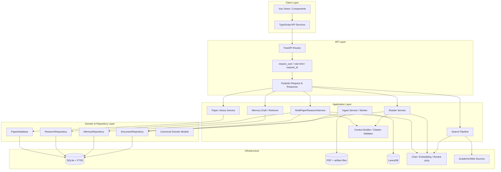
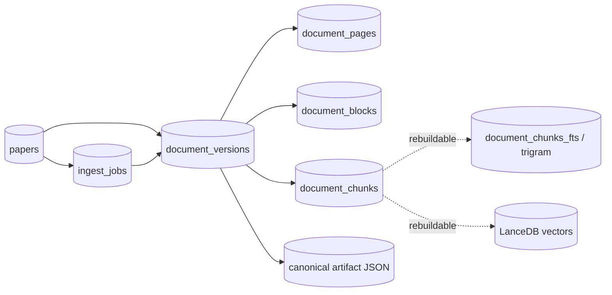

# PaperGraph 系统架构

## 一句话结论

PaperGraph 是“模块化单体 API + 独立持久化 Worker + 本地多存储投影”的架构；关键设计不是微服务数量，而是把 user scope、文档版本、Workflow 和 Evidence 合法性放在确定性边界内。

## 架构分层

## 核心模块职责

| 模块 | 责任 | 不负责 |
|---|---|---|
| FastAPI Route | HTTP 参数、认证依赖、响应模型、错误映射 | 业务持久化细节 |
| Service | 业务编排、降级、模型调用边界 | 绕过 Repository 拼接越权 SQL |
| Repository | user/paper/version/session scope、事务、Schema 读写 | Docling 或 LLM 语义 |
| Ingest Workflow | Job、解析、质量、Chunk、Embedding、版本激活 | 在保存 HTTP 内跑重任务 |
| Retrieval | QueryPlan、sparse/dense、RRF、rerank、expansion | 决定用户可访问哪些论文 |
| Context/Citation | Token Budget、Evidence 分配、引用标记清洗 | 判断自然语言论断是否完全蕴含 |
| Agent | 意图、有限工具选择、答案生成 | 身份、授权、永久 Memory 写入 |
| Frontend | 用户交互、SSE、PDF 渲染、Evidence 跳页 | 充当服务端历史或权限事实源 |

## 架构不变量

1. `user_id` 来自认证 token，经 API/Repository 传递；LLM 不产生 `user_id`。
2. 可访问 `paper_id` 由用户文献库或 research session 决定。
3. 只有 active document version 参与 canonical Reader 检索。
4. SQLite 保存 canonical 事实；FTS/LanceDB 可删除重建。
5. 新文档版本先 staging/ready/degraded，完成持久化后原子替换 active。
6. 只有进入本轮 ContextPackage 的 canonical chunk 可获得 `[E#]`。
7. 工具 JSON 本身不可信；按 `chunk_uid` 回 Repository 后再次经过预算才可引用。
8. Memory、历史、元数据和外部 Web 信息不能映射成 PDF Evidence。
9. 永久 Memory 必须经过用户确认或用户手动创建。
10. Reader Agent 请求级实例不持有跨请求对话状态；历史从服务器 SQLite 读取。

## 数据架构

SQLite 中的 version/page/block/chunk 是可审计真相。FTS5 由 trigger 或 rebuild 同步，LanceDB 以 version 为单位删除再写入并校验数量。Embedding 配置哈希防止“模型名相同、instruction 不同”却误用旧向量。

## 进程拓扑

| 进程 | 是否常驻 | 状态共享 |
|---|---|---|
| Vite/Nginx Frontend | 是 | 浏览器 localStorage 保存 token 和本地搜索会话 UI 状态 |
| FastAPI | 是 | SQLite、PDF、artifact、LanceDB；少量进程内 cache/rate limiter |
| Ingest Worker | 是，推荐独立 | 通过 SQLite Job lease 协调 |
| 外部模型/搜索 API | 外部 | HTTP/stdio 调用；失败需降级 |

## 为什么不是自由多 Agent

代码存在 SearchAgent 和 PaperAnalysisAgent，但核心链路不是多个 Agent 互相委派：

- SearchAgent 只把自然语言变成 `SearchIntent`。
- `ResolvedSearchPlan` 以后由确定性 Pipeline 决定来源、过滤、RRF 和精排。
- Reader Agent 使用固定工具表和有界循环。
- Multi-paper service 直接构建一次跨论文 ContextPackage，再调用 LLM。

合理推断：当前项目优先可测试性、权限边界和成本上限，因此避免自由多 Agent 的非确定性状态传播。

## 模块耦合与质量评价

### 优点

- Repository 将作用域检查集中化。
- Ingest、Retrieval、Context、Citation 有清晰阶段对象。
- 模型 Provider 有接口层，真实 API 与测试 fake 可替换。
- 前端 API service 与 view 基本分离。

### 问题

- `paper_analysis_agent.py`、Search Pipeline 和 Reader 周边仍较大，存在宽泛异常捕获。
- 部分 Service 运行时 import 较多，降低静态依赖可见性。
- FastAPI 模块化单体和 SQLite 适合单机，但扩到多副本需要外置队列、共享对象存储和分布式限流。
- 全仓 mypy 仍有 140 errors/41 files。

## 面试官可能提问

### 为什么选择模块化单体？

当前是单用户/小团队本机科研工具，SQLite 和本地 PDF 是权威资产。模块化单体降低部署复杂度，同时通过 Service/Repository/Worker 保留边界；数据量和团队规模扩大后再拆更经济。

### 为什么 Worker 必须独立？

Docling、OCR、Embedding 是秒到分钟级任务。独立 Worker 通过持久化 Job 支持重启恢复、有限重试和 HTTP 快速返回，避免 Uvicorn reload 中断任务。

### 架构中最重要的安全边界是什么？

不是 Prompt，而是认证 `user_id`、Repository scope、active version 和 Evidence Registry 四层确定性约束。

## 证据来源

- `backend/app/api/main.py::lifespan`
- `backend/app/repositories/document_repository.py::DocumentRepository`
- `backend/app/services/ingest/service.py::IngestService`
- `backend/app/services/reader/paper_reader_service.py::PaperReaderService`
- `backend/app/services/context/builder.py::DynamicContextBuilder`
- `backend/app/services/citation/evidence_registry.py::EvidenceRegistry`
