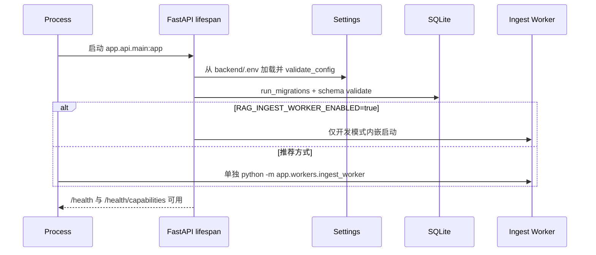
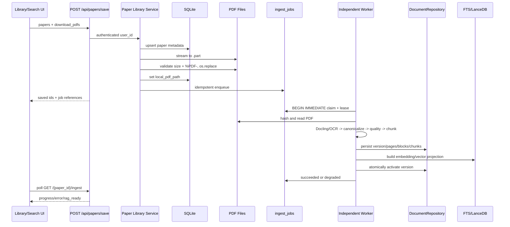
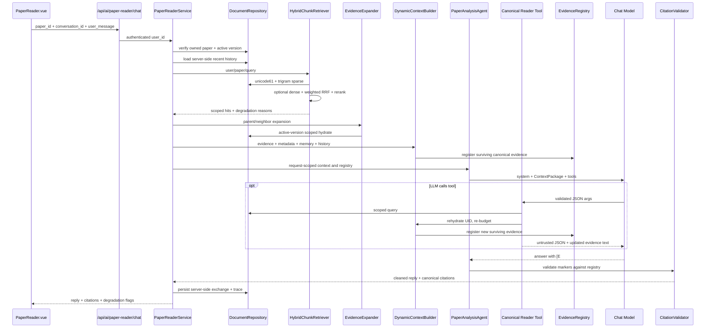
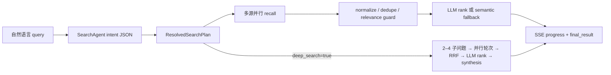
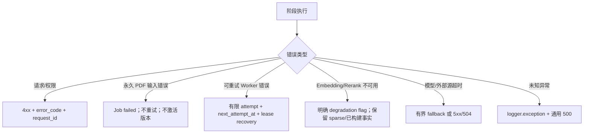

# PaperGraph 请求与数据流

## 一句话结论

PaperGraph 的关键数据流分为同步控制面和异步数据面：HTTP 完成认证、保存与排队，Worker 完成 canonical 建库，Reader 请求只消费 active version 并把最终可引用 Evidence 注册到本轮响应。

## 启动流程

配置错误或 Migration 失败会阻止启动，不会带着不完整 Schema 对外服务。

## 通用用户请求流程

1. 浏览器 API service 从 `localStorage.pg_token` 注入 `Authorization: Bearer ...`。
2. `_MeaningfulActivityMiddleware` 读取或生成 `X-Request-ID`。
3. `require_user` 验签并再次查询 `auth_users` 状态。
4. Route 用 Pydantic 验证请求，复杂入口调用进程内滑动窗口限流。
5. Service 接收已认证 `user_id`，Repository 再做资源作用域过滤。
6. 成功响应按具体 ResponseModel 返回；失败进入统一 HTTP/Validation/Unhandled handler。
7. 响应携带 `X-Request-ID`；错误体携带 `error_code` 和 `request_id`。

## PDF 保存与 canonical 入库流

关键点：

- 已有合格目标文件会复用，不重复下载。
- 只有本地 PDF 存在才 enqueue。
- Job 和 version 都有幂等身份；Worker 可恢复过期 lease。
- Embedding 失败可保留 sparse 可用的 degraded active version，但解析/质量硬失败不会激活。

## canonical Reader Chat 流

## 多论文请求流

1. 用户从自己的文献库选择 2–8 篇论文，创建 `research_session`。
2. Repository 固化 `research_session_papers`，后续 chat 不接受客户端临时扩大范围。
3. Service 查找所选论文的 active version 集合。
4. Hybrid Recall 使用 `paper_ids` 列表作为硬 scope。
5. 每篇先选一个 anchor，再允许每篇最多两个，防止单篇垄断。
6. 扩展、ContextPackage、Evidence Registry 和 Citation Validator 与单篇共用原则。
7. 只有摘要的论文只作为明确标记的背景，不能生成 PDF citation。

## 学术搜索 SSE 流

SSE 队列容量为 128，服务端总墙钟约 420 秒；前端 `fetch` 流逐块解析 `data:` 并更新步骤 UI。

## 异常与降级流

代表性永久错误：`PDF_FILE_MISSING`、`PDF_HASH_FAILED`、`PDF_ENCRYPTED`、`PDF_INVALID`、`QUALITY_GATE_FAILED`。降级不等于伪装成功；对外返回 `context_mode`、`degradation_flags` 或 Job `error_code`。

## 数据写入与查询的一致性

| 操作 | 一致性策略 |
|---|---|
| Paper 保存 | SQLite transaction；PDF 成功后记录相对路径 |
| PDF 文件 | `.part` + 头/大小校验 + `os.replace` |
| Job claim | `BEGIN IMMEDIATE`，lease owner/expiry/heartbeat |
| Version 写入 | page/block/chunk 同一受控阶段，激活单独原子切换 |
| FTS | external-content FTS + trigger，可 rebuild |
| LanceDB | version 级 delete/add/count verify，失败清理 |
| Memory commit | `Idempotency-Key` + active content unique index + transaction |
| Reader history | 服务器持久化，客户端历史不作为 canonical Reader Prompt 事实源 |

## 面试官可能提问

### 为什么要把 Ingest 和 Reader 请求拆开？

Reader 需要稳定 active version，Ingest 耗时且可能失败。用版本和 Job 把二者解耦后，Reader 不会读到半写入 Chunk，HTTP 也不被 OCR/Embedding 阻塞。

### 工具结果为什么还要回表？

LLM 可伪造工具输出里的文本或 UID，且工具结果可能超预算。只有 Repository 返回的 scoped chunk 经过 ContextPackage 后才进入 Evidence Registry。

### 降级怎么避免掩盖故障？

返回机器可读 `degradation_reasons/error_code/context_mode`，日志记录错误类型；永久输入错误不重试，模型投影失败与源数据失败分开。

## 证据来源

- `backend/app/services/papers/papers_library_service.py::save_papers`
- `backend/app/core/pdf_download.py::download_paper_pdf_to_path`
- `backend/app/services/ingest/worker.py::IngestWorker`
- `backend/app/services/reader/paper_reader_service.py::process_chat`
- `backend/app/agents/support/canonical_reader_tools.py`
- `backend/app/api/routes/search.py::search_agent_chat_stream`
