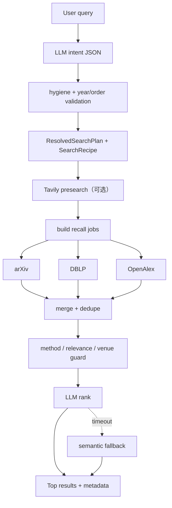

# 学术搜索功能

## 一句话结论

学术搜索把 LLM 限制在意图解析、候选精排和可选综述生成，把来源选择、并行召回、去重、过滤、RRF 和超时降级留给确定性 Pipeline。

## 业务目标

用户可以用“找 2023–2025 年 CVPR 的某方法”“找经典论文”“对某主题做深度检索”等自然语言表达，不必掌握不同学术 API 的查询语法。

## 在整体架构中的位置

上游是 `SearchAgent.vue` 的自然语言与 Deep Search 开关；下游是 arXiv、DBLP、OpenAlex、可选 Tavily 与 MCP source，最终论文可以保存到用户文献库并触发 PDF 入库。

## 核心职责

| 阶段 | 真实实现 |
|---|---|
| 意图解析 | `SearchAgent` 调 Chat LLM，仅接受 JSON；失败按 correction hint 最多重试配置次数 |
| 计划固化 | `ResolvedSearchPlan.from_search_intent` 限制来源、年份、候选数、结果数 |
| 召回 | `build_recall_jobs` 并发执行 arXiv/DBLP/OpenAlex，按 recipe 做 pinned ID、venue、proceedings 补召回 |
| 标准排序 | normalize、dedupe、method/venue guard，再调用 `LlmPaperRanker` |
| 排序降级 | LLM rank 超时后优先 semantic scoring，再退到 recall pool |
| Deep Search | 2–4 个子问题、最多 2 轮、并发查询、RRF(k=60)、top-24 LLM rank、可选 brief |
| 交互 | `/api/papers/search-agent/stream` 发送 SSE status/tool/deep/final_result |

## 输入与输出

| 类型 | 字段 | 约束 |
|---|---|---|
| 请求 | `message` | 自然语言检索意图 |
| 请求 | `mode` | `accuracy` 或 `novelty` |
| 请求 | `deep_search` | 是否走子问题迭代 |
| 请求 | `history` | Search UI 上下文；与 Reader 的服务器历史策略不同 |
| 输出 | `papers` | 标准化论文对象 |
| 输出 | `search_params` | query/keywords/venue/year/sort/mode |
| 输出 | `tool_calls` | 前端可视化步骤 |
| 输出 | `response` | 检索说明或 Deep Search synthesis |

## 标准搜索流程

## Deep Search 流程

1. `decompose_query` 将 query 分解为最多 4 个互补子问题；LLM 不可用时使用原 query。
2. 每个子问题以 `asyncio.gather` 并行检索，每个默认最多 12 条。
3. 若 unique 候选不足 `max_results * 3`，LLM 可提出最多 2 个新子问题。
4. 所有 round/sub-query 候选按 RecordedCandidate 做 RRF(k=60)。
5. top-24 进入 LLM rank；失败保留 RRF 顺序。
6. top-8 摘要可生成 300–500 字研究 brief。

这不是联网 Agent 的无限循环：默认最多 2 轮，关键 LLM 调用有 timeout 和 retries 上限。

## 关键类、函数与文件

| 文件路径 | 类或函数 | 作用 |
|---|---|---|
| `backend/app/agents/search_agent.py` | `SearchAgent`、`IntentParser` | JSON 意图、TTL cache、重试 |
| `backend/app/services/retrieval/search_plan.py` | `ResolvedSearchPlan` | 检索层单一计划事实源 |
| `backend/app/services/retrieval/search_pipeline.py` | `run_search_pipeline_async` | 标准召回、过滤、排序 |
| `backend/app/services/retrieval/deep_search_pipeline.py` | `run_deep_search_pipeline_async` | 子问题迭代与 RRF |
| `backend/app/core/search/paper_searcher.py` | `PaperSearcher.search_async` | 多 source adapter 并发入口 |
| `backend/app/api/routes/search.py` | `search_agent_chat_stream` | 限流、SSE、420 秒墙钟 |

## 异常处理

- 意图 JSON 为空/格式错：correction hint 后重试；耗尽返回 `search_agent_intent_failed`。
- 单一来源异常：返回空列表并保留其他来源结果。
- recall/LLM rank 超时：使用 bounded fallback，并在 metadata 记录。
- SSE 客户端断开：Generator 捕获取消并关闭 memory object stream。
- 搜索入口按 user + IP 每分钟 10 次限流；该限流仅进程内有效。

## 为什么这样设计

代码明确说明 `ResolvedSearchPlan` 后检索层不再调用 LLM。这样使来源和过滤可测试，也防止模型在召回中悄悄扩大条件。Deep Search 单独实现，不修改标准流程，降低高级能力对常用路径的风险。

## 技术取舍

| 方案 | 优点 | 缺点 | 当前采用 |
|---|---|---|---|
| 单 LLM 直接返回论文 | 简单 | 不可审计、易幻觉 | 否 |
| 多源确定性召回 + LLM rank | 真实来源、可降级 | Pipeline 较复杂 | 是 |
| 无限自主研究 Agent | 灵活 | 成本/终止/复现差 | 否 |
| 有界 Deep Search | 覆盖盲区、成本可控 | 仍受摘要与外部 API 质量限制 | 是 |

## 当前限制

- 搜索结果质量依赖外部 API、网络和 LLM。
- SSE 没有 heartbeat、Last-Event-ID 或断点续传。
- SearchAgent 的进程内 TTL intent cache 与限流无法跨副本共享。
- Deep Search synthesis 只依据标题/摘要，不是 PDF Evidence。

## 面试官可能提问与回答要点

1. **为什么 SearchAgent 不直接执行所有检索？**
   Agent 只解析语义，`ResolvedSearchPlan` 后由可测试 Pipeline 执行，避免非确定性来源扩大。
2. **Deep Search 如何控制成本？**
   子问题≤4、轮次≤2、每子问题默认 12、top-24 精排、top-8 综述，所有模型调用有 timeout。
3. **多源结果怎么融合？**
   先按 arXiv ID/DOI/title 等统一身份去重；Deep Search 用 RRF，标准搜索按过滤后 LLM rank。
4. **精排失败怎么办？**
   优先语义打分 fallback，再使用 recall pool，并记录 ranking method。
5. **如何保证论文真实？**
   结果来自 source adapter；LLM 不生成 Paper 事实对象，但外部源元数据仍需用户核验。

## 证据来源

- `backend/app/agents/search_agent.py::IntentParser._parse_with_retry`
- `backend/app/services/retrieval/search_plan.py::ResolvedSearchPlan`
- `backend/app/services/retrieval/search_pipeline.py::run_search_pipeline_async`
- `backend/app/services/retrieval/deep_search_pipeline.py::run_deep_search_pipeline_async`
- `frontend/src/composables/useSearchAgentChat.ts`
