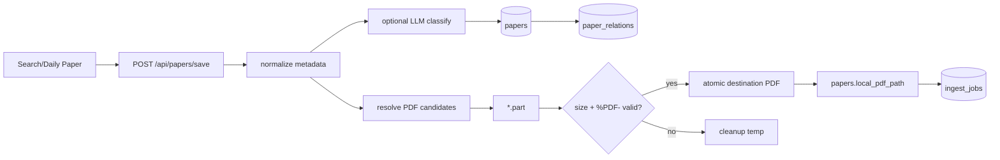

# 文献库与 PDF 保存

## 一句话结论

文献库是整个系统的用户资产入口：论文元数据先按用户落 SQLite，PDF 以相对路径原子写入本地文件，成功后立即创建持久化 Ingest Job。

## 业务目标

把临时搜索结果变成可筛选、可阅读、可入库、可导出的用户私有文献资产，并为后续 canonical RAG 建立可信文件入口。

## 真实实现

`save_papers` 的实际顺序：

1. API Paper 转换为 core `Paper`，补齐 arXiv ID、DOI、venue type。
2. 可选调用 `PaperAnalysisAgent.classify_for_library` 进行分类与 tag 补充；失败回到确定性分类规范化。
3. 摘要缺失且 Tavily 已配置时尝试补齐摘要。
4. `PaperDatabase.add_papers(..., user_id=...)` 添加或更新元数据。
5. 为新论文生成 paper relation。
6. 从 `pdf_url/source_url/doi/arXiv/proceedings` 组合下载候选 URL。
7. PDF 流写入 `<dest>.part`，校验大小≥256 且文件头 `%PDF-`，再 `os.replace`。
8. 保存 `local_pdf_path`；路径是 data root 下的相对路径。
9. 对每个可读本地 PDF 调 `enqueue_owned_paper_ingest`。
10. 返回新增/更新数、PDF 下载数、Job references 和 enqueue 失败数。

## 文件与数据流

## 查询与交互

| 能力 | 后端 | 前端 |
|---|---|---|
| 列表与筛选 | `GET /api/papers/library`，q/year/read_status/tags/category/offset/limit | `Library.vue` debounce、分页、分类 folder |
| PDF | `GET /api/papers/{id}/library-pdf`，验证 user scope 后流式返回 | `PaperReader.vue` 获取 Blob 给 PDF.js |
| 更新 | `PUT /api/papers/{id}` | 可扩展元数据编辑 |
| 删除 | `DELETE /api/papers/{id}` | 单删/批量删 |
| 阅读时长 | `POST /reading/log`、`GET /reading/calendar` | Reader 离开时 flush，Calendar 展示 |
| Ingest 状态 | `GET/POST /{paper_id}/ingest` | 2.5 秒轮询、错误提示、手动重试 |

## 关键类、函数与文件

| 文件路径 | 类或函数 | 作用 |
|---|---|---|
| `backend/app/services/papers/papers_library_service.py` | `save_papers` | 保存全流程 |
| `backend/app/core/pdf_download.py` | `resolve_paper_pdf_url` | 解析可下载 PDF |
| `backend/app/core/pdf_download.py` | `download_paper_pdf_to_path` | 临时文件与原子替换 |
| `backend/app/core/storage.py` | `PaperDatabase` | user-scoped paper CRUD |
| `backend/app/services/pdf/pdf_service.py` | `build_library_pdf_response` | 权限校验和流式 PDF |
| `frontend/src/views/Library.vue` | `load`、`exportBibTeX` | 文献库交互 |

## 异常处理

- 无有效 PDF URL：保留论文元数据，返回“未能写入本地 PDF”的消息。
- 单个 PDF 下载失败：清理 `.part`，不影响其他论文保存。
- enqueue 失败：论文与 PDF 不回滚，返回 `ingest_enqueue_failed` 并提示用户重试。
- LLM 分类失败：记录 warning，保留确定性类别。
- PDF 请求不存在、路径越权或文件缺失：返回受控 HTTP 错误。

## 为什么这样设计

代码注释明确要求“PDF 已保存后必须成为 durable queue row”，同时禁止在 HTTP 请求内运行 Docling/Embedding。文件原子替换避免数据库指向半个 PDF；论文元数据与 Ingest 失败解耦，保证用户仍能看到和修复资产。

## 技术取舍

| 方案 | 优点 | 缺点 | 当前采用 |
|---|---|---|---|
| PDF 存数据库 BLOB | 单一存储 | DB 体积和流式操作成本高 | 否 |
| 本地文件 + DB 相对路径 | 简单、适合本机 | 多副本共享困难 | 是 |
| 保存请求同步解析 PDF | 立即可用 | 超时、不可恢复 | 否 |
| 持久化 Job 异步解析 | 快速返回、可重试 | 需要 Worker 运维 | 是 |

## 当前限制

- `save_papers` 同时承担元数据补全、分类、下载、关系构建和排队，职责偏重。
- 摘要补齐处存在宽泛异常静默忽略，观测性不足。
- 文件存储适合单机；多实例需要对象存储与内容寻址。
- 删除 Paper 时 PDF/向量/artifact 的完整垃圾回收策略需要进一步核验。

## 面试官可能提问与回答要点

1. **如何避免下载到 HTML 冒充 PDF？** 校验状态码、大小和 `%PDF-` 文件头。
2. **为什么先 `.part` 再替换？** 保证读者只能看到完整文件，崩溃后残留临时文件可清理。
3. **Ingest 排队失败是否回滚论文？** 不回滚；返回明确计数，用户可通过幂等接口重试。
4. **多用户 PDF 如何隔离？** API 先校验 Paper 属主，DB 保存 user scope；物理路径不是授权依据。
5. **搜索结果重复保存怎么办？** `PaperDatabase.add_papers` 按用户和论文身份执行 add/update。

## 证据来源

- `backend/app/services/papers/papers_library_service.py::save_papers`
- `backend/app/core/pdf_download.py::download_paper_pdf_to_path`
- `backend/app/api/routes/papers.py`
- `frontend/src/services/api/papers.ts`
