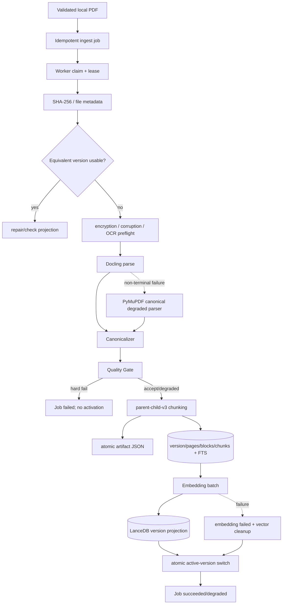

# Canonical PDF Ingest

## 一句话结论

Ingest 把不可控的 PDF 解析变成可恢复、可版本化、可审计的 ETL：持久化 Job 驱动 Docling/OCR，输出带页码和 provenance 的 canonical page/block/chunk，再建立 FTS 与向量投影。

## 业务目标

- 不让重型 PDF 解析阻塞 API。
- 同一文件和配置重复请求时幂等。
- 解析失败不污染 active Reader 数据。
- 保留页码、章节、表格、公式和 bbox 来源。
- Embedding 失败时仍允许 sparse RAG 降级。

## 建库流程

## 持久化 Job

| 机制 | 实现 |
|---|---|
| 幂等键 | `user_id + paper_id + requested_file_hash + parser_mode` 的活动 Job 复用 |
| Claim | SQLite `BEGIN IMMEDIATE`，写入 `lease_owner/lease_expires_at` |
| Lease | 默认约 900 秒；heartbeat 不超过 60 秒或 lease/3 |
| Retry | 默认最多 3 attempts，`next_attempt_at` 控制延迟重试 |
| Recovery | 过期 running lease 可重新 claim |
| 状态 | queued/running/succeeded/degraded/failed/cancelled 等 |
| 进度 | current_step/progress/error_code/error_message/version_id |

它是单机持久化 Worker，不应宣传成分布式任务队列。

## 解析与 OCR

`DoclingParserAdapter` 的 canonical 配置：

- `raises_on_error=False`，表格结构识别开启，页面图像导出关闭。
- device 默认 `auto`，线程数为 4。
- Windows 路径可复制到 ASCII-safe staging 目录，规避中文路径兼容问题。
- OCR mode 支持 `auto/always/never`。
- `auto` 最多抽样 12 页：原生文本覆盖率≥0.85、median≥280、单页≥160 时跳过 OCR，否则启用本地 RapidOCR。
- 加密或明显损坏 PDF 在 Docling 前返回稳定永久错误码。

Docling 的非终止解析/质量错误可进入 PyMuPDF canonical 降级解析器；这仍输出同一 canonical Domain，不是另一套 Reader 数据源。

## Canonical 数据模型

| 对象 | 关键字段 | 价值 |
|---|---|---|
| `CanonicalDocument` | version/parser/quality/pages | 一次解析的完整结果 |
| `CanonicalPage` | page_index/text/markdown/image/table/formula/OCR | 页级统计与显示 |
| `CanonicalBlock` | block_uid/type/section/text/table/formula/bbox/provenance | 结构和来源最小单元 |
| `CanonicalChunk` | chunk_uid/parent/level/page range/text variants/token count | 检索与引用单元 |
| `DocumentVersion` | file/config/version/status/count/error | 可审计版本身份 |

`Canonicalizer` 遍历 Docling body tree、维护 section stack、过滤 header/footer，并把附近 caption 绑定到 table。

## Quality Gate

硬失败包括：

- 无 page；
- block 数过少；
- 总文本小于 120 字；
- parser 明确返回不可恢复文件错误。

可降级包括 page coverage 不足、provenance 不完整等。质量结果进入 `quality_json`，而不是只写日志。

## Chunking

`parent-child-v3` 的实际策略：

- Parent 目标约 1,200 tokens；Child 约 450；overlap 约 60。
- 短 block 不强切，长 block 才滑窗。
- 最小有效文本约 8 字符。
- 按 section/page/content type 保留语义边界。
- Table 按 row 切分，每个 child 重复 caption/header，防止脱离表头。
- Chunk 同时保存 `display_text`、`embedding_text`、`sparse_text`。

## Embedding 与激活

1. `EmbeddingProvider` 区分 query 和 document instruction。
2. 默认 DashScope `text-embedding-v4`、1024 维、batch 10、timeout 60 秒、最多 2 次。
3. 校验向量数量、维度、非零和有限值。
4. LanceDB 写入前删除该 version 旧向量，完成后校验 count。
5. 配置哈希包含 provider/model/dimension/document instruction。
6. Embedding 失败会删除部分向量并标记 `embedding_status=failed`；canonical chunk/FTS 仍可激活为 degraded。
7. 新 version 激活时原 active version 标记 superseded，唯一 partial index 保证每用户/论文只有一个 active。

## 关键类、函数与文件

| 文件路径 | 类或函数 | 作用 |
|---|---|---|
| `services/ingest/queue.py` | `enqueue_owned_paper_ingest` | 权限与幂等入队 |
| `services/ingest/worker.py` | `IngestWorker` | lease、heartbeat、retry |
| `services/ingest/parsers.py` | `DoclingParserAdapter` | PDF/OCR 解析 |
| `services/ingest/canonicalizer.py` | `DoclingCanonicalizer` | 结构化 canonical 转换 |
| `services/ingest/quality.py` | `DocumentQualityGate` | accept/degrade/reject |
| `services/ingest/chunking.py` | `HierarchicalChunker` | section/page/table-aware Chunk |
| `services/ingest/service.py` | `IngestService` | 全链路编排与激活 |
| `services/embedding/indexer.py` | `EmbeddingIndexer` | 向量投影生命周期 |

## 异常处理

| 错误 | 是否重试 | 结果 |
|---|---|---|
| PDF 缺失/Hash 失败 | 否 | failed，不激活 |
| 加密/损坏 PDF | 否 | `PDF_ENCRYPTED/PDF_INVALID` |
| Quality hard fail | 否 | `QUALITY_GATE_FAILED` |
| 临时模型/API/数据库错误 | 有限重试 | `next_attempt_at` 后重跑 |
| Embedding 失败 | 由阶段策略处理 | 清理向量，sparse degraded active |
| Worker 崩溃 | lease 到期后恢复 | 不依赖进程内状态 |

## 为什么这样设计

代码明确把 Embedding 视为 projection，因此 version identity 不依赖 embedding；合理推断是避免换向量模型时重跑昂贵 PDF 解析。版本激活单独执行，是为 Reader 提供“旧版本完整可用或新版本完整可用”的切换语义。

## 当前限制

- Docling/OCR 性能较重；image-only 单页实测约 85 秒。
- LanceDB 未创建显式 ANN index，规模扩大后需补索引与压测。
- requirements 未锁 PyTorch/CUDA wheel，完整环境仍非完全可复现。
- 业务库尚无 active canonical 数据，当前能力主要由隔离库证明。

## 面试官可能提问与回答要点

1. **为什么要 canonical model？** 统一不同 parser 输出并保留 provenance，使 Chunk、引用和版本可复现。
2. **为什么先持久化再向量化？** SQLite 是事实源；向量失败可以重建，不应丢掉解析成果。
3. **如何保证幂等？** Job 和 document version 分别用文件 Hash、parser config、chunker version 等身份约束。
4. **如何处理扫描 PDF？** auto OCR 抽样文本层，必要时启用 RapidOCR。
5. **为什么表格不按普通 token 切？** 普通滑窗会让数据行失去 caption/header，项目按行切并重复上下文。
6. **如何防止半成品被 Reader 读到？** 只有原子激活后的 active version 才参与检索。

## 证据来源

- `backend/app/services/ingest/service.py::IngestService`
- `backend/app/services/ingest/parsers.py::DoclingParserAdapter`
- `backend/app/services/ingest/chunking.py::HierarchicalChunker`
- `backend/app/repositories/document_repository.py::activate_version`
- `backend/tests/test_ingest_*`
