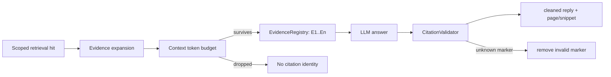

# Canonical Paper Reader

## 一句话结论

Paper Reader 是 active canonical document 上的证据问答：检索和工具只在当前用户/论文/version 内运行，回答中的 `[E#]` 必须映射到本轮真正进入 Token Budget 的 Chunk。

## 业务目标

让用户在 PDF 阅读界面中获得导读、问答、表格/章节定位、相关论文建议和可跳页引用，同时明确区分 PDF 证据、Memory、历史、元数据和外部信息。

## 前置条件

- 用户已认证且拥有 `paper_id`。
- 论文有可读本地 PDF，前端可用 PDF.js 展示。
- canonical RAG 必须存在 active document version。
- Reader 服务端从 SQLite 获取对话历史，客户端 `messages` 不作为 canonical Prompt 历史事实源。

## 真实实现

### Opening

`get_opening` 读取 active version 的 parent chunks，最多选约 8 个 Evidence，在 2,800 token 文档预算内构建 `canonical_opening_v2` ContextPackage，生成导读并校验引用。

### Chat

1. 限制最新问题最大约 800 tokens。
2. 从 server-side conversation 取最近最多 24 个 turns。
3. 检索当前 paper active version：unicode61 + trigram + 可用 dense + RRF + rerank。
4. 选 anchor 并扩展 parent/相邻 child。
5. MemoryRetriever 取相关 confirmed Memory，但标记为不可引用。
6. `DynamicContextBuilder` 在约 2,800 文档 token 内组装 evidence/metadata/memory/history。
7. 创建 request-scoped `EvidenceRegistry`、Reader context 和 `PaperAnalysisAgent`。
8. Agent 可调用 canonical outline/section/table/search 工具；总工具回流预算约 800 tokens。
9. LLM 生成 `[E#]`，`CitationValidator` 移除无效标记并返回 canonical snippet/page。
10. 持久化用户和助手 turns、context mode、degradation 与 trace。

## 证据约束

Registry 记录 user、paper、document version、chunk UID、page range、section path、snippet。Validator 能证明“标记来自本轮允许 Evidence”，但不能自动证明回答语句被该 Evidence 完全蕴含。

## Reader 工具

| 工具 | 作用 | 关键约束 |
|---|---|---|
| `reader_get_outline` | 获取章节轮廓 | sections≤32 |
| `reader_get_section` | 取指定章节 | `section_ref`≤160 字符，chunks≤6 |
| `reader_get_table` | 定位 canonical table | table ref 有界 |
| `reader_search_document` | 当前文档内二次 sparse search | query≤800，results≤8 |
| Paper/reference lookup | 查相关论文与参考文献 | 只能作为外部/元数据，不变成 PDF Evidence |

工具输出必须按 UID 回 Repository，并重新进入 ContextPackage。详见 `23_TOOL_FUNCTION_CALLING.md`。

## 输入与输出

| 类型 | 内容 |
|---|---|
| 输入 | `paper_id`、可选 `conversation_id`、`user_message` |
| 输出 | `reply`、conversation、`context_mode`、`degradation_flags` |
| 引用 | marker、evidence_id、page range、section、snippet |
| 辅助 | related papers/hints、KG edges |

## 前端交互

`PaperReader.vue`：

- 左右可拖动分栏，左侧 `PdfJsViewer` 使用 IntersectionObserver 懒渲染页面。
- Evidence chip 有页码时调用 `gotoPage`。
- 2.5 秒轮询 Ingest 状态，并对加密/损坏/质量失败给出差异化提示。
- 对话支持 LaTeX/Markdown 展示。
- 离开或切换论文时提交阅读时长。
- “总结为记忆”弹窗让用户编辑、勾选后提交。

## 异常处理

- 没有召回相关 evidence：构建明确“证据不足”的 package，不制造 citation。
- Dense/Rerank 不可用：返回 degradation reasons，继续 sparse。
- Tool timeout/未知工具/参数错误：结构化 ToolError，Agent loop 仍受总 deadline 限制。
- LLM 返回伪造 marker：Validator 删除并记录 invalid markers。
- LLM/Service 异常：Route 记录并返回通用安全错误，不泄露堆栈。

## 为什么这样设计

Prompt 要求引用只是一层软约束；Registry 和 Validator 把来源合法性变成确定性检查。请求级 Agent 与服务器历史避免跨用户状态泄漏；工具回表避免 LLM 把任意 JSON 升格为证据。

## 当前限制

- citation validator 不检查自然语言 entailment。
- 标准 Chrome/Edge 的 PDF canvas + Evidence 跳页尚未形成发布级自动门禁。
- 业务库当前无 active canonical version，真实业务论文体验未验收。
- Reader 页面生产 chunk 约 358.59 kB，PDF.js worker 约 1.376 MB。

## 面试官可能提问与回答要点

1. **如何防止伪造页码？** 页码来自 canonical chunk provenance，Marker 必须存在于本轮 Registry。
2. **为什么客户端历史不能直接传给模型？** 客户端可篡改且可能跨 scope；canonical Reader 使用服务端持久化 history。
3. **工具结果怎么成为证据？** 只接受工具命中的 chunk UID，Repository 回表并重新预算后注册。
4. **Rerank 挂了还能答吗？** 可以 sparse/dense 的剩余路径降级，但响应携带原因。
5. **Evidence 合法是否等于答案正确？** 不等于；当前只验证来源映射，entailment 仍需 Golden/人工/判别器。

## 证据来源

- `backend/app/services/reader/paper_reader_service.py`
- `backend/app/agents/paper_analysis_agent.py::_run_reader_llm`
- `backend/app/services/citation/evidence_registry.py`
- `backend/app/services/citation/validator.py`
- `backend/tests/test_canonical_reader_api_e2e.py`
