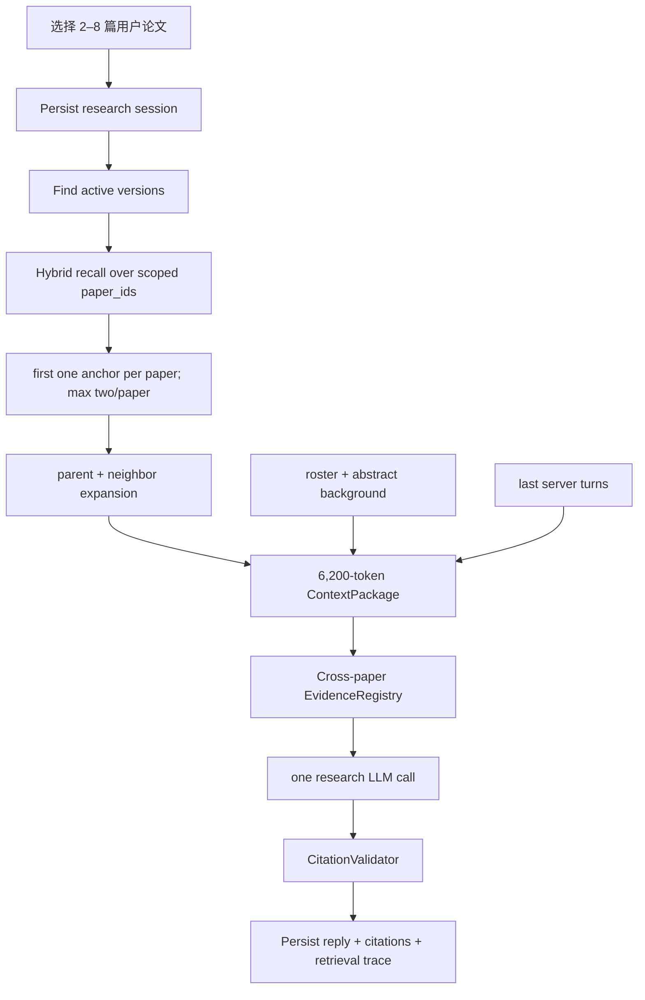

# 多论文协同研究

## 一句话结论

多论文研究不是把多篇摘要直接塞给模型，而是在用户固定 Research Session 内，对已入库论文做统一 Hybrid Recall、论文均衡 anchor、Evidence Expansion 和跨论文 `[E#]` 校验。

## 业务目标

支持用户比较方法、实验、结论与限制，生成主题归纳、差异表和研究空白，同时能说明每个正文结论来自哪篇论文。

## Session 模型

| 表 | 作用 |
|---|---|
| `research_sessions` | user-owned 会话、标题、时间 |
| `research_session_papers` | 固定选中论文及 position |
| `research_turns` | 服务端 user/assistant turns 和 metadata |

创建 session 时 Repository 验证全部 `paper_id` 属于当前用户。Chat 只接受 `session_id + user_message`，不会接收客户端临时 paper list。

## 真实流程

## 预算与均衡

- 总 Context budget：6,200 tokens。
- 最大 Evidence：12。
- 初始 retrieval limit：16。
- 最大 expansion anchors：4。
- Evidence source cap：约 3,700 tokens。
- Metadata：1,400；history：800；tool note：300。
- 先为每个有 hit 的 paper 选一个 anchor，再填充；每篇最多两个 anchor。

这些参数防止长论文或高 BM25 分数论文垄断多论文回答。

## 部分入库语义

所选论文中没有 active version 的论文仍会出现在 roster，并以“仅摘要背景”标记。规则：

- 摘要可用于说明选中文献范围。
- 方法、实验、结论、表格、公式等全文事实必须来自 `[E#]`。
- 未入库论文不能产生 citation。
- 没有召回到相关片段时，必须说明全文证据不足。

这是一条显式的 canonical evidence 边界，不把 metadata 伪装成全文。

## 引用返回

每个 citation 包含：

- `paper_id` 和 `paper_title`；
- `document_version_id`；
- `chunk_uid/content_type`；
- `page_start/page_end`；
- `section_path/snippet`；
- `[E#]` marker。

前端在每个 assistant turn 下显示论文标题和页码 chip，但当前多论文页面没有内嵌 PDF 跳页视图。

## 异常处理

- Session 不存在或不属于用户：`ResearchSessionNotFound`。
- 问题空或超过 4,000 字符：请求拒绝。
- Retrieval/provider 异常：记录 `multi_paper_research.rag_context_failed`，metadata 保留 error type，并明确全文检索不可用。
- LLM 失败或空回复：返回受控 RuntimeError，不写伪成功 turn。
- 伪造 `[E#]` 或页码标记：Validator 清理。

## 为什么这样设计

代码明确采用确定性 anchor 均衡而不是 LLM planner。合理推断：跨论文比较的首要风险是 scope 泄漏和证据失衡，固定 session 与确定性采样更容易测试。

## 技术取舍

| 方案 | 优点 | 缺点 | 当前采用 |
|---|---|---|---|
| 把所有 PDF 全文塞入 Prompt | 简单 | 超预算、噪声大 | 否 |
| 每篇一个 Agent 再辩论 | 并行推理强 | 成本高、引用合并复杂 | 否 |
| 统一 Hybrid Recall + balanced anchors | 作用域清晰、可控 | 深层跨文档推理依赖一次生成 | 是 |

## 当前限制

- 只有临时 SQLite 双论文回归；缺业务论文、Frozen Golden 和标准浏览器 E2E。
- 没有面向每篇论文的配额自适应或 coverage optimizer。
- 单次 LLM 生成最多 1,800 tokens，复杂综述可能受限。
- 前端未提供 citation 点击后跨论文 PDF 联动。

## 面试官可能提问与回答要点

1. **如何防止某篇论文垄断上下文？** 两阶段 deterministic anchor selection，先每篇一个，再每篇最多两个。
2. **如何防止跨用户论文混入？** Session 创建与读取都按 user scope；retrieval 再传固定 paper_ids。
3. **摘要可以引用吗？** 不可以，摘要只是背景，只有 canonical chunk 可注册 `[E#]`。
4. **为什么不用多 Agent？** 当前目标是可控 scope、成本和引用；统一检索更易做确定性校验。
5. **如何评估？** 需要多论文 Frozen Golden，断言论文归属、required evidence、差异结论和不可回答。

## 证据来源

- `backend/app/services/research/multi_paper_service.py::MultiPaperResearchService`
- `backend/app/repositories/research_repository.py`
- `backend/tests/test_multi_paper_rag.py`
- `frontend/src/views/MultiPaperResearch.vue`
