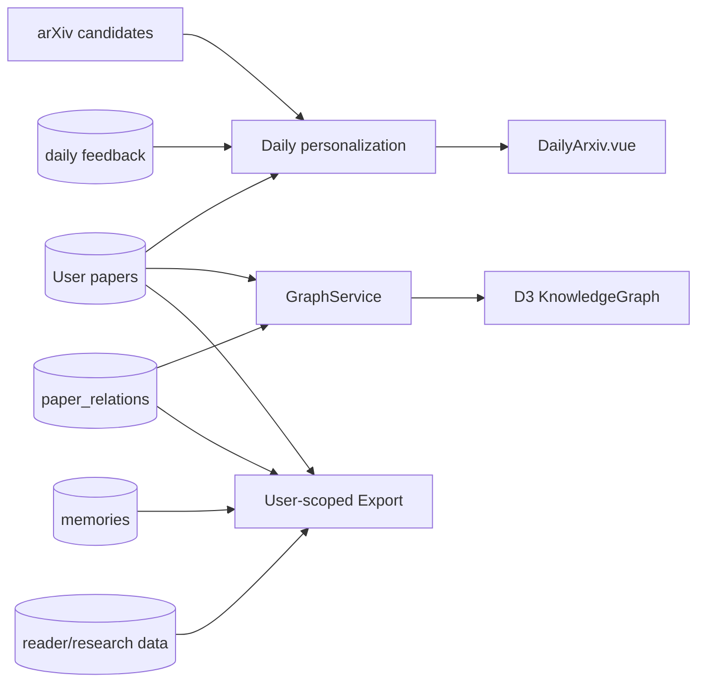

# Daily 推荐、知识图谱与导出

## 一句话结论

这三项能力围绕用户文献资产提供发现、组织和迁移：Daily 生成用户作用域推荐，Graph 把 SQLite 关系投影为 D3 图，Export 按用户过滤后导出 JSON/BibTeX/PNG。

## Daily 推荐

### 真实流程

1. `GET /api/papers/daily` 读取当日 user-scoped cache；没有命中可返回 204。
2. `POST /api/papers/daily` 计算或强制刷新。
3. 从用户文献库提取类别、标题共现、偏好与行为特征。
4. 从配置的 arXiv CS 类别等来源召回候选。
5. 分成 personalized 和 general 两路，去掉已在库论文。
6. 生成主题关键词、策略说明和每篇推荐理由。
7. 写入 `daily_recommendations/daily_papers_cache`。
8. 用户跳过/不喜欢通过 `/daily/feedback` 记录；负反馈不会自动变成长期 Memory。

FastAPI lifespan 明确关闭进程全局自动刷新，因为后台任务没有认证 owner；当前由用户请求触发。

### 边界

- Daily 是用户作用域推荐，不是实时持续训练系统。
- 推荐理由可来自 LLM，但论文对象来自召回结果。
- 缓存和反馈表在 v009 增强所有权；当前业务库只读快照尚未迁移到 v009。

## Knowledge Graph

### 真实图模型

`build_library_graph` 读取用户论文与关系，生成：

- paper 节点；
- author 节点；
- category/keyword 等组织节点；
- paper-author、paper-category；
- 共享作者、显式 `paper_relations` 等 paper-paper edge。

前端 `KnowledgeGraph.vue` 使用 D3 force simulation，支持：

- 文本、节点类型、年份过滤；
- 点击节点加载论文详情；
- 局部展开；
- edge 类型说明；
- 导出当前 SVG 视图为 PNG。

它不是外置图数据库，不参与 canonical RAG 的 Evidence Recall。

## Export

### JSON

`GET /api/export/json?scope=` 支持：

- `all`；
- `papers`；
- `reader`；
- `memory`；
- `graph`；
- `feedback`。

Route 逐表检查存在性并强制 `user_id` 过滤，响应使用 attachment filename。Memory 导出仍保留 confirmed/status 等字段，不泄露其他用户。

### 其他

- Library 前端对选中论文生成 BibTeX。
- Reader 可以复制 BibTeX/APA。
- Graph 前端导出 PNG。

## 数据流

## 异常处理

- Daily 冷路径耗时长：前端单独显示超时提示，API 记录阶段异常。
- 某一推荐辅助分析失败：服务可降级到剩余候选和确定性说明。
- Graph 关系查询失败：记录 warning，仍可返回基础节点。
- Export 不存在的可选表：跳过而不是跨 Schema 崩溃。
- 所有入口仍通过 `require_user`，导出不是管理员全库 dump。

## 技术取舍

| 方案 | 优点 | 缺点 | 当前采用 |
|---|---|---|---|
| SQLite 派生图 + D3 | 与文献库一致、部署轻 | 图算法能力有限 | 是 |
| Neo4j/GraphRAG | 复杂关系查询强 | 当前规模和目标不需要 | 否 |
| 自动把负反馈写长期 Memory | 个性化快 | 误记且不可解释 | 否 |
| 用户作用域 JSON 导出 | 可迁移、透明 | 不是完整数据库备份 | 是 |

## 当前限制

- Daily 的真实推荐指标、A/B 测试和长期用户效果没有证据。
- Graph 关系构建有多处异常降级，缺关系质量 Golden。
- Export 没有导入/恢复对称流程，也没有数据版本 manifest。
- PNG 导出是前端画布快照，不适合超大图。

## 面试官可能提问与回答要点

1. **为什么不用 Neo4j？** 当前图主要用于用户文献组织，SQLite 关系 + D3 足够且不增加运维。
2. **Daily 如何个性化？** 读取用户文献类别、标题共现、行为与反馈，再与 general 候选配比。
3. **负反馈会写 Memory 吗？** 不会；feedback 是推荐信号，永久 Memory 仍需用户确认。
4. **导出如何防止越权？** Route 从 token 得到 user_id，所有查询显式 user filter。
5. **Graph 是否用于 RAG？** 当前不用于 canonical Evidence Retrieval。

## 证据来源

- `backend/app/services/daily/daily_service.py::compute_daily_papers`
- `backend/app/services/graph/graph_service.py::build_library_graph`
- `backend/app/api/routes/export.py::export_json`
- `frontend/src/views/DailyArxiv.vue`
- `frontend/src/views/KnowledgeGraph.vue`
