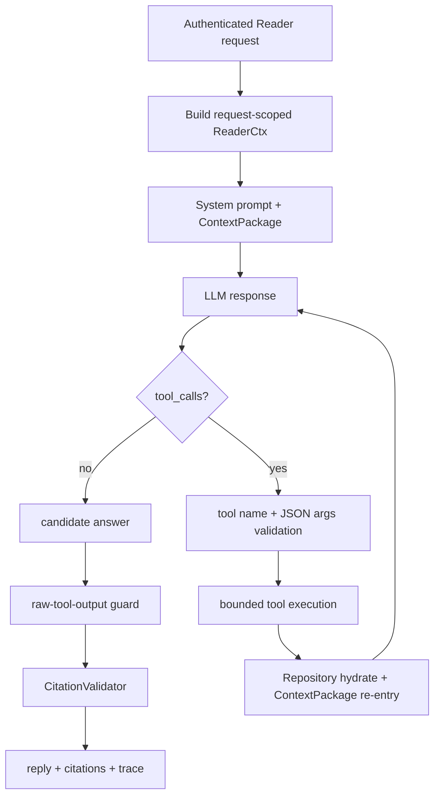
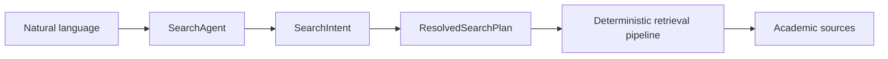

# AI Agent 设计

## 一句话结论

PaperGraph 的 Agent 是受约束的语义组件，不是系统控制器：SearchAgent 解析意图，PaperAnalysisAgent 在请求级上下文内选择有限工具并生成回答，权限、检索作用域、持久化和引用校验仍由确定性代码负责。

## Agent 清单

| Agent/运行时 | 生命周期 | 主要职责 | 边界 |
|---|---|---|---|
| `SearchAgent` | 进程级 singleton | 自然语言→`SearchIntent`、结果解释 | 不直接决定用户权限；检索计划固化后不介入召回层 |
| `PaperAnalysisAgent` | Reader 请求级使用 | 生成导读/回答、选择 canonical tools、辅助分类 | 不拥有对话历史，不直接写 Memory |
| `BoundedAgentLoop` | 单次 LLM 任务 | OpenAI-style tool call 循环 | 最大轮次、调用数、共享 deadline、输出上限 |
| Deep Search tasks | 单次函数任务 | 子问题分解、盲区判断、brief | 有界轮次，不是常驻 Agent |
| Memory draft task | 单次结构化生成 | 对选中 turns 生成候选草稿 | 不能 commit |

## 状态定义

### SearchAgent

- 输入：message、profile。
- 短期状态：5 分钟、最多 200 项的 TTL intent cache。
- cache key：消息 lowercase 前 200 字 + profile。
- 返回前 deep copy，避免并发请求共享可变 list。

### Reader Agent

`ReaderCtx` 是请求级状态快照，包含：

- `user_id/paper_id/document_version_id`；
- ContextPackage 和 EvidenceRegistry；
- server-side history；
- 当前问题；
- tool budget 和 trace；
- 可用工具实例。

Agent 不在 singleton 内积累 conversation；下一请求重新由 Service 构造。

## Agent Workflow

## 有界 Agent Loop

`PaperAnalysisAgent` 传入的实际上限：

- `max_tool_iterations=5`；
- `max_tool_calls=8`；
- 所有工具共享 `tool_deadline_sec=28`；
- canonical tool 默认单次 timeout 4 秒；
- canonical tool 单次输出上限 520 tokens；
- 通用裁剪上限不会超过 2,000 tokens；
- 达到轮次上限后要求模型给出不再调用工具的最终回答。

Tool timeout 只停止等待；对已交给线程的同步函数不能强制杀死，这是当前运行时边界。

## 工具注册与参数校验

每个工具转换成 `ToolSpec`：

- name/description；
- JSON schema；
- handler；
- timeout；
- max output tokens。

Loop 对 `tool_calls[].function.arguments` 做 JSON object 解析，拒绝未知工具、重复超限调用和错误参数。事件只记录脱敏字段，如 tool name、status、code、elapsed、是否截断，不记录完整敏感正文。

## 搜索 Agent 与确定性 Workflow 的分工

`ResolvedSearchPlan` 是意图与 Pipeline 的单一事实源。来源只允许 arXiv/DBLP/OpenAlex；结果数、年份和候选上限在代码中裁剪。这样即使 LLM 返回异常 JSON，也不能直接发出任意系统操作。

## 多 Agent 协作状态

当前没有自由多 Agent 协商、共享黑板或 Agent-to-Agent 消息协议。多论文研究由一个 Service 做确定性检索和一次回答生成。面试中应表述为“多种专用 Agent/LLM task + 统一 Workflow”，不能表述为“多 Agent 自主协作平台”。

## 异常处理

- LLM 未配置：Search intent 失败；Deep Search 某些步骤回原 query。
- JSON 解析失败：意图解析最多按配置重试并提供 correction hint。
- 未知工具：返回结构化错误给模型，不执行。
- Tool timeout：记录 `TOOL_TIMEOUT` 或共享 deadline exceeded。
- 工具输出过长：token clip 并标记 `output_truncated`。
- 最终输出仍像原始 tool JSON：PaperAnalysisAgent 额外做一次解释/清理。

## 为什么这样设计

代码中的设计信号很明确：

- Search plan 注释强调“retrieval layer 无 LLM calls”。
- canonical tools 注释强调工具 JSON 不是 Evidence。
- Memory prompt 明确禁止模型决定最终 scope。
- Reader 是 request-scoped。

合理推断：项目用 Agent 处理自然语言的不确定性，用 Workflow 保住可复现性、成本上限和安全边界。

## 技术取舍

| 方案 | 优点 | 缺点 | 当前采用 |
|---|---|---|---|
| 自由 ReAct 无限循环 | 灵活 | 难终止、难测试、成本不定 | 否 |
| 有界 tool loop | 能补充证据、可控 | 复杂任务深度有限 | 是 |
| 全部确定性无 Agent | 稳定 | 难理解开放自然语言 | 否 |
| Agent 语义 + Workflow 控制 | 兼顾灵活和约束 | 边界设计成本高 | 是 |

## 当前限制

- 同步工具线程超时后不能取消底层工作。
- Agent loop 没有跨进程 tracing/metrics backend。
- tool-call 结果语义质量主要由测试和 Prompt 约束，尚无完整 Golden。
- `PaperAnalysisAgent` 文件较大，包含多个辅助职责，仍可拆分。

## 面试官可能提问与回答要点

1. **Agent 和普通 LLM 调用有什么差别？** Reader 有工具 schema、循环、状态快照、deadline 与 trace；SearchAgent 有结构化意图和重试。
2. **为什么 Agent 不负责权限？** LLM 输出不可作为授权事实；权限必须在 API/Repository 硬过滤。
3. **如何防止 Agent 无限调用工具？** 5 轮、8 次、28 秒共享 deadline 和单工具 timeout。
4. **项目是多 Agent 吗？** 有多个专用 Agent/task，但没有自由多 Agent 协作。
5. **Agent 状态如何隔离？** Reader 每个请求新建 context/registry/agent 输入，历史来自 user-scoped SQLite。

## 证据来源

- `backend/app/agents/search_agent.py::SearchAgent`
- `backend/app/agents/paper_analysis_agent.py::_run_reader_llm`
- `backend/app/services/llm/agent_loop.py::run_bounded_agent_loop`
- `backend/app/services/retrieval/search_plan.py::ResolvedSearchPlan`
