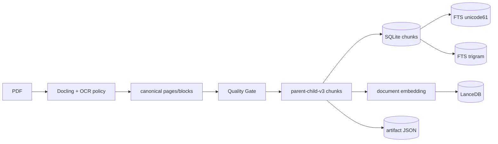
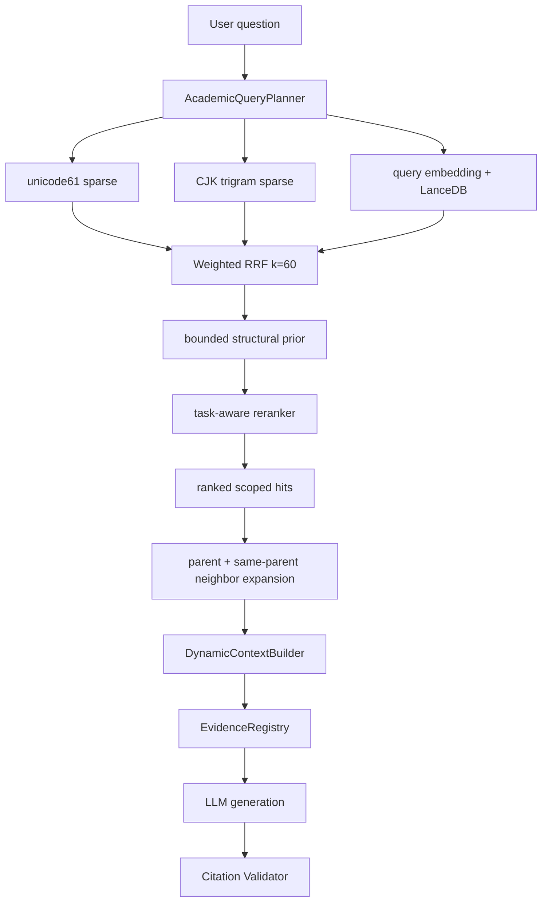

# Canonical RAG Pipeline

## 一句话结论

PaperGraph 的 canonical RAG 是双阶段系统：离线把 PDF 转成 versioned canonical chunks 与稀疏/向量投影，在线用 QueryPlan 驱动 unicode61、CJK trigram、dense、Weighted RRF、task-aware rerank、Evidence Expansion 和 Token Budget。

## 建库链路



详见 `13_FEATURE_CANONICAL_PDF_INGEST.md`。本文件重点描述在线查询。

## 查询链路



## Query Planning

`AcademicQueryPlanner` 是确定性规则规划器，不调用 LLM：

- 识别语言：CJK、English、mixed。
- 识别任务：factual、summary、method、table、formula、limitation、reference。
- lexical query 去除会话壳词；dense query 保留原始语义。
- 为中文生成有限 n-gram，为常见术语使用有界 alias。
- 解析显式来源偏好，如 abstract/experiment/table，而不是让任意 section prior 生效。
- 生成 task-specific rerank instruction。

## Sparse Retrieval

| 通道 | 用途 | 约束 |
|---|---|---|
| FTS unicode61 | 英文、数字、术语和一般 token | external-content FTS |
| FTS trigram | 中文自然问句与中英混合补召回 | 只在有 CJK 时启用 |

查询始终限制：

- `user_id`；
- `paper_id` 或固定 `paper_ids`；
- active `document_version_id`；
- child chunk 为主要 recall 单元。

## Dense Retrieval

1. 查 active version 的 embedding provider/model/dimension/config hash/status/count。
2. 只有与当前 provider 完全一致且 `ready` 的 version 才参与 dense。
3. `embed_query` 与 document instruction 分离。
4. LanceDB 使用 metadata prefilter 限制 user/paper/version。
5. score 由 cosine distance 转换。

Dense 未配置、状态不匹配或 provider 失败会生成 degradation reason，不阻断 sparse。

## Fusion 与 Rerank

### Weighted RRF

不同通道按：

```text
score(d) = Σ weight_i / (60 + rank_i(d))
```

合并，避免直接比较 BM25 与 cosine 的不同分值尺度。

### Candidate 扩大

- sparse-only 默认候选 multiplier≈3；
- 结构/跨语言精确任务可扩大到 10；
- 总候选 cap 100。

### Structural Prior

只对用户显式 section/source 偏好施加小幅上限分：

- section match 约 0.03；
- content type match 约 0.012。

它不会覆盖主检索排序。

### Rerank

- DashScope `qwen3-rerank`。
- query 前加入 task-aware instruction。
- 请求最多约 50 candidates、timeout 30 秒、最多 2 attempts。
- 返回 index/score 必须合法。
- `rag_rerank_min_score` 默认空，等待 Golden 校准。
- 若启用阈值后全部被过滤，至少保留 top1 并标记可见降级。

## Evidence Expansion

直接给 LLM 一组碎 child 会丢上下文。`EvidenceExpander`：

- 默认从 top 4 anchors 开始；
- 优先 parent；
- 加同 parent 半径 1 邻居；
- 总量最多 12；
- 每次 hydrate 再做 user/paper/active-version scope。

## ContextPackage

`DynamicContextBuilder` 处理：

- source token caps；
- 内容去重；
- content type 偏好；
- section diversity；
- 最新 history tail；
- Memory/metadata/history/tool 的非 Evidence 标识；
- untrusted data boundary；
- 最终 Evidence 编号。

单篇 Reader 默认文档侧约 2,800 tokens，另给工具回流约 800，总计约 3,600；最大 Evidence 常用 10。Token 统计优先 `tiktoken cl100k_base`，不可用时用 Unicode-aware 近似。

## 引用校验

只有 `ContextPackage.evidence` 中的 canonical item 被注册。`CitationValidator`：

- 识别 `[E#]`；
- 删除不存在 marker；
- 从 Registry 生成 page/section/snippet；
- 记录 invalid markers。

它不做 claim-evidence entailment，这是明确限制。

## 质量评测

隔离 Silver v2：

| 方案 | Recall@10 | MRR@10 | evidence_complete@10 |
|---|---:|---:|---:|
| Sparse | 0.869565 | 0.573240 | 0.869565 |
| Hybrid + Rerank | 1.0 | 0.920290 | 1.0 |

边界：24 个开发样例/26 anchors，小语料结果不能推广为产品通用质量；Golden Candidate 未经用户审核不能运行。

## 为什么这样设计

- FTS 对精确术语、公式标识和专名强；dense 对语义改写强；RRF 避免分值校准问题。
- CJK trigram 专门修复中文 tokenization 弱点。
- Parent-child 将精确召回和完整回答上下文分离。
- Embedding 是投影，允许换模型而不重跑 Docling。
- ContextPackage 在编号前裁剪，避免引用到实际上没给模型的片段。

## 当前限制

- LanceDB 没有显式 ANN index 和规模性能基线。
- Dense/Rerank 效果只在 Silver 开发集实测。
- citation 只验证 source legality，不验证 entailment。
- Context Budget 是启发式固定值，未基于真实模型 context/cost 自适应。
- 业务库无 canonical chunk，尚无真实用户 query 分布。

## 面试官可能提问与回答要点

1. **为什么 Hybrid 比单向量好？** 学术问答包含专名、公式、表格和跨语言改写，sparse/dense 互补。
2. **为什么用 RRF？** 不必把 BM25、trigram、cosine 校准到同一数值空间。
3. **为什么 recall child、扩展 parent？** child 精确，parent/邻居提供回答所需上下文。
4. **如何防越权？** 每个查询和 hydrate 都带 user/paper/active version scope。
5. **如何评价引用正确？** 当前保证 marker 来源合法；语义蕴含需要 answer/citation Golden 补齐。

## 证据来源

- `backend/app/services/retrieval/academic_query_planner.py`
- `backend/app/services/retrieval/hybrid.py::HybridChunkRetriever`
- `backend/app/services/retrieval/evidence_expander.py`
- `backend/app/services/context/builder.py::DynamicContextBuilder`
- `backend/app/services/citation/validator.py`
