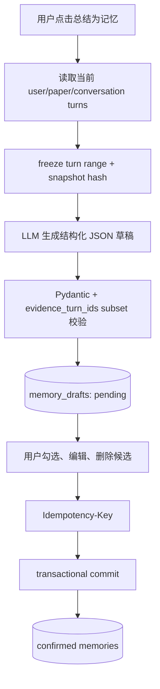

# Memory 系统

## 一句话结论

PaperGraph 把 Memory 当作用户确认的长期数据，而不是 Agent 隐式状态：Reader 只生成带 turn evidence 的草稿，用户选择/编辑后以幂等事务写入，检索时再做 user/paper/status/expiry 硬过滤。

## 业务目标

- 记住论文阅读总结、关键发现、开放问题和研究决策。
- 记住用户偏好与长期研究目标。
- 避免模型误判一句临时对话并永久写入。
- 保证 Memory 不跨用户、跨论文或冒充 PDF Evidence。

## Memory 类型

| scope | kind | 示例 | 写入方式 |
|---|---|---|---|
| paper | reading_summary | 对本篇论文的总结 | Reader 草稿后确认 |
| paper | key_finding | 关键发现 | Reader 草稿后确认 |
| paper | open_question | 未解决问题 | Reader 草稿后确认 |
| paper | research_decision | 研究决策 | Reader 草稿后确认 |
| user | preference | 更偏好中文回答 | 草稿确认或手动创建 |
| user | research_goal | 长期研究主题 | 草稿确认或手动创建 |

## 写入工作流

### Draft

- 最多取最近 40 个选中 turns。
- Prompt 明确禁止 LLM 决定 `user_id/paper_id/final scope`。
- 输出 `MemoryDraftPayload`，其中每个 item 带 `evidence_turn_ids`。
- Service 验证所有 turn ID 属于当前快照。
- 没有任何候选时返回错误，不创建空草稿。

### Commit

- `Idempotency-Key` 长度 8–128。
- 客户端只提交用户保留/编辑后的 paper/user items。
- kind 白名单验证。
- paper item 固定 `user_id + paper_id`；user item 固定 `user_id`。
- 内容 normalize/hash；active content unique index 防重复。
- transaction 和 IntegrityError 处理并发竞态。
- draft 状态变为 committed；相同 key 重试返回同一语义结果。

## 检索工作流

`MemoryRetriever` 先做硬过滤：

- 当前 `user_id`；
- paper Memory 必须是当前 `paper_id`；
- confirmed；
- active；
- 未过期；
- 未删除/未被 supersede。

再做相关性：

- unicode token 与 CJK trigram；
- lexical overlap；
- dual FTS candidate；
- RRF(k=20)；
- 默认最小 relevance 约 0.04；
- quota：最多 3 个 paper Memory + 2 个 user Memory。

没有 query 时只返回 paper Memory，避免无条件把广泛用户画像注入回答。

## Context 中的地位

Memory 进入 `ContextPackage.memory`，明确标识为背景，不进入 `EvidenceRegistry`。因此：

- 可以帮助回答延续研究目标；
- 不能生成 PDF 页码；
- 不能使模型引用 `[E#]`；
- 与 canonical chunks 去重但不改变其 provenance。

## 前端

- `PaperReader.vue`：生成草稿、编辑、勾选、确认或取消。
- `LongTermMemory.vue`：查看 user Memory、手动创建 preference/research_goal、软删除。
- API：draft create/get/cancel/commit、paper memories、user memories、list/stats/delete。

## 关键类、函数与文件

| 文件路径 | 类或函数 | 作用 |
|---|---|---|
| `services/memory/memory_draft_service.py` | `MemoryDraftService.generate_draft` | turn snapshot 与 LLM 草稿 |
| `repositories/memory_repository.py` | commit/list/delete | 事务、幂等、作用域 |
| `services/memory/retriever.py` | `MemoryRetriever.retrieve` | 双 FTS/相关性/配额 |
| `domain/memory.py` | `MemoryDraftPayload` | 结构化 schema |
| `api/routes/memory.py` | memory routes | HTTP 与用户依赖 |

## 异常处理

- LLM 非 JSON：解析 fence 后仍失败则 `MemoryDraftError`。
- evidence turn 越界：拒绝草稿。
- 重复 commit：由 idempotency key 和内容 hash 安全返回。
- 跨用户 draft/memory：Repository 查询不到。
- delete：软删除，不物理抹掉审计记录。

## 为什么这样设计

代码明确要求“用户审查并提交后才写入”。这把模型从“事实写入者”降为“候选整理者”，牺牲自动化程度换取用户控制与可解释性。

## 当前限制

- Memory semantic dense/vector retrieval 未实现。
- importance、expiry、supersede Schema 已存在，但产品 UI/策略并未完整使用。
- 没有 Memory 质量 Golden 或真实用户相关性标注。
- 对用户手动输入 Memory 的事实正确性不做外部验证。

## 面试官可能提问与回答要点

1. **为什么不自动写 Memory？** 模型推断可能错误，永久状态必须经用户确认。
2. **如何保证 Memory 来源？** draft item 引用服务器 conversation turn ID，并验证属于固定快照。
3. **如何防重复提交？** Idempotency-Key + normalized content hash + unique active index。
4. **Memory 能否作为论文引用？** 不能，它永不进入 EvidenceRegistry。
5. **检索如何避免无关画像污染？** 硬 scope、status/expiry、相关性门槛和 paper/user quota。

## 证据来源

- `backend/app/services/memory/memory_draft_service.py`
- `backend/app/repositories/memory_repository.py`
- `backend/app/services/memory/retriever.py`
- `backend/tests/test_memory_*`
