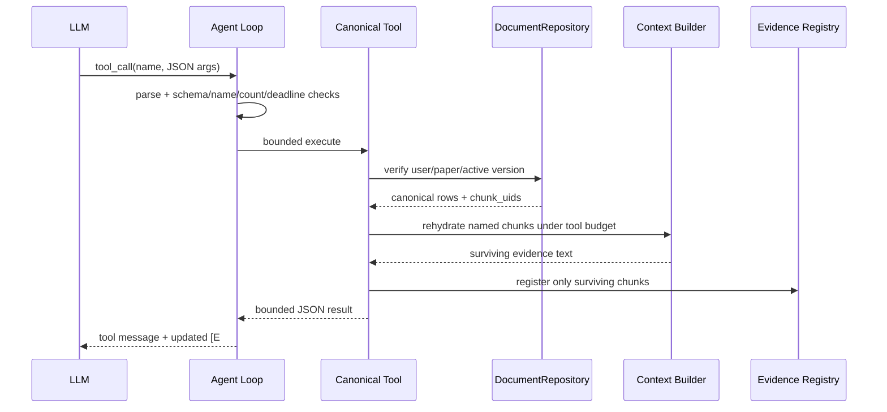

# Tool 与 Function Calling

## 一句话结论

Reader Function Calling 的关键不是“模型会调函数”，而是每个工具共享同一请求 scope，参数有界、执行有 deadline，返回的 chunk UID 必须回 Repository 并重新经过 Context Budget 才能获得新 `[E#]`。

## 工具集合

| 工具 | 典型问题 | 返回 |
|---|---|---|
| `reader_get_outline` | 论文结构是什么 | canonical section outline |
| `reader_get_section` | 方法章节怎么说 | 指定 section 的 scoped chunks |
| `reader_get_table` | 表 2 的结果是什么 | canonical table block/chunks |
| `reader_search_document` | 文中哪里提到某术语 | 当前文档 sparse search hits |
| `reader_paper_lookup` | 有哪些相关论文 | 外部论文元数据 |
| `reader_reference_lookup` | 某参考文献是什么 | 参考文献/外部检索结果 |

前四个是 canonical document tools；后两者可辅助推荐，但不能生成当前 PDF Evidence。

## ToolSpec

`BoundedAgentLoop` 使用的 ToolSpec 含：

- `name`；
- `description`；
- OpenAI function JSON schema；
- `handler`；
- `timeout_sec`；
- `max_output_tokens`。

模型只能从注册表中选择工具。参数必须是 JSON object，Pydantic/工具代码再限制长度和数量。

## 执行流程

## Scope 防护

每个 canonical tool 构造时接收：

- db path / `DocumentRepository`；
- `user_id`；
- `paper_id`；
- `document_version_id`；
- 当前 registry/context builder；
- tool budget 和 trace。

工具执行前再次验证 active version 仍然等于请求快照的 version。即使模型传入另一个 paper/version，也没有对应可控参数。

## Budget

- canonical tool 默认 timeout 4 秒。
- 单工具输出 token cap 520。
- Reader 整体工具补充 budget 约 800 tokens。
- 一次工具回流最多约 4 个 Evidence。
- `reader_search_document` query≤800 字符，results≤8。
- outline sections≤32；section chunks≤6。
- Agent 总计≤5 rounds、≤8 calls、共享 28 秒。

## 为什么 Tool JSON 不能直接引用

工具输出可能包含：

- 模型可控的参数回显；
- 被截断文本；
- 目录、状态、错误说明；
- 外部网页内容；
- 超过 Context Budget 而未给模型的 chunk。

因此工具只返回候选 UID，真实文本从 Repository hydrate；Context Builder 裁剪后才分配 `[E#]`。这避免“工具说找到了”被直接当成论文事实。

## 错误契约

| 场景 | 处理 |
|---|---|
| unknown tool | 结构化错误消息，不执行 |
| malformed JSON args | 参数错误返回模型 |
| per-tool timeout | `TOOL_TIMEOUT` |
| shared deadline exhausted | `TOOL_REQUEST_DEADLINE_EXCEEDED` |
| output too large | token clip + `output_truncated=true` |
| Repository scope mismatch | 工具失败，不返回数据 |
| no match | 返回明确空结果，不伪造 Evidence |

Trace 只保留工具名、状态、code、elapsed、截断标记等，不记录完整论文正文或 secret。

## 为什么这样设计

Function Calling 提供按需取结构的能力，避免初始 Prompt 放入整篇 PDF；但工具本身是新的输入攻击面，所以项目用固定工具、无 scope 参数、Repository 回表、双重预算和 registry re-entry 限制。

## 技术取舍

| 方案 | 优点 | 缺点 | 当前采用 |
|---|---|---|---|
| 初始上下文放整篇论文 | 无工具循环 | 超预算 | 否 |
| 工具返回文本直接可信 | 简单 | 可注入、可伪造 provenance | 否 |
| UID 回表 + re-entry | 可审计、预算一致 | 实现复杂 | 是 |
| 任意 shell/SQL tool | 灵活 | 风险极高 | 否 |

## 当前限制

- 超时不能取消已启动的同步线程。
- Tool 选择正确率没有独立 Golden 指标。
- search tool 为 sparse-only，成本低但不复用 dense/rerank。
- 外部 paper/reference 工具结果的质量依赖学术源。

## 面试官可能提问与回答要点

1. **如何防止模型调用任意函数？** 固定 ToolSpec registry，未知 name 直接拒绝。
2. **如何做参数校验？** JSON object 解析 + schema/长度/数量限制，paper scope 不暴露为参数。
3. **工具返回如何变成 citation？** UID 回 Repository、Context Builder 预算后再注册 `[E#]`。
4. **如何控制工具成本？** rounds/calls/deadline/per-tool timeout/output cap/tool token budget。
5. **工具超时后线程还跑怎么办？** 当前不能强杀，这是技术债；工具应设计为短任务并在底层设置 I/O timeout。

## 证据来源

- `backend/app/agents/support/canonical_reader_tools.py`
- `backend/app/services/llm/agent_loop.py::run_bounded_agent_loop`
- `backend/app/agents/paper_analysis_agent.py`
- `backend/tests/test_agent_loop_safety.py`
- `backend/tests/test_canonical_reader_tools.py`
