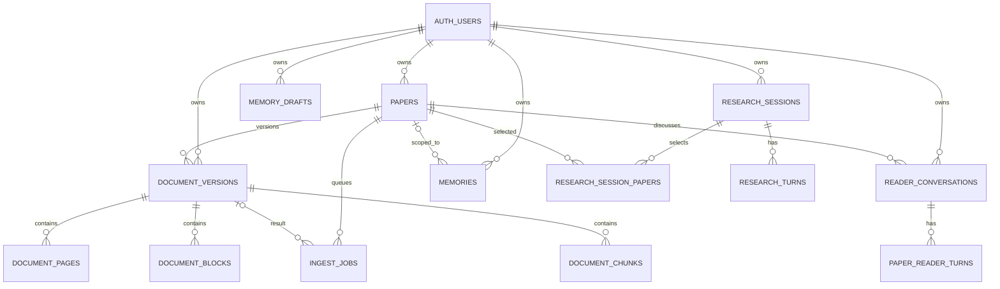

# 数据库与存储设计

## 一句话结论

PaperGraph 以 SQLite 保存用户、论文、canonical 文档、会话、Memory 和 Job 的业务事实，以 FTS5 和 LanceDB 做可重建检索投影，以本地文件保存 PDF 与 canonical artifact。

## 存储分工

| 存储 | 内容 | 一致性定位 |
|---|---|---|
| SQLite | 用户、论文、document version/page/block/chunk、Job、对话、Memory、Research、Daily、Graph relation | 业务事实源 |
| SQLite FTS5 | paper/chunk/Memory 稀疏索引 | 可 rebuild projection |
| LanceDB | child chunk dense vector | 可 rebuild projection |
| 本地 PDF | 原始论文文件 | document version 的输入 |
| Artifact JSON | canonical 解析报告/结构 | 可审计派生产物 |

## Canonical ER 图

## Migration

| 版本 | 主题 |
|---:|---|
| v001 | baseline papers/authors/auth_users/FTS |
| v002 | ownership、reading、daily feedback |
| v003 | Reader conversation/history |
| v004 | canonical Memory/draft/idempotency |
| v005 | research sessions |
| v006 | document version/page/block/chunk/FTS/ingest job |
| v007 | embedding status |
| v008 | Job retry schedule/heartbeat |
| v009 | runtime tables ownership、daily、relations、cache isolation |
| v010 | CJK trigram chunk FTS、embedding config hash |
| v011 | Memory lifecycle 与 dual FTS |

Migration runner：

- 保存 version/name/checksum；
- `BEGIN IMMEDIATE`；
- 临时关闭 FK 完成结构迁移；
- commit 后重新开启并做 schema/FK validation；
- 支持 fresh、已有库、幂等与 rollback 测试；
- 不允许改写历史 Migration。

## SQLite 连接策略

`Database.connect`：

- `row_factory=sqlite3.Row`；
- `PRAGMA foreign_keys=ON`；
- `PRAGMA busy_timeout=5000`；
- 非内存写连接使用 WAL；
- `read_only=True` 使用 URI `mode=ro`；
- transaction 异常自动 rollback。

Job claim 和 Migration 使用 `BEGIN IMMEDIATE`，普通 Repository transaction 使用 `BEGIN`。

## Document Version

`document_versions` 的关键约束：

- `(user_id, paper_id)` 只允许一个 `status='active'` 的 partial unique index。
- `(user_id,paper_id,file_hash,parser_config_hash,chunker_version,parser_id,parser_version)` 幂等 unique。
- 记录 parser/chunker/embedding/quality/count/error/时间。
- page/block/chunk 通过 version FK cascade。

Embedding 不进入 document identity，因为它是可重建投影；v010 另存 embedding config hash。

## Chunk 与 FTS

`document_chunks` 保存：

- parent/child level；
- page range；
- section path；
- block UIDs；
- display/embedding/sparse text；
- text hash、token count、chunker version。

unicode61 FTS 使用 external content 和 insert/update/delete trigger。v010 增加 trigram FTS 解决中文自然问句。SQLite 不支持 FTS5 时，Migration 保留 source table并删除无效 trigger，Retrieval 返回 sparse degradation。

## LanceDB

- table：`paper_chunk_vectors`。
- 只写 child chunk。
- 字段包含 vector 与 user/paper/version/chunk metadata。
- upsert 为 version 级 delete → add → count verify。
- query 先 metadata filter，再 cosine distance。
- 当前未创建显式 ANN index。

## 当前业务库只读快照

2026-07-31 未执行 Migration 的只读检查：

| 项目 | 结果 |
|---|---:|
| 普通 tables | 50 |
| `schema_migrations` | v001–v007 |
| papers | 11 |
| active document versions | 0 |
| document chunks | 0 |
| ingest jobs | 0 |
| `foreign_key_check` | 0 issues |

代码已定义 v008–v011，API 启动时会运行 Migration；为何当前文件仍停在 v007 需要开发者确认，详见 `99_UNCONFIRMED_QUESTIONS.md`。本知识库未修改该用户数据库。

## 事务与并发

| 场景 | 机制 |
|---|---|
| Job claim | immediate write lock + lease |
| active version 切换 | transaction + unique partial index |
| Memory commit | idempotency key + unique content + transaction |
| SQLite busy | 5 秒 busy timeout |
| Reader query | read connection + active version filter |
| 多 Worker | lease 可防重复 claim；仍受 SQLite 单写者限制 |

## 为什么这样设计

对于本机科研工具，SQLite 同时提供事务、FK、FTS5 和可移植单文件，运维成本低。向量和 artifact 分离，避免一个外部投影故障破坏业务事实。

## 当前限制

- 多 API/Worker 实例下 SQLite 单写者会成为瓶颈。
- 本地文件/LanceDB 不适合无共享盘的横向扩容。
- current business DB 的 Migration level 与代码不一致。
- 没有在线备份、PITR、对象存储版本和投影重建 runbook 的完整演练。

## 面试官可能提问与回答要点

1. **为什么 SQLite 能做这个项目？** 当前单机规模，SQLite 有事务/FK/FTS/WAL，部署简单。
2. **为什么 FTS/LanceDB 不是事实源？** 它们可由 canonical chunks 重建，失败不应丢业务状态。
3. **如何保证只有一个 active version？** partial unique index + 原子激活 transaction。
4. **如何处理并发 Worker？** lease owner/expiry + `BEGIN IMMEDIATE`，但不是无限扩展方案。
5. **何时迁移 PostgreSQL？** 多副本、高写并发、集中部署、需要成熟备份/监控时。

## 证据来源

- `backend/app/infrastructure/db/connection.py::Database`
- `backend/app/infrastructure/db/migrations/v006_document_rag.py`
- `backend/app/infrastructure/db/migrations/v010_bilingual_fts_and_memory_index.py`
- `backend/app/repositories/document_repository.py`
- `backend/app/infrastructure/vector/lancedb_store.py`
