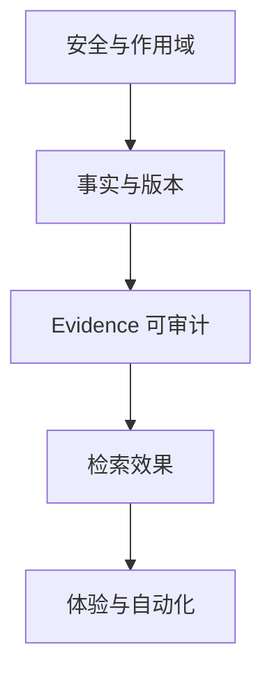

# 关键架构决策

## 一句话结论

项目的核心决策可以归纳为：模型处理语义、Workflow 处理控制；SQLite 保存事实、索引保存投影；Evidence 先预算后编号；长期状态必须由用户确认。

## ADR-1：授权由确定性代码决定

### 决策

`user_id` 来自 token；paper/session/version scope 在 Route/Service/Repository 多层过滤，不允许 LLM 或 tool args 指定任意 owner。

### 原因

Prompt 不能成为安全边界；模型输出可能被注入或幻觉。

### 结果

- 好处：可测试、可审计、跨用户泄漏目标为 0。
- 代价：Repository 方法参数较多，必须持续避免绕过。

## ADR-2：PDF 保存与重型 Ingest 解耦

### 决策

HTTP 只下载、原子落盘和 enqueue；独立 Worker 完成 Docling、Chunk、Embedding。

### 代码明确理由

`save_papers` 注释要求不要在请求内运行 Docling/Embedding；API reload 不应中断任务。

### 结果

- Job 可重试、恢复、查询状态。
- 增加 Worker 进程、lease 和运维复杂度。

## ADR-3：Canonical Document Version 是 Reader 唯一全文事实

### 决策

PDF 每次解析由 file hash + parser config + chunker version 等形成 document version；Reader 只查询 active。

### 原因

避免半写入、旧新 Chunk 混用和不可追溯页码。

### 结果

- 支持原子切换、重复解析幂等和 provenance。
- Schema/迁移/垃圾回收更复杂。

## ADR-4：Embedding 是投影，不是文档身份

### 决策

document identity 不含 Embedding；向量状态和 config hash 独立。

### 代码明确理由

`DocumentRepository` 注释说明 projection 可重建。

### 结果

- 换 embedding instruction/model 时不重跑 Docling。
- 需要精确校验 dense version 配置，避免误用旧向量。

## ADR-5：Evidence 在 Context Budget 后分配

### 决策

只有真正进入 ContextPackage 的 canonical item 才得到 `[E#]`。

### 原因

若先编号后裁剪，模型可能引用实际没看到的材料。

### 结果

- Marker 与本轮 Prompt 一一对应。
- Context Builder 与 Registry 耦合更紧，需要 request scope。

## ADR-6：工具结果必须回表

### 决策

canonical tools 返回 chunk UID，Repository hydrate 后重新预算、注册。

### 原因

工具 JSON、目录、状态或外部文本不是自动可信证据。

### 结果

- 工具可扩上下文而不破坏引用模型。
- 多一次 DB query 和 budget 管理。

## ADR-7：Memory 必须用户确认

### 决策

LLM 只生成 draft，用户决定哪些内容进入 paper/user Memory。

### 原因

永久状态比一次回答风险更高，自动写入会固化误判。

### 结果

- 可控、可解释、幂等。
- UX 多一步，Memory 覆盖率可能低。

## ADR-8：Hybrid Retrieval 使用 RRF

### 决策

unicode61、trigram、dense 分别排序后用 Weighted RRF(k=60)，再做 rerank。

### 合理推断

BM25、trigram 和 cosine 分值不可直接比较，RRF 对尺度稳定且实现简单。

### 结果

- 多路互补，Silver 指标提升。
- 权重和 k 仍需 Frozen Golden 校准。

## ADR-9：多论文用固定 Session，不用自由多 Agent

### 决策

Session 固定论文集合，一次统一检索和回答，anchor 确定性均衡。

### 原因

scope、成本和引用归属更容易控制。

### 结果

- 安全边界清晰。
- 复杂跨文档推理深度不如专门多 Agent 流程。

## ADR-10：SQLite/本地文件优先

### 决策

以单机本地部署为权威，Docker 仅实验性。

### 合理推断

目标用户是个人科研阅读，低运维和本地数据控制优先。

### 结果

- 开发/备份直观。
- 横向扩容和灾备能力弱。

## 决策优先级

从代码看，项目宁愿显式降级和用户多一步确认，也不让 LLM 获得授权、自动 Memory 或伪引用能力。

## 面试官可能提问与回答要点

1. **最关键的 ADR 是哪个？** LLM 不控制权限/事实源，Evidence 由确定性 Registry 管理。
2. **为什么 active version 必须唯一？** 保证 Reader 每次只看到同一解析配置的完整文档快照。
3. **为什么 Embedding 不进版本身份？** 它可重建且更新频率高于 PDF 解析。
4. **哪些是合理推断而非原始决策记录？** SQLite/单机优先和 RRF 选择的业务原因主要由实现反推。
5. **下一项应形成 ADR 的决策？** 从 SQLite Job/本地文件迁移到生产级共享基础设施的触发条件。

## 证据来源

- `docs/ARCHITECTURE.md`
- `backend/app/repositories/document_repository.py`
- `backend/app/services/context/builder.py`
- `backend/app/services/citation/evidence_registry.py`
- `backend/app/services/memory/memory_draft_service.py`
