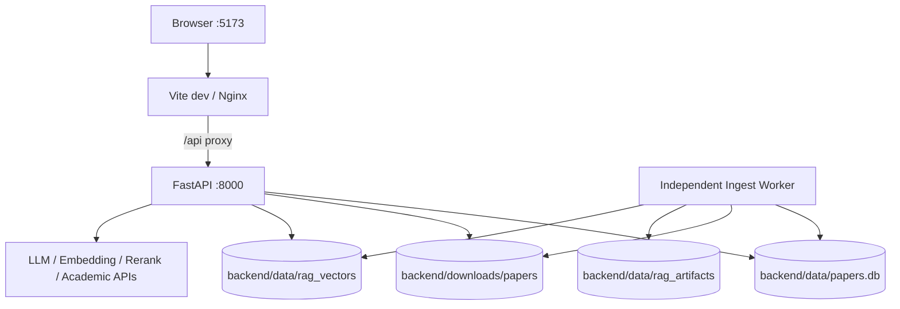

# 部署与配置

## 一句话结论

当前权威部署是 Windows 本机的三个进程：Vue/Vite、FastAPI、独立 Ingest Worker，共享 SQLite/PDF/artifact/LanceDB；Docker 文件存在但没有安装完整 RAG 依赖、Worker service 和 GPU/模型缓存验收，只能视为实验配置。

## 权威运行环境

| 组件 | 当前值 |
|---|---|
| OS | Windows |
| Python | 3.11.9 |
| 完整环境 | `D:\AIModels\PaperGraph\venv-rag` |
| Backend | `127.0.0.1:8000` |
| Frontend | `127.0.0.1:5173` |
| Node/npm | 24.11.0 / 11.6.1 |
| GPU | NVIDIA RTX 4060 Laptop，PyTorch 2.7.1+cu126 |
| SQLite | 3.45.1 |
| Docling/LanceDB | 2.115.0 / 0.34.0 |

不能用裸 `python` 验收，因为 PATH 可能命中 Anaconda 或其他 Python。

## 本机拓扑



## 启动

```powershell
cd backend
$PaperGraphPython = 'D:\AIModels\PaperGraph\venv-rag\Scripts\python.exe'
& $PaperGraphPython -m app.cli.preflight --strict-rag
& $PaperGraphPython run.py
```

另一个终端：

```powershell
cd backend
$PaperGraphPython = 'D:\AIModels\PaperGraph\venv-rag\Scripts\python.exe'
& $PaperGraphPython -m app.workers.ingest_worker
```

前端：

```powershell
cd frontend
npm ci
npm run dev
```

Worker 可用 `--once` 做一次 smoke。`RAG_INGEST_WORKER_ENABLED=true` 可把 Worker 嵌入 API，仅适合单进程开发演示。

## 配置加载

`backend/app/settings/config.py`：

- 明确从 `backend/.env` 加载，不依赖 current working directory。
- `pydantic-settings` 忽略未知项、大小写不敏感。
- 默认 data/PDF 路径由 backend root 解析。
- startup 调 `validate_config`；JWT secret 缺失或过短会阻止服务。

主要配置组：

| 组 | 配置示例 |
|---|---|
| 应用 | `HOST`、`PORT`、`CORS_ORIGINS`、`LOG_LEVEL` |
| 认证 | `PAPERGRAPH_JWT_SECRET` |
| Chat | `LLM_API_KEY/BASE_URL/MODEL_ID` 的兼容映射 |
| Embedding | model/key/base/dimension、`RAG_EMBEDDING_ENABLED` |
| Rerank | model/key/endpoint、`RAG_RERANK_ENABLED`、min score |
| Ingest | artifact/vector/staging/device/OCR/worker |
| 搜索 | Tavily、OpenAlex、NCBI、recall/rank/deep-search timeout |
| MCP | enabled/command/storage path |

密钥只在 `.env`，不得提交或写入文档/日志。

## 数据路径

| 数据 | 默认 |
|---|---|
| SQLite | `backend/data/papers.db` |
| PDF | `backend/downloads/papers` |
| artifacts | `backend/data/rag_artifacts` |
| vectors | `backend/data/rag_vectors` |
| RAG corpus | `backend/data/rag_eval_corpus` |
| PDF eval DB | `backend/data/rag_eval_workspace/rag_eval.db` |

评测脚本拒绝把业务 DB 当作 eval target。Backfill 默认 dry-run，只有 `--execute` 才写 Job。

## Docker 实际状态

`docker-compose.yml` 有 backend/frontend 两个 service 和 data/download volumes，但：

- Backend Dockerfile 只安装 `requirements.txt`，未安装 `requirements-rag.txt`。
- Compose 没有独立 Ingest Worker service。
- 没有 artifact/vector/Docling model cache volume。
- 没有 CUDA runtime/GPU 配置。
- 当前机器未完成 Docker RAG 验收。
- Dockerfile 的 `PAPERGRAPH_DATA_DIR/PAPERGRAPH_DOWNLOADS_DIR` 与 Settings 实际字段别名不一致；Compose 另传 `DATA_DIR/DOWNLOADS_DIR` 才是有效值。

因此不能把 `docker compose up` 描述为完整 canonical RAG 部署。

## 依赖复现

- 基础依赖在 `requirements.txt`。
- RAG 依赖在 `requirements-rag.txt`。
- RapidOCR/ONNX Runtime 已在实际文件中声明。
- PyTorch 因 CPU/CUDA host 差异故意不锁。
- 尚无完整 lock/constraints 覆盖所有环境。

## 发布前检查

```powershell
cd backend
& $PaperGraphPython -m pip check
& $PaperGraphPython -m compileall -q app tests run_rag_eval.py
& $PaperGraphPython -m pytest -q

cd ..\frontend
npm run typecheck
npm run build
```

还应补：Migration 到 v011、Worker heartbeat、health capabilities、标准浏览器 PDF/citation、Frozen Golden。

## 当前限制

- 没有 IaC、secret manager、CI/CD 和正式生产 runbook。
- SQLite/PDF/LanceDB 均是本地状态，多副本不可直接部署。
- Docker 与权威 Windows 环境不等价。
- 模型 API 的区域、限额、费用和 SLA 未文档化。

## 面试官可能提问与回答要点

1. **生产部署是什么？** 当前没有生产部署证据，权威是 Windows 本机开发拓扑。
2. **为什么 Worker 独立？** 避免 API reload/timeout 中断 Docling，支持 lease 恢复。
3. **Docker 能直接跑 RAG 吗？** 不能，缺 RAG 依赖、Worker、GPU和持久卷验收。
4. **如何管理配置？** backend/.env + Pydantic Settings，startup validate，密钥不入库。
5. **怎么做环境门禁？** 显式 venv + strict-rag preflight + pip check/tests/build。

## 证据来源

- `docs/ENVIRONMENT.md`
- `backend/app/settings/config.py`
- `backend/app/cli/preflight.py`
- `docker-compose.yml`
- `backend/Dockerfile`
