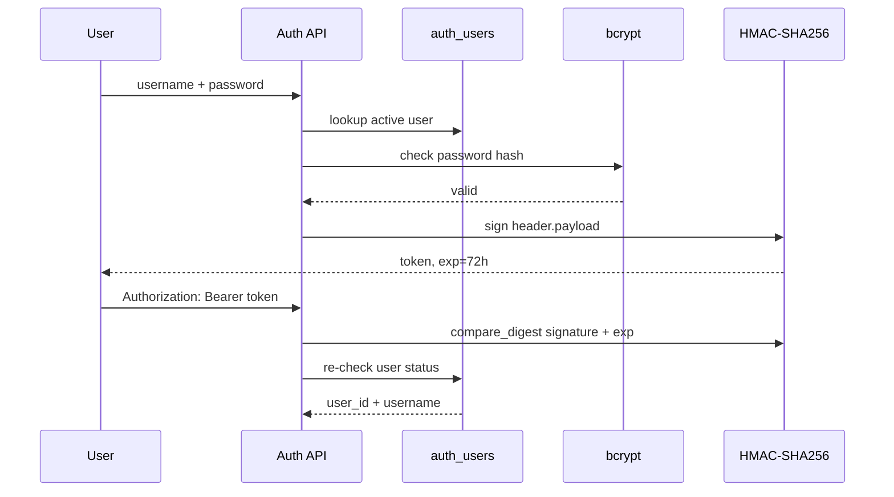

# 安全、认证与数据隔离

## 一句话结论

安全主线是“认证 token → active user lookup → Route user_id → Repository hard scope → Evidence scope”；密码使用 bcrypt，token 使用 HMAC-SHA256，但其 header/payload 为 hex 而非标准 JWT base64url，第三方 JWT 兼容性是明确技术债。

## 认证流程

## 密码安全

- bcrypt `gensalt` + `hashpw`。
- 登录使用 `checkpw`。
- 注册最小密码长度只有 6；这不足以作为高安全生产策略。
- DB 只存 password hash。

## Token 实现

- 三段格式：header.payload.signature。
- header/payload 是 UTF-8 JSON 后 `.hex()`。
- signature 是 HMAC-SHA256 hex digest。
- `hmac.compare_digest` 防 timing comparison。
- payload：`sub/username/iat/exp`，过期 72 小时。
- secret 必须存在且至少 32 字符，否则认证返回 503/启动校验失败。

虽然常量和 `typ` 称 JWT/HS256，但编码不是 RFC JWT 的 base64url；不能与标准 JWT library/gateway 直接互换。它本质是自定义 HMAC token。

## 授权与租户隔离

| 层 | 控制 |
|---|---|
| API | `require_user` 不允许匿名 fallback |
| Paper | 所有 CRUD/PDF/Job 传 `user_id` |
| Document | Repository 强制 user/paper/active version |
| Research | session owner + 固定 session papers |
| Memory | user scope，paper Memory 再限制 paper_id |
| Export | 每个 table query 加 user_id |
| Citation | Registry 固化 user/paper/version/chunk |

LLM 从不决定 `user_id`、允许访问的 paper 或最终 Memory scope。

## 文件安全

- PDF 通过已授权 Paper 查询得到实际路径。
- DB 保存相对路径，不能把请求路径直接传文件系统。
- 下载校验 `%PDF-` 和大小。
- Artifact/vector 路径由配置和 version 解析。
- 自动化测试使用临时目录/隔离 DB，不应写真实业务库。

## Prompt/Tool 安全

- PDF、Memory、History、Tool/Web 标为 untrusted data。
- canonical tool 不暴露 user/paper/version 参数。
- 工具结果按 UID 回 Repository。
- 只有 Registry item 可引用。
- Agent rounds/calls/deadline/output 有上限。
- 永久 Memory 需要用户确认。

## Web 安全现状

### 已有

- CORS allowlist 来自配置。
- API docs UI 关闭。
- 错误不向客户端返回堆栈。
- 进程内 rate limit。
- Pydantic 请求校验。

### 缺失或不足

- token 存 `localStorage`，有 XSS 读取风险。
- 没有 refresh token、撤销列表、设备/session 管理。
- token 非标准 JWT。
- 无 CSRF cookie 问题是因为 Bearer header，但 XSS 仍关键。
- 无 CSP、HSTS、TLS termination 配置证据。
- CORS `allow_credentials=True` 与宽方法/header 需生产核验。
- 客户端提供的 X-Request-ID 未做长度限制。
- 无分布式 rate limiting/防暴力破解专用策略。

## 威胁与控制

| 威胁 | 当前控制 | 剩余风险 |
|---|---|---|
| 跨用户 Paper | Repository user scope + tests | 绕过 Repository 的新 SQL |
| token 篡改 | HMAC + compare_digest | secret 管理/撤销不足 |
| 密码泄露 | bcrypt | 密码策略弱 |
| PDF prompt injection | untrusted boundary + tool re-entry | 缺完整攻击 E2E |
| 伪引用 | Registry + Validator | 不检查 entailment |
| 工具滥用 | 固定工具、参数与 deadline | sync thread 无法取消 |
| DoS | rate limit、timeout、budget | 进程内且重型接口仍昂贵 |
| 数据外发 | 本地存储、受控模型调用 | 外部 LLM/Embedding 数据治理未说明 |

## 面试官可能提问与回答要点

1. **JWT 是标准的吗？** 不是；是三段 HMAC token，但用 hex 编码，生产应迁移标准库。
2. **如何防跨用户数据泄漏？** user_id 不来自 body/LLM，Route 和 Repository 双层 scope，并有 API/Repository tests。
3. **token 为什么放 localStorage？** 实现简单，但 XSS 风险高；生产可改 HttpOnly Secure SameSite cookie。
4. **如何防 Prompt Injection？** 数据边界、受限工具、回表与 Registry；仍需专门 E2E。
5. **外部模型是否会看到 PDF？** Reader Context/Embedding 会发送必要片段/文本到配置的外部服务，当前缺正式数据治理说明。

## 证据来源

- `backend/app/services/auth/user_service.py`
- `backend/app/api/deps.py`
- `backend/app/repositories/document_repository.py`
- `backend/app/repositories/memory_repository.py`
- `backend/tests/test_phase1_auth_and_isolation.py`
