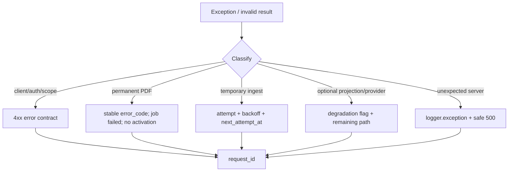

# 异常处理、重试与降级

## 一句话结论

项目按“请求错误、永久输入错误、临时基础设施错误、可选能力退化”分类处理：永久 PDF 错误不重试，Worker 临时错误有限重试，dense/rerank 可降级，所有引用仍必须通过相同 Registry。

## 总体流程

## API 错误

| 类型 | HTTP | 处理 |
|---|---:|---|
| 未认证/失效 | 401 | `AUTH_REQUIRED` |
| secret 配置错误 | 503 | `SERVICE_UNAVAILABLE` |
| 不属于用户/不存在 | 404 或 403 | Route/Repository 语义 |
| Pydantic 错误 | 422 | errors list + request_id |
| rate limit | 429 | 用户提示 |
| 已冲突/幂等边界 | 409 | `CONFLICT` |
| 未处理异常 | 500 | 安全 message，不泄露 stack |

`safe_http_500` 在服务器记录原异常，对客户端返回通用提示。

## Ingest 错误分类

### 永久输入错误

| code | 语义 |
|---|---|
| `PDF_FILE_MISSING` | 本地文件不存在 |
| `PDF_HASH_FAILED` | 无法稳定计算文件身份 |
| `PDF_ENCRYPTED` | 加密 PDF |
| `PDF_INVALID` | 文件损坏/非有效 PDF |
| `QUALITY_GATE_FAILED` | canonical 内容不足 |

这些错误：

- 不继续消耗 attempts；
- version/report/job 保留相同 code；
- 不激活 version；
- 前端显示差异化提示。

### 临时错误

- 数据库临时失败；
- Provider timeout/5xx；
- Worker 非永久异常；
- 部分文件 I/O。

Worker 按 `attempt_count/max_attempts/next_attempt_at` 重试。运行中崩溃由 lease expiry 恢复。Heartbeat thread 保持长解析任务租约。

### Embedding 失败

解析与 Chunk 已成功时：

- 删除 version 部分向量；
- `embedding_status=failed`；
- 记录 error；
- 可激活为 degraded，允许 FTS canonical Reader。

这符合“投影失败不破坏事实源”。

## Retrieval 降级

`HybridChunkRetriever` 返回 `degradation_reasons`：

- FTS 通道不可用；
- dense 未配置/版本状态不匹配；
- embedding query 失败；
- LanceDB 失败；
- rerank 不可用/失败；
- evidence expansion 部分失败。

剩余通道仍排序，但 Context/Response 明确携带原因。没有 hit 时构建证据不足语义，不虚构引用。

## Agent/Tool 错误

- malformed args、unknown tool 作为 tool message 回模型。
- per-tool timeout 与 shared deadline 分开编码。
- output 截断记录。
- 达到 max iterations 后强制 final answer。
- 原始 tool JSON 泄漏时做一次 cleanup/interpretation。
- Citation Validator 删除无效 marker，而不是让整个回答崩溃。

## Search 错误

- 单 source failure 隔离。
- 意图 JSON 带 correction hint 重试。
- recall/rank 有墙钟 timeout。
- rank timeout 优先 semantic fallback。
- SSE 内发送 error，再尽可能发送 final_result。
- 前端没有 final_result 时报告 stream incomplete。

## 异常处理中的问题

代码存在大量宽泛 `except Exception`。其中一部分是有意隔离外部 source，但也有：

- `papers_library_service.py` 摘要补齐静默 pass；
- middleware meaningful activity 静默 pass；
- graph/daily 辅助路径只 warning；
- 部分工具/搜索 adapter 静默跳过。

应按“可选降级”与“编程错误”分开，至少记录 error code/counter。

## 为什么这样设计

PDF 永久错误重试没有价值，会浪费 CPU；外部模型/网络错误可能恢复；Embedding 是投影，所以可降级。明确分类比统一 catch/retry 更能控制成本和用户预期。

## 当前限制

- Retry/backoff 参数缺统一策略对象和全链路 jitter。
- 无 circuit breaker。
- sync thread timeout 不能取消底层操作。
- 降级原因命名尚未形成稳定公开 enum。
- 没有故障注入覆盖所有外部源、磁盘满、DB lock 和网络半开。

## 面试官可能提问与回答要点

1. **哪些错误不重试？** 缺失、Hash、加密、损坏、质量门失败等永久 PDF 输入。
2. **Worker 崩了怎么办？** Job 持久化，lease 过期后其他 Worker 可重新 claim。
3. **Embedding 挂了为什么还能用？** canonical chunk/FTS 是事实与本地投影，dense 只是可选投影。
4. **如何防止降级伪装成功？** Job/context 响应带 machine-readable error/degradation，日志和 trace 记录。
5. **宽泛 catch 是否合理？** 外部多源隔离可合理，但静默 pass 需要治理。

## 证据来源

- `backend/app/api/main.py` exception handlers
- `backend/app/services/ingest/service.py`
- `backend/app/services/ingest/worker.py`
- `backend/app/services/retrieval/hybrid.py`
- `backend/app/services/llm/agent_loop.py`
