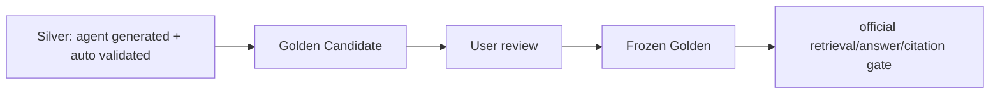

# 测试与评测

## 一句话结论

后端的权限、Migration、Ingest、RAG、Memory、Agent safety 和多论文已有较强临时数据库回归；2026-07-31 实测 141 passed，但 Frozen Golden、前端自动测试和标准浏览器产品门禁仍缺。

## 最新实际验收

```text
pip check: No broken requirements found
compileall: passed
pytest: 141 passed, 1 warning in 42.22s
frontend typecheck: passed
frontend production build: passed
mypy app: 140 errors in 41 files (checked 200 source files)
```

唯一 pytest warning 是 FastAPI TestClient 依赖旧 Starlette/httpx 适配的弃用提示。

## 测试分层

| 层 | 内容 | 当前状态 |
|---|---|---|
| T0 | 纯函数、Schema、RRF、budget、normalization | 每次 pytest |
| T1 | Repository/Migration/API 临时 SQLite | 每次 pytest |
| T2 | 本地 LanceDB、真实/生成 PDF、fake provider | 已有部分 |
| T3 | 真实 Embedding/Rerank/OCR smoke | 显式开关/隔离执行 |
| T4 | Retrieval/Context/Answer/Citation Golden | Retrieval Silver 完成，Frozen Golden 未完成 |
| T5 | 标准浏览器 E2E | 部分手工/隔离，未形成发布门禁 |

## 已覆盖的关键风险

### 数据与权限

- fresh/已有/幂等/rollback Migration；
- token 篡改与用户状态；
- Paper/Reader/Memory/Export 跨用户隔离；
- Research session scope；
- active version 与 Chunk scope。

### Ingest

- parser adapter、quality gate；
- parent-child-v3；
- CJK artificial spacing；
- table caption/header row chunks；
- OCR auto、ASCII staging；
- image-only PDF 决策；
- encrypted/invalid PDF stable error；
- Job lease/heartbeat/retry/recovery；
- 保存 PDF 自动 enqueue；
- dry-run backfill。

### RAG/Agent

- embedding response count/dimension/finite；
- LanceDB upsert/search/filter；
- unicode61/trigram/dense/RRF/rerank 基础；
- Context budget、dedupe、history tail；
- canonical Reader API E2E；
- Evidence Registry 与伪造 marker 清理；
- tool re-entry；
- Agent deadline/output safety；
- 多论文 anchor 均衡与 cross-paper citation。

### Memory

- draft snapshot/evidence turn；
- confirm/commit/idempotency；
- active/confirmed/expiry/delete/supersede；
- paper/user quota 与非 Evidence handoff。

## Canonical Reader API E2E

`test_canonical_reader_api_e2e.py` 使用临时 DB：

```text
PDF → canonical chunk → FTS → hybrid_rag_v2
→ ContextPackage → EvidenceRegistry → [E#] citation
```

它不调用真实外部 Embedding/Rerank/LLM，证明链路与权限，不证明模型回答质量。

## 隔离 RAG 语料

| 项目 | 当前值 |
|---|---:|
| 公开 PDF | 16 篇 |
| 页数 | 419 |
| active versions | 16 |
| chunks | 3,217 |
| parent/child | 1,102 / 2,115 |
| Silver v2 | 24 cases / 26 evidence anchors |
| Golden Candidate | 10，pending user review |

### Silver v2

| 配置 | Recall@10 | MRR@10 | evidence complete@10 |
|---|---:|---:|---:|
| sparse | 0.869565 | 0.573240 | 0.869565 |
| dense + rerank | 1.0 | 0.920290 | 1.0 |

这些是开发诊断，不是最终产品通过标准。

### SciFact

60 queries / 300 title-abstract documents，sparse `Recall@10=0.966667`、`MRR@10=0.901852`。它不含 PDF 页码、版面、引用或回答质量，单独报告。

## Golden 规则



Candidate 未经用户审核不得运行、调参或报告 Golden 分数。

## 不可妥协验收

- Chunk provenance 100%。
- 跨用户/跨论文泄漏 0。
- unconfirmed/deleted/expired Memory 召回 0。
- marker 映射本轮 Evidence 100%。
- citation snippet 来自 canonical source 100%。
- Migration 全套通过。
- 前端 typecheck/build 通过。

## 缺失覆盖

- answer faithfulness 与 citation entailment；
- PDF prompt injection 全产品流；
- 标准 Chrome/Edge PDF canvas + citation jump；
- SSE 断线/heartbeat/recovery；
- 业务库论文 canonical E2E；
- 多论文业务/Frozen Golden/UI；
- 磁盘满、DB lock、外部 provider 半开等故障注入；
- 前端 unit/component/E2E 自动 suite；
- 性能/并发/成本基线。

## 为什么这样设计

权限和引用合法性适合确定性断言；完整自然语言不适合逐字匹配，因此计划断言 required/forbidden facts、abstention、Evidence/page，并把 LLM-as-judge 只作为辅助。

## 面试官可能提问与回答要点

1. **141 tests 能证明上线吗？** 不能，主要证明代码与隔离数据；业务数据、Frozen Golden、浏览器和运维仍未完成。
2. **如何测 RAG？** retrieval 用 Recall/MRR/evidence completeness，回答用 required facts/abstention/citation legality。
3. **为什么 Candidate 不运行？** 避免 Agent 自己出题、自己调参造成数据泄漏和虚高。
4. **如何测权限？** 临时 DB 建两个用户/论文，Repository/API 断言跨 scope 为 0。
5. **前端测试最大缺口？** PDF.js worker、Evidence 跳页、SSE 断线和 Memory UX。

## 证据来源

- `docs/TESTING_AND_ACCEPTANCE.md`
- `docs/EVALUATION_STATUS.md`
- `backend/tests`
- `backend/tests/golden`
- 2026-07-31 实际命令输出
