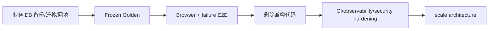

# 当前限制与技术债

## 一句话结论

项目的主要问题不是缺少功能代码，而是“能力尚未被业务数据、Frozen Golden、标准浏览器和生产运维共同证明”；其次是全仓类型、异常观测、认证标准化和部署复现债务。

## P0：影响真实性或发布门禁

| 问题 | 真实现状 | 风险 | 完成标准 |
|---|---|---|---|
| 业务库无 canonical 数据 | 11 papers，0 active version/chunk/job | Reader 主链未在用户数据上成立 | 备份后迁移、回填、抽样核验 |
| DB Migration 落后代码 | 业务库只到 v007，代码到 v011 | 启动时首次迁移风险 | 副本 rehearsal + v011 + FK/schema verify |
| Frozen Golden 缺失 | 10 个 Candidate 未审核 | RAG 效果无最终门禁 | 用户审批后冻结并完整运行 |
| 标准浏览器 E2E 缺失 | PDF worker/citation/SSE 未形成发布门禁 | UI 关键链路可能回归 | Chrome/Edge 自动 E2E |
| 容器 RAG 不完整 | Docker 未装 RAG、无 Worker/GPU/卷 | 误导部署 | 完整 compose 或明确移除 |

## P1：安全与可靠性

| 问题 | 证据 | 风险 |
|---|---|---|
| 自定义 HMAC token 非标准 JWT | header/payload 使用 hex | 网关/库不兼容、维护风险 |
| token 存 localStorage | `api/client.ts`、router | XSS 可读取 |
| 进程内限流/cache | `api/deps.py`、SearchAgent TTLCache | 多副本不共享 |
| 大量宽泛异常捕获 | 全仓 `except Exception` hotspots | 编程错误被当成降级 |
| sync tool timeout 不取消线程 | `agent_loop.py` 注释 | 资源继续占用 |
| 无 circuit breaker | 外部源/模型直接 retry/fallback | 故障放大 |
| 无生产监控/告警 | 仅 stderr/health/trace | 难发现持续退化 |
| 外部模型数据治理未说明 | Context/Embedding 走外部 API | 论文隐私与合规未知 |

## P1：质量与可维护性

- 2026-07-31 `mypy app`：140 errors in 41 files。
- `PaperAnalysisAgent`、文献保存、Search Pipeline 周边职责较多。
- Service 中运行时 import 较多，依赖图不直观。
- 手写前端 API type 与 generated OpenAPI 并存。
- 错误响应 `detail` 与 `message` 不完全统一。
- Prompt 没有统一 `prompt_version` 贯穿运行记录。
- citation validator 只验证来源合法性，不验证 claim entailment。
- 前端没有 unit/component/E2E 自动 suite。

## P1：RAG 与 Ingest

- LanceDB 无显式 ANN index与规模基线。
- 真实 dense/rerank 只在小型 Silver 开发集验证。
- 中文/低清扫描 OCR 质量尚无专门集。
- image-only 单页 OCR 实测约 85 秒。
- Context budget 对不同模型使用近似 tokenizer。
- Memory dense retrieval 未实现。
- Multi-paper 缺业务论文、Frozen Golden 和 UI citation E2E。
- 故障注入未覆盖磁盘满、SQLite lock、provider 半开与投影损坏。

## P2：产品与体验

- SSE 无 heartbeat、resume 和断线恢复。
- 多论文 citation 不能直接联动对应 PDF。
- Export 无导入/恢复流程与 schema manifest。
- Graph 关系质量无 Golden，且不是图数据库。
- Daily 没有推荐准确率、采纳率或 A/B 数据。
- 删除 Paper 后 PDF/artifact/vector 的完整垃圾回收需要核验。
- 阅读与搜索会话持久化策略不统一。

## 待删除兼容代码

代码仍保留旧 Reader/Memory/PDF 工具与 fallback 分支。它们不是本知识库描述的架构，应该在业务论文 canonical 回填、Frozen Golden 和浏览器 E2E 通过后删除，并同步删掉兼容 enum、默认值、Prompt 文案、测试和缓存表依赖，避免长期双事实源。

## 不应夸大的能力

| 不应说 | 准确说法 |
|---|---|
| “所有用户论文已向量化” | 隔离评测库已入库；业务库当前 0 active chunks |
| “RAG 已通过 Golden” | Silver 有结果，Golden Candidate 待用户审核 |
| “完全防止幻觉” | marker 来源可验证，语义蕴含未自动验证 |
| “生产级分布式任务系统” | 单机 SQLite persisted Worker |
| “GraphRAG” | SQLite 关系图可视化，不参与 canonical Evidence |
| “MCP 已上线” | 可选 adapter 存在，默认关闭且依赖/端到端未完 |
| “Docker 一键部署” | Docker 仅实验性，不含完整 RAG |
| “全仓类型安全” | 前端 typecheck 通过，后端 mypy 有 140 errors |

## 风险治理顺序

## 面试官可能提问与回答要点

1. **最大不足是什么？** canonical 代码和隔离测试较完整，但业务数据与发布门禁未闭环。
2. **为什么不先重构全部 mypy？** 先保证数据/权限/引用 P0，再分模块建立类型基线，避免大爆炸。
3. **为什么保留 SQLite？** 当前规模适合；迁移应由并发/运维指标触发。
4. **RAG 分数为什么不能当上线证明？** Silver 小且开发可见，缺 Frozen Golden、answer/citation/UI。
5. **最危险的安全债是什么？** 自定义 token/localStorage、外部数据治理和无分布式限流。

## 证据来源

- `docs/CURRENT_STATE.md`
- `docs/TESTING_AND_ACCEPTANCE.md`
- `docs/EVALUATION_STATUS.md`
- 2026-07-31 只读业务 DB 快照与验证命令
- `backend/app/services/auth/user_service.py`
- `docker-compose.yml`、`backend/Dockerfile`
